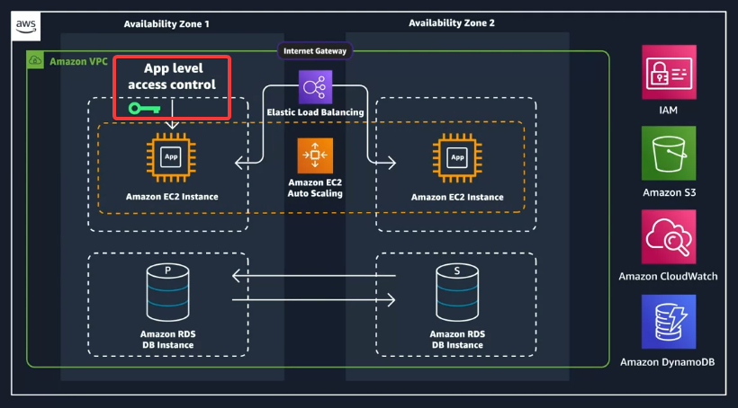
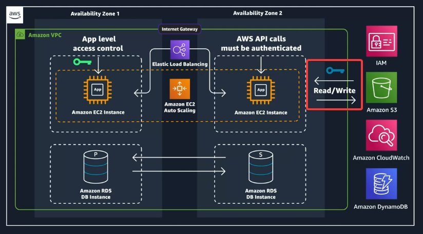
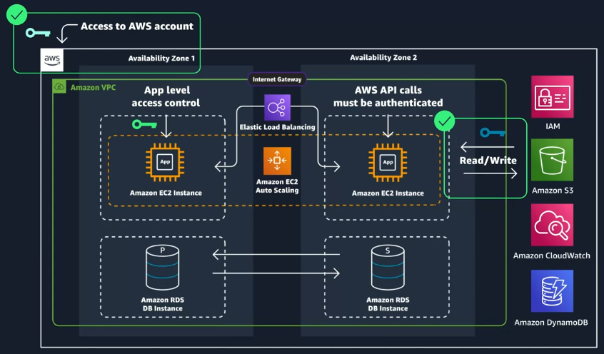

# Coursera: AWS Cloud Technical Essentials (cont)

See https://www.coursera.org/learn/aws-cloud-technical-essentials/lecture/LYogr/introduction-to-aws-identity-and-access-management.

## Intro to Identity and Access Management (IAM)

### User Login

In the case of our Employee Directory app, we will want users to be authenticated. We could do this a username & password, enforced as an app-level access control.



### API Calls Between Services

All API calls in AWS must be both signed and authenticated in order to be allowed, **even if the resources live in the same account**.



### Access to AWS Account

How will we build out this architecture? We'll need access to an AWS account through the use of a login.

The root user has these permissions, but we don't want to use the root user to administer these resources.

Within one AWS account, there are often multiple people that need to administer the achitecture. We shouldn't give everyone that needs access to an AWS account the root user credentials.

This is where we use AWS IAM. It can be used for both login credentials **and** to sign API calls to AWS services.



IAM accounts provide authentication of the users.  IAM policies provide authorization for AWS actions, like creating Amazon EC2 instances.

IAM policies allow you to:

* Grant or deny permission to take actions
* Actions are AWS API calls
* Attach policies to AWS identities

An example of an IAM policy would be:
```
{
  "Statement":[{
    "Effect":"Allow",
    "Action":"ec2:*",
    "Resource":<Amazon Resource Name>,
    "Condition":{
        <Conditions here>
    }
  }]
}
```
This policy would be attached to a user or group, and it would then grant access to perform any EC2-related actions.  **For IAM policies, grant least privilege, or only the permissions required to perform a task**.  IAM allows you to get very granular with your permissions.

It's generally recommended to assign users to groups, and apply policies to **groups**.

## Role-Based Access

How do we allow our EC2 instance to access our S3 storage?

* **We do not handle this by creating a user for the app.**
* **Also, we do not hardcode credentials.**

Instead, we handle it with IAM roles and **role-based access**.

IAM roles:

* Have no static login credentials.
* Are assumed programmatic in nature
* Are temporary in nature
* Are automatically rotated

For our Employee Directory App example, we will create a new role named `EmployeeWebAppRole`.  We will add the `AmazonS3FullAccess` and `AmazonDynamoDBFullAccess` policies to it. This will be used by the EC2 instances.

## AWS IAM Identity Center

AWS IAM Identity Center is an Identity Provider (IdP). For organizations with many employees and AWS accounts, it can simplify the management of access to AWS accounts and app.

The company's system handles managing user accounts, while AWS IAM Identity Center handles what those users can do in AWS. This keeps things separate and more secure.

## Next

https://www.coursera.org/learn/aws-cloud-technical-essentials/lecture/2ijHO/introduction-to-lab-1