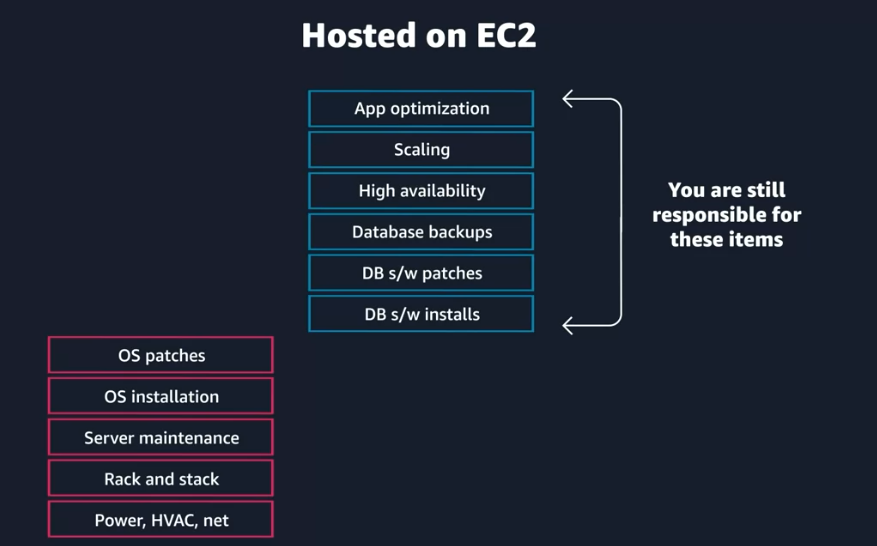
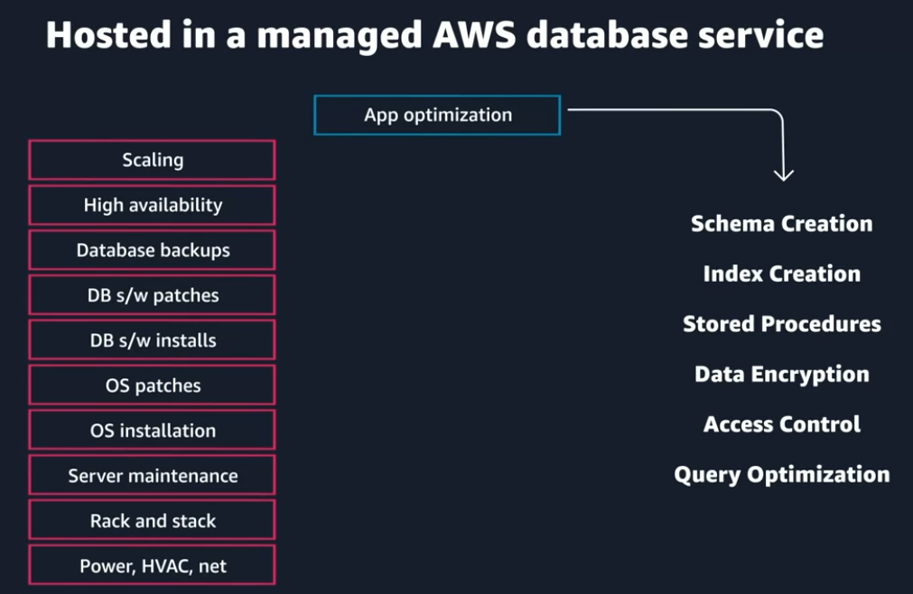
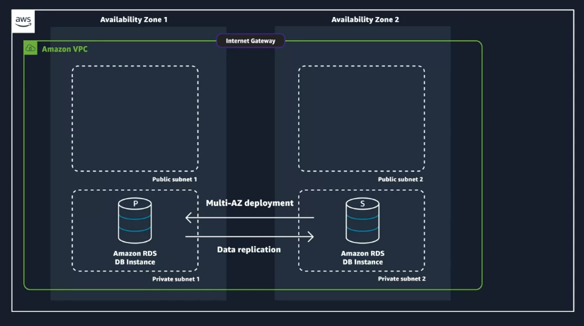
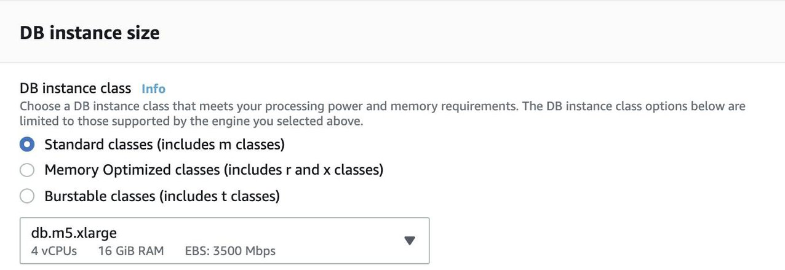
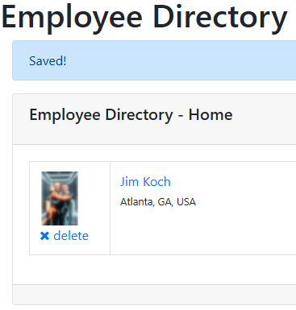

# Coursera: AWS Cloud Technical Essential: Storage on AWS (cont.)

See https://www.coursera.org/learn/aws-cloud-technical-essentials/lecture/3c2r5/explore-databases-on-aws

## Databases on AWS

Relational databases are widely utilized across all software industries.  One option for using databases with AWS is to install and operate database applications on EC2:



When doing this, you are no longer responsible for the physical infrastructure or the operating system. However, you are still responsible for the installing the database engine, distributing it across multiple AZs with data replication, along with security patches and database management tasks.

Another option is to utilize Amazon Relational Database Service (RDS):



With this option, AWS takes care of the "undifferentiated heavy lifting" for you. Instead, you are only resposnible for the creation, maintenance, and optimization of the database itself.

### Benefits of Relational Databases

* **Joins**: You can join table to better understand relationships between the data.
* **Reduced redundancy**: You can store data in one table and reference it from other tables.
* **Familiarity**: Relational databases have been a popular choice since the 1970s.
* **Accuracy**: Relational databases ensure your data adheres to the ACID (atomicity, consistency, isolation, durability) principle.

### Amazon Relational Database Service

Amazon RDS supports numerous database engines, including MySQL, PostgreSQL, MariaDB, Microsoft SQL Server, and Amazon Aurora.

Amazon Aurora is an AWS-specific database that was built to take advantage of the scalability and durability of the AWS Cloud. It is drop-in compatible with MySQL and PostreSQL, and it is 5x faster than standard MySQL databases and 3x faster than PostgreSQL databases.

This makes it ideal for scenarios involving large amounts of data being stored with high availability, durability, and low latency for data retrieval.

An RDS DB instance is assigned to a specific subnet within an Availability Zone. Much like with EC2 instances, it's recommended to replicate the RDS DB instance across at least two AZs to ensure high availability:



AWS makes it easy to support this setup with Multi-AZ deployment, which handles the data replication and automatic failover.

### Options When Setting Up RDS Instances

Just like with EC2 instances, you have the option to choose the underlying compute upon which your RDS DB instance runs:



Also like with an EC2 instance, a DB instance uses Amazon Elastic Block Store (EBS) volumes as its storage layer. You can choose between three types of EBS volume storage:

* General purpose (SSD)
* Provisioned IOPS (SSD)
* Magnetic storage

When you create a DB instance, you select the Amazon VPC that your databases will live in, and you select the subnets that you want the DB instances to be placed in. This is referred to as a **DB subnet group**.

The subnets you choose should be private, so they don't have a route to the internet gateway. You can also further restrict access to the DB instance using network ACLs and security groups.

Additionally, you can restrict a tions and resources by using IAM policies.

### Back Up Your Data

With Amazon RDS, you have the option of **automatic backups** and **manual snapshots**. Automatic backups are enabled  by default, and they can be configured to be retained for up to 35 days.

Manual snapshots can be performed through the RDS console. Snapshots can be initiated at any time, and they will exist until you delete them. This may be necessary for compliance requirements.

## Introduction to Amazon DynamoDB

DynamoDB is a fully-managed NoSQL database service. With DynamoDB, you can scale up or scale down your tables' throughput capacity without downtime or performance degradation. DynamoDB automatically spreads data and traffic for your tables over a sufficient number of servers to handle your throughput and storage requirements.

Each DynamoDB table is a collection of **items**, and each item is a collection of **attributes**. DynamoDB uses primary keys to uniquely identify each item in a table.

## Week 3 Exercise & Assessment

Goals of this lab:

* Create an Amazon Simple Storage Service (Amazon S3) Bucket
* Create an S3 bucket policy
* Modify an Application to Use an S3 Bucket
* Upload an Object to an S3 Bucket
* Create an Amazon DynamoDB table
* Test an Application Using an Application Web Interface
* Manage Existing DynamoDB Items Using the AWS Management Console
* Create Items in a DynamoDB Table Using the AWS Management Console

### Setting Up an S3 Bucket

I created an S3 bucket named `employee-photo-bucket-jimkoch-at-gmail`. I gave it the following bucket policy:
```
{
    "Version": "2012-10-17",
    "Statement": [
        {
            "Sid": "AllowS3ReadAccess",
            "Effect": "Allow",
            "Principal": {
                "AWS": "arn:aws:iam::442426860725:role/EmployeeWebApp"
            },
            "Action": "s3:*",
            "Resource": [
                "arn:aws:s3:::employee-photo-bucket-jimkoch-at-gmail",
                "arn:aws:s3:::employee-photo-bucket-jimkoch-at-gmail/*"
            ]
        }
    ]
}
```

### Setting Up a DynamoDB Table

I created a DynamoDB table named `Employees`. I gave it the following resource-based policy:
```
{
  "Version": "2012-10-17",
  "Statement": [
    {
      "Sid": "AllowDynamoReadAccess",
      "Effect": "Allow",
      "Principal": {
        "AWS": "arn:aws:iam::442426860725:role/EmployeeWebApp"
      },
      "Action": "dynamodb:*",
      "Resource": "arn:aws:dynamodb:us-west-2:442426860725:table/Employees"
    }
  ]
}
```

### Testing

After setting up the new S3 bucket and DynamoDB table, I confirmed that I could successfully add employees in my EC2 instance:



## Next

* Review ACID.
* See https://www.coursera.org/learn/aws-cloud-technical-essentials/lecture/26rKT/introduction-to-week-4.