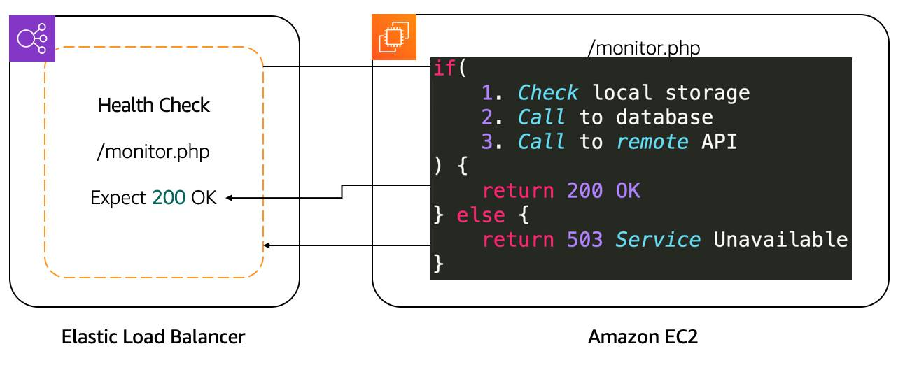
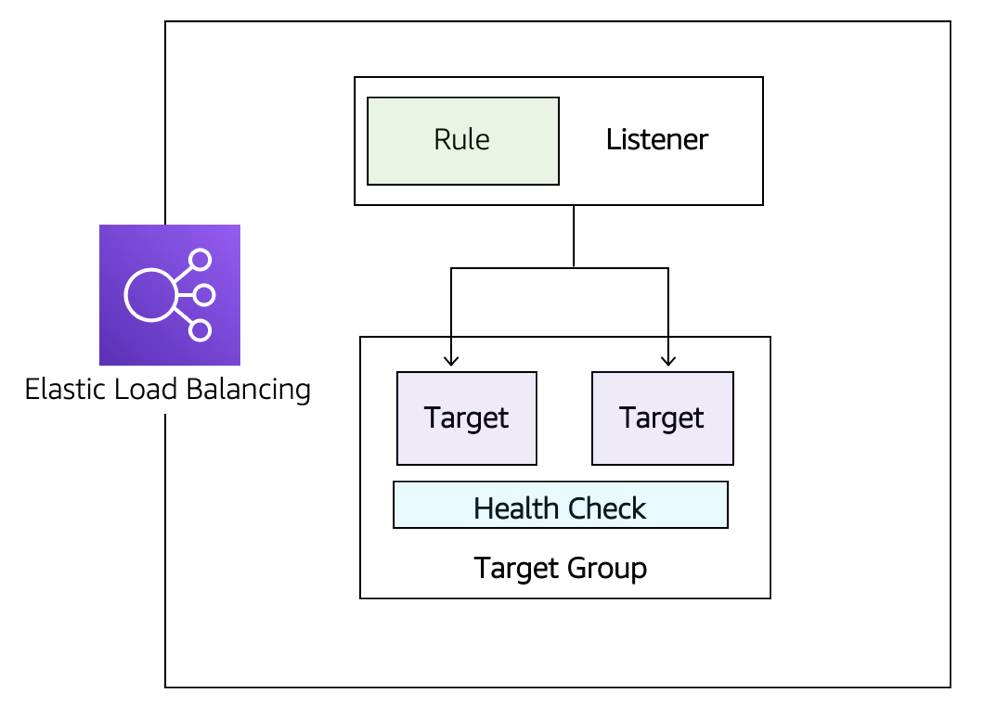
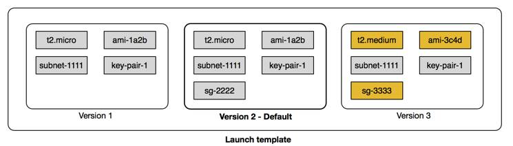

# Coursera: AWS Cloud Technical Essential: AWS Optimization

See https://www.coursera.org/learn/aws-cloud-technical-essentials/lecture/fjBGf/amazon-ec2-auto-scaling.

## Route Traffic with Amazon Elastic Load Balancing (ELB)

Load balancing is the process of distributing tasks across a set of resources. Traffic is redirected to backend services based on an algorithm. The most popular algorithm is round-robin, which sends the traffic to each server one after the other.

### Features of ELB

* ELB can load balance to IP addresses, so this would allow it to operate in a hybrid mode where it load balances to on-premises servers.
* ELB is highly available. The only option you have to ensure is that the load balancer is deployed across multiple Availability Zones.
* ELB automatically scales to meet the demand of incoming traffic.

### Health Checks

It is important to define appropriate health checks that validate all elements, including databases, S3 storage, and the application itself.

After confirming the availability of a new EC2 instance, the load balancer starts sending traffic to it. If ELB determines that an EC2 instance is no longer working, it stops sending traffic to it and lets EC2 Auto Scaling know. EC2 Auto Scaling's responsibility is to remove it from the group and replace it with a new EC2 instance.

During a scale down action due to scaling policy, EC2 Auto Scaling lets ELB know that EC2 instances will be terminated. ELB can prevent EC2 Auto Scaling from terminating the EC2 instance until all connections to that instance end, while preventing any new connections. That feature is called **connection draining**.

### ELB Components

The ELB server is comprised of three components:

* **Listeners**: The port and protocol on which the ELB will listen.
* **Target groups**: The backend servers you want to direct traffic to.
* **Rules**: A condition that optionally includes the source IP address of the client, and results in deciding which target group to send the traffic to.

### Application Load Balancer

Application Load Balancer (ALB) routes HTTP and HTTPs traffic.

* It can route data based on request data, enabling granular routing to target groups.

* It has the ability to reply direct to the client with a fixed response, or to send a redirect to the client.

* ALB supports TLS offloading. An SSL certificate can be imported from IAM or from AWS Certificate Manager (ACM). This ensures the traffic between the client and ALB is encrypted.

* ALB can authenticate users using the OpenID Connect protocol, and ALB integrates with other AWS services to support protocols like SAML, LDAP, and Microsoft AD.

* To prevent traffic from reaching the ALB, you can configure a security group to specify the supported IP address ranges.

* ALB uses the round-robin routing algorithm.

* ALB uses the least outstanding request routing algorithm. Consider a situation where the EC2 instances in a target group aren’t the same size. In that case, one server’s CPU utilization will be higher than the other if the same number of requests are sent to each server using the round-robin routing algorithm. That same server will have more outstanding requests as well. Using the least outstanding request routing algorithm would ensure an equal usage across targets.

* ALB supports sticky sessions. If an application is stateful, the sticky sessions feature uses an HTTP cookie to remember which server to send the traffic to.

### Network Load Balancer

Network Load balancer (NLB) supports TCP, UDP, and TLS protocols. NLB operates at the connection layer, so it doesn't understand what an HTTPS request is. This means NLB doesn't support features like authentication, least outstanding request routing algorithm, and routing rules based on HTTP request data.

* NLB uses a flow hash routing algorithm. The algorithm is based on:
  * The protocol.
  * The source IP address and port.
  * The destination IP address and port.
  * The TCP sequence number.

If all of these parameters are the same, then the packets are sent to the same target.

* NLB has stick sessions. These sessiosn are based on the source IP address of the client, instead of a cookie.

* NLB supports TLS offloading. NLB understands the TLS protocol. It can also offload TLS from the backend servers, similar to how ALB works.

* NLB supports millions of requests per second. ALB needs to scale to reach that number. NLB can handle that instantly.

* NLB supports static and elastic IP addresses. This is useful if the application can't use DNS, or if the connecting  clients require firewall rules based on IP addresses.

* NLB preserves source IP address. With ALB, if you look at the source address of the request, you will find the IP address of the load balancer. With NLB, you will see the real IP address of the client, which is required by the backend application in some cases.

## Amazon EC2 Auto Scaling

The entire system can become unavailable if there is a capacity issue. Let's look at the load issue with both active-passive and active-active systems.

### Vertical Scaling

If there are too many requests sent to a single active-passive system, the active server will become unavailable and failover to the passive server. But this doesn't fix the problem.

Vertical scaling involves increasing the size of the server. In the case of EC2 instances, that's either a larger type or a different instance type. This isn't practical, since it needs to be done manually, and it requires the EC2 instance to be in the stopped state.

This is where an active-active system can help, by scaling horizontally with more servers.

### Horizontal Scaling

For the application to work in an active-active system, it has to be stateless. Then to scale up, it's just a matter of adding more instances.

The Amazon EC2 Auto Scaling service can take care of that task by automatically creating and removing instances based on metrics from Amazon CloudWatch.

### Integrate ELB with EC2 Auto Scaling

ELB is automatically notified when new instances are added to or removed from an EC2 Auto Scaling group. ELB will then use health checks to validate that the instance is ready, and it will continue to monitor all instances with those health checks.

### Configuring EC2 Auto Scaling Components

There are three main components to EC2 Auto Scaling.

* **Launch template or configuration**: What resource should be automatically scaled?

* **EC2 Auto Scaling Group**: Where should the resources be deployed?

* **Scaling policies**: When should the resources be added or removed?

### Launch Templates

A launch template stores the information that EC2 Auto Scaling requires to create EC2 instances on your behalf. This is all the same parameters that are needed to manually create EC2 instances, such as the AMI ID, instance type, security group, etc.

### EC2 Auto Scaling Group (ASG)

An ASG allows you to specify the VPC and subnets where EC2 instances should be launched. ASGs also allow you to specify the type of purchase: On-Demand only, Spot only, or a combination of the two.

### Enable Automation with Scaling Policies

You can use scaling policies to automatically change the desired capacity. Metrics and alarms are used by scaling policies to know when to act. For example, you can set up an alarm that says when the CPU utilization is above 70% across the entire fleet of EC2 instances, trigger a scaling policy to add an EC2 instance.

#### Simple Scaling Policy

A simple scaling policy uses a CloudWatch alarm and specifies what to do when it is triggered. Once this scaling policy is triggered, it waits a cooldown period before taking any other action.

What if CPU utilization is above 90% across the ASG? Adding one EC2 instance may not resolve the problem. You may want to add another step to the scaling policy.

#### Step Scaling Policy

Step scaling policies respond to additional alarms even while a scaling activity or health check replacement is in progress. So depending on metrics, you may decide to add two or four instances in certain situations.

#### Target Tracking Scaling Policy

Deciding when to add or remove instances based on CloudWatch metrics is a difficult task. With target tracking scaling policies, all you need to provide is the target value.

## Next

https://www.coursera.org/learn/aws-cloud-technical-essentials/lecture/GGmpd/introduction-to-lab-4