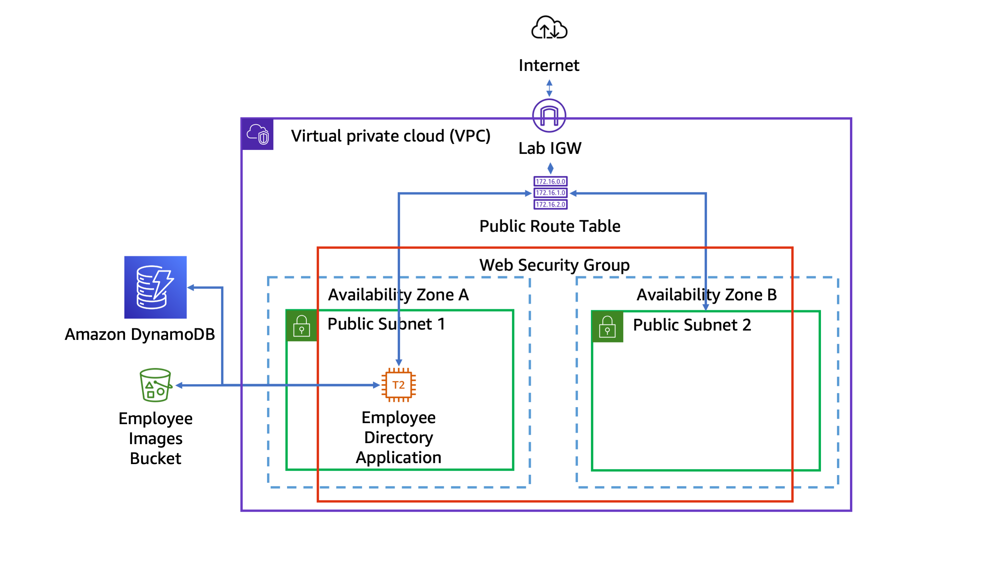

# Coursera: AWS Cloud Technical Essential: Lab 4 and Assessment

See https://www.coursera.org/learn/aws-cloud-technical-essentials/lecture/GGmpd/introduction-to-lab-4.

## Introduction to Lab 4: High Availability

In this lab, we will:
* Review the configuration of an Amazon EC2 instance
* Create a launch template
* Create an Application Load Balancer
* Set up an Auto caling group using the launch template.

## Lab 4: Configure High Availability for your Application

We start out with a configuration like this:

We followed this process:

* Created an application load balancer
* Created a launch template
* Created an Auto Scaling group

## Next

https://www.coursera.org/learn/aws-cloud-technical-essentials/lecture/39eaF/redesigning-the-employee-directory
