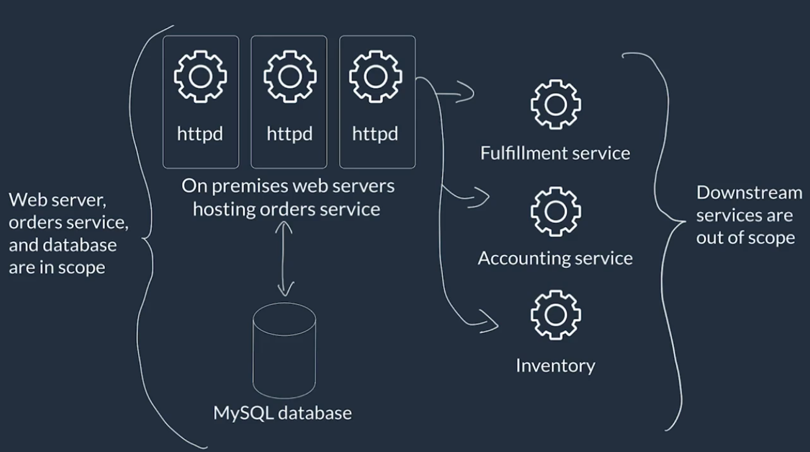

# Coursera: Architecting Solutions on AWS

See https://www.coursera.org/learn/architecting-solutions-on-aws/lecture/iYatj/course-introduction.

## Course Introduction

This course will teach you to think through customer requirements, and then select the best AWS services to meet those requirements.

During the first week, we will look at a scenario involving a customer working at a company that sells cleaning products online. The company currently has a service that processes online orders and is experiencing issues.

During the second week, we will look at a customer working at a software company who provides a solution using QR codes for loading restaurant menus. This customer wants to enhance their products by adding data analysis for better business intelligence solutions.

During the third week, we will look at an insurance company that has some workloads running on premises that they need to find a way to migrate to a hybrid envioronment between what they have currently running on-premises and the new AWS environment.

During the last week, we will look at the scenario of a marketing agency that has everything runningi n the same account, while providing workloads for its own clients.

This course was designed to help you understand the differences between the AWS services so you can more easily figure out which service to use to meet specific use cases.

## Course Feedback

If you have questions about any AWS services you are learning about, they can be asked at re:Post ([repost.aws](http://repost.aws)).

If there is any out-of-date, incorrect, or broken content, a ticket should be opened at support.aws.amazon.com/#/contacts/aws-training.

## Week 1 Introduction

During this course, we will be designing a possible solution to meet the customer's needs step-by-step. To view drawing and diagramming tools, see [AWS Architecture Icons](https://aws.amazon.com/architecture/icons/), and scroll to the drawing and diagramming tools section.

## Customer #1: Use Case and Requirements

The first customer is Any Compnay Ecommerce, which has moved a decent number of workloads to AWS without refactoring (i.e. a lift-and-shift model for migration).

* There is a website & app open to the public for purchasing products.
* There is also a website and app for buyeres to purchase products wholesale, for resale in their own shop.
* Orders from the frontends come in to the orders service, hosted on premises.
* Orders service validates, authenticates, accepts, orders, processes, and stores the order in a database. Order service then makes calls downstream to other services, like inventory fulfillment and accounting service, to reflect the confirmed order.
* The inventory fulfillment and accounting services are already hosted in the AWS Cloud.
* The orders service is the last major piece that needs to be moved over.
* Payment processing is out of scope, because they use a payment gateway service.

Follow-up details:
* There is a web-server running on the same system where the front-end is hosted.
* They are currently using MySQL on-prem to store order data. Orders are stored in only one table. Ideally they would have something in AWS that's simpler to manage.
* Other downstream services use their own datastores.

Pain points:
* Most issues come from the application layer, because all of the business logic is in the one order service.
* They have a hard time scaling on-prem to accomodate heavy load.
* If the app crashes partway through processing, it's possible to have inconsistency with orders.

## Customer #1: Requirements Breakdown

Based on what the customer reported, this is what their on-premises solution looks like right now:

The current problem is that order acceptance and downstream calls are all handled by one code package as a monolith. We need to break that into multiple components, and have them loosely coupled to avoid having a single point of failure.

Gathered requirements:
* **Managed scaling for compute and database components**. This makes us immediately think of serverless services, so we probably won't be looking at EC2 a lot for this solution.

* **Decoupling components to maximize resilience**. We should break the order service down into multiple components, and follow an event-driven architecture, so we can more loosely couple each piece. Order acceptance, order processing, and downstream calls should all be independent.

* **Centralized monitoring and logging**. Be able to see the state of the application all in one place. This won't be a problem, especially with the serverless services, which all tend to be integrated with CloudWatch and CloudWatch Logs.

* **Optimizing for cost, performance efficiency, and operational overhead**. Serverless tends to really be useful for this, especially with bursty traffic patterns.

## Next

https://www.coursera.org/learn/architecting-solutions-on-aws/lecture/EDH9R/selecting-a-serverless-compute-service