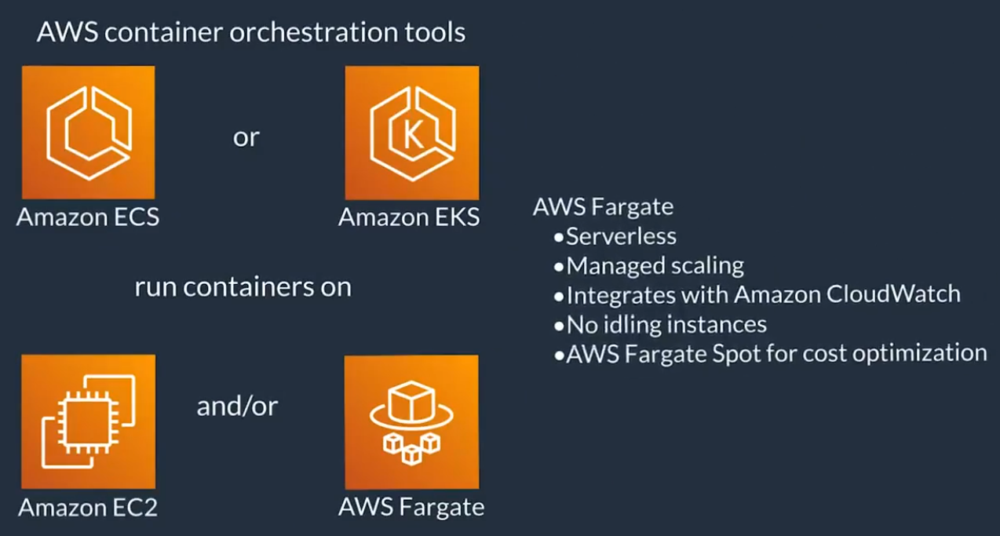

# Coursera: Architecting Solutions on AWS

See https://www.coursera.org/learn/architecting-solutions-on-aws/lecture/EDH9R/selecting-a-serverless-compute-service.

## Compute on AWS

As we are considering solutions for our customer, we should first review the options available from Amazon AWS at [aws.amazon.com/products/compute](aws.amazon.com/products/compute).

The serverless category is particularly appealing, since the customer suggested a serverless solution to reduce costs.

### Why not EC2?

People often look to EC2 as the default option. You can spin up VMs and customize your OS and applications. In this specific scenario, we could lift-and-shift to EC2, and it would work fine.

But just because it could work doesn't mean we should just go with it.

### Containers

Let's consider container options:

However, we're not sure if our customer is interested in using container technology, which could be a blocker for this option.

### AWS Lambda

AWS Lambda is cloud native and completely serverless. It scales up and down automatically without a lot of operational overhead. You may have to tweak some configurations over time, depending on your workload, and there are things you can do to make scaling happen faster and make your code run faster.

Operational overhead with Lambda is significantly lower when compared to EC2. In AWS Lambda, each request or event that comes in spins up its own instance of a Lambda function. The Lambda function runs in a microVM powered by soemthing called Firecracker, and this microVM will shut down on its own after a period of time.

### Amazon API Gateway

Amazon API Gateway is one of several possibly triggers for AWS Lambda. Other possible triggers are Amazon SQS, HTTPS, or an Application Load Balancer.

Amazon API Gateway would provide us with additional benefits that meet the customer's requirements. It does authentication on requests, and it also supports basic data format validation.

Therefore, it seems that we would be well-served to receive requests with **Amazon API Gateway**, and relay them from there to **AWS Lambda**.

## AWS Lambda Exploration

AWS Lambda has built-in support for several language runtimes, including .NET, Go, Java, Node.js, Python, and Ruby. You also have the option to build your own custom runtime on Amazon Linux 1 or Amazon Linux 2.

You can then select an **execution role**, which specifies which permissions the Lambda function has.

There are then additional configuration you can make, like **Enable VPC**. This will allow the function to run within a VPC to access private resources during invocation.

Once created, you can customize your Lambda function further. You can:

* Specify triggers
* Define the lambda function
* Add environment variables
* Add tags for filtering or managing costs
* Enable and configure monitoring and logs

Once the lambda function is defined, you can use the "Test" tab to validate the function.

## Compute on AWS

We have chosen AWS Lambda for this week's architecture. **Lambda function can run for up to 15 minutes.** Any processes that need longer than 15 minutes to run should use other compute services on AWS for hosting. Each execution enviornment stays active for a period of time, and then it shuts down on its own.

With Lambda, you are responsible only for your own code. Lambda then manages the compute fleet.

Lambda is a good choice for use cases where the requirements include reducing operational overhead, optimizing for cost, or optimizing for performance efficiency. Lambda works well for these use cases because it’s a managed service and you only pay for what you use.

We then selected **Amazon API Gateway** to integrate with Lambda, thus providing a way to expose the backend service without exposing to the open internet.

API Gateway is fully managed. It handles traffic management, CORS support, authorization and access control, throttling, monitoring, and API version management.

## Next

https://www.coursera.org/learn/architecting-solutions-on-aws/lecture/0yxl6/choosing-an-aws-database-service