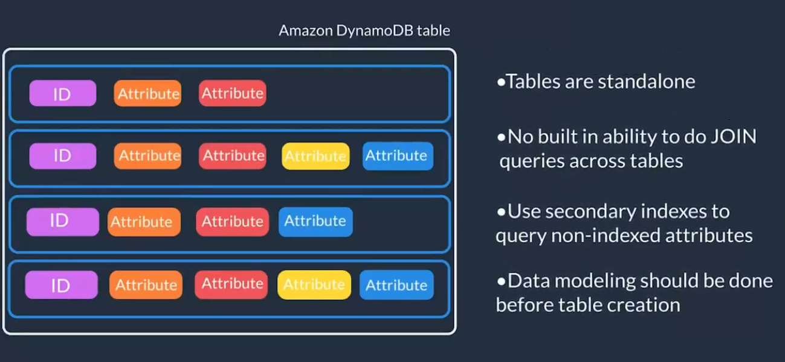

# Coursera: Architecting Solutions on AWS

See https://www.coursera.org/learn/architecting-solutions-on-aws/lecture/0yxl6/choosing-an-aws-database-service.

## Choosing an AWS Database Service

For a quick overview of database options, see aws.amazon.com/products/databases. By choosing one database type over another, you can save a lot of time in database setup, maintenance, and coding by choosing a type that supports the features you need in your application.

There are a couple of options that meet the criteria for AnyCompany Online.

### Amazon Aurora

Amazon Aurora is a commercial-grade relational database under the RDS umbrella. It is MySQL and PostgreSQL compatible.

It is massively scalable and highly performant. Aurora Servless is elastic in nature, and you only pay for the capacity consumed.

### Amazon DynamoDB

DynamoDB is a serverless key-value NoSQL database. It supports high numbers of concurrent users. It manages scaling of the data storage under-the-hood, so it has very low overhead.

In the case of a spiky usage pattern, you'll want to choose the **on-demand mode**, which scales up and down as your demand changes.

Keep in mind that DynamoDB is not the best option for every use case. For example, it's not good when complex queries are needed, such as `JOIN` queries.

## Databases on AWS

Databases are purpose-built in AWS, meaning that each AWS database service is built for a specific use case.

### Amazon Aurora

Amazon Aurora is a fully managed relational database engine that's compatible with MySQL and PostgreSQL.

As an enterprise-level database, Aurora can deliver up to 5x the throughput of MySQL and 3x the throughput of PostgreSQL without requiring changes to existing applications.

Aurora includes a high-performance storage subsystem. The underlying storage grows automatically as needed, and an Aurora cluster volume can grow to a maximum size of 128 tebibytes (TiB). It also automates and standardizes database clustering and replication.

Aurora is part of Amazon RDS, a web service that makes it easier to set up, operate, and scale a relational database in the cloud.

Aurora Serverless v2 is an on-demand, automatic scaling configuration for Aurora. It helps automate the processes for monitoring the workload and adjusting the capacity for your databases.

### Amazon RDS Proxy

RDS Proxy establishes a database connection pool and reuses connections in this pool without the memory and CPU overhead of opening a new database connection each time. To protect the database against oversubscription, you can control the number of database connections that are created.

RDS Proxy queues or throttles application connections that can't be served immediately from the pool of connections. Although latencies might increase, your application can continue to scale without abruptly failing or overwhelming the database.

### Amazon DynamoDB

Amazon DynamoDB is a fully managed NoSQL database service that provides fast and predictable performance with seamless scalability. With DynamoDB, you can create database tables that can store and retrieve virtually any amount of data and serve virtually any level of request traffic.

NoSQL is a term used to describe nonrelational database systems that are highly available, scalable, and optimized for high performance. Instead of the relational model, NoSQL databases (such as DynamoDB) use alternate models for data management, such as key-value pairs or document storage. 

In DynamoDB, tables, items, and attributes are the core components that you work with. A table is a collection of items, and each item is a collection of attributes.

## Next

https://www.coursera.org/learn/architecting-solutions-on-aws/lecture/hQgYC/building-event-driven-architectures