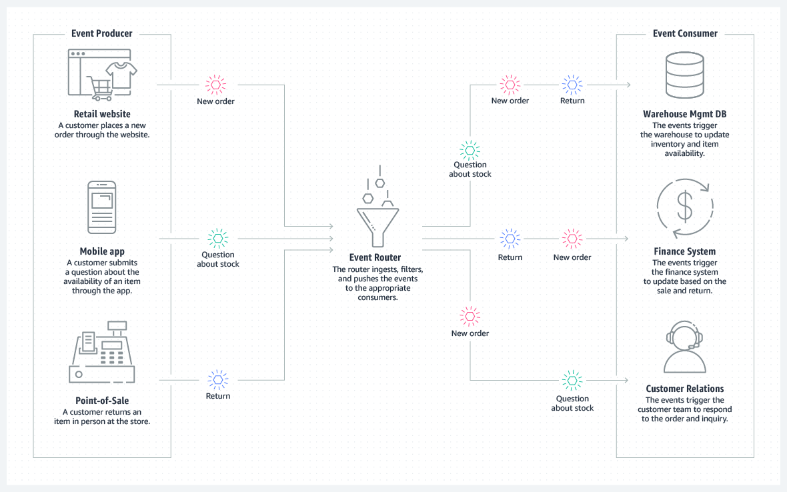
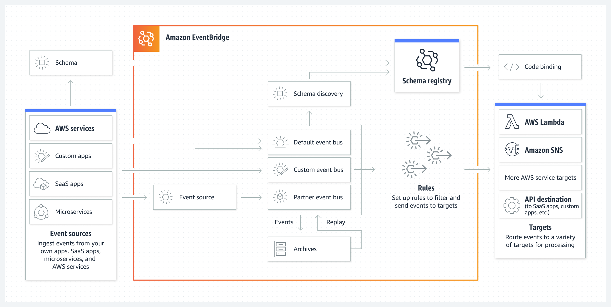

# Coursera: Architecting Solutions on AWS

See https://www.coursera.org/learn/architecting-solutions-on-aws/lecture/hQgYC/building-event-driven-architectures.

## Building Event-Driven Architectures

The AWS documentation for event-driven architectures can be found at [aws.amazon.com/event-driven-architecture](aws.amazon.com/event-driven-architecture).

An event-driven architecture uses events to invoke and communicate between decoupled services. It's a common architecture in modern applications that are built with microservices. An event is a cahnge in state, or an update, such as placing an item in a shopping cart on an ecommerce website.

Event-driven architectures have three key components:

* **Event producers**: Publish an event to the router
* **Event router**: Filters and pushes events to consumers
* **Event consumers**: Process that an event has occurred

## Amazon EventBridge compared to Amazon SNS

**Amazon EventBridge** is recommended when you want to build an application that reacts to events from SaaS applications or AWS services. EventBridge is the only event-based services that integrates directly with third-party SaaS AWS Partners.

EventBridge uses a defined, JSON-based structure for events, and you can also select events to forward to a target by creating rules that are applied across the entire event body.

It supports many AWS services sa targets, including AWS Lambda, Amazon Simple Queue Services (Amazon SQS), Amazon SNS, and more.

It has limited throughput and a typical latency of about half a second.

**Amazon SNS** (Simple Notification Service) is recommended when you want to build an application that reacts to high throughtout or low-latency messages that are published by other applications or microservices.

It provides nearly unlimited throughtput, and you can use it for applications that need very high fan-out.

Amazon SNS supports forwarding messages to AWS Lambda, Amazon SQS, HTTP/S endpoints, SMS, mobile push, and email. The typical latency is under 30 milliseconds.

## Amazon EventBridge

EventBridge is a serverless event bus service that you can use to connect your applications with data from various sources.

EventBridge receives an **event**, which indicates a change in environment. **Rules** match events to targets based on either the structure of the event (which is called an **event pattern**), or on a schedule. For example, when an EC2 instance changes from pending to running, you can have a rule that sends the event to a Lambda function.

All events are associated with an event bus. Rules are tied to a single event bus, so they can only be applied to events on that event bus.

## Amazon SNS

Amazon Simple Notification Service (Amazon SNS) is a managed service that provides message delivery from publishers to subscribers. Publishers communicate asynchronously by sending messages to a topic, which is a logical access point and communication channel. Clients can subscribe to the topic and receive published messages by using a supported endpoint type, such as Amazon Knesis Data Firehose, Amazon SQS, AWS Lambda, HTTP, email, mobile push notifications, and SMS.

Amazon SNS is simpler to use, it has higher throughput that supports thousands of event subscribers, and it supports a straightforward way to send messages between components or microservices.

## Amazon DynamoDB Streams

DynamoDB Streams captures a time-ordered sequence of item-level modifications to a DynamoDB table, and it stores this information in a log for up to 24 hours.

The stream records are written in near-real time, so yo ucan build applications that consume the streams and take action based on the contents.

## Next

https://www.coursera.org/learn/architecting-solutions-on-aws/lecture/lrz4P/decoupling-aws-solutions