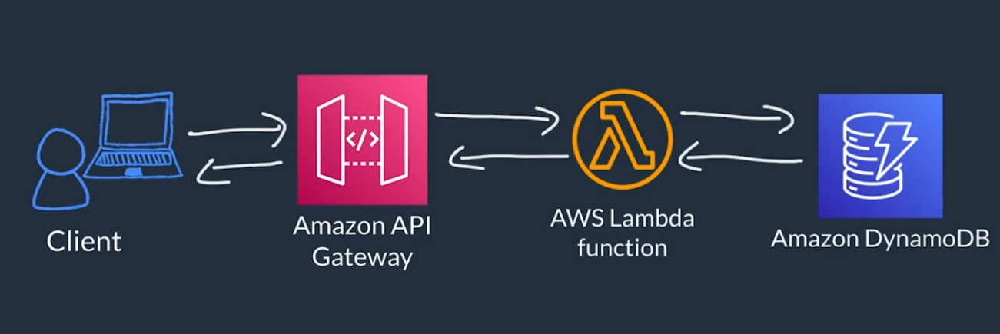
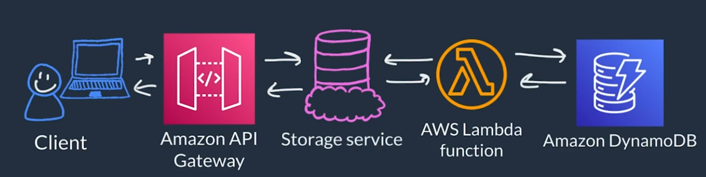
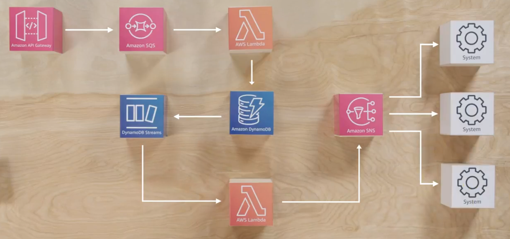
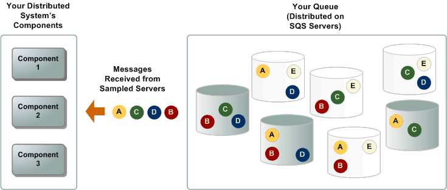

# Coursera: Architecting Solutions on AWS

See https://www.coursera.org/learn/architecting-solutions-on-aws/lecture/lrz4P/decoupling-aws-solutions.

## Decoupling AWS Solutions

As stated in the original problem, orders are processed using a *synchronous* model. The user submits their order to the order service, the service accepts and validates the order, processes the order, stores it in a database, and then  calls the downstream services for inventory, fulfillment, and accounting before responding to the user.

This is especially problematic during scaling events, when the backend starts rejecting requests because it's overwhelmed.

We're going to recommend for the customer to move to an *asynchronous* architecture, where the request comes in, and API Gateway accepts and validates the requeust. From there, instead of sending the request directly to Lambda, API Gateway would send the request to storage first. This is following a *storage-first* pattern, which is used to reduce API latency.

What we currently have looks like this:

In this case, Lambda must process the order and write it to the database before the client receives a response.

Instead, we would like to transition to have this:

Here, API Gateway is given a successful response as soon as the request is written to the storage service. Then, Lambda *asynchronously* processes the order request, without the user waiting.

What would this look like? API Gateway can handle a lot for you, like authenticating the request, along with validating the transforming the payload before it reaches the compute layer. So we can offload all of that logic from our compute layer to our API.

Also, API Gateway can integrate directly with other AWS services, meaning that it can write an item to DynamoDB, or add a message to an SQS queue, or publish a message to SNS.

If the order service did nothing more than pass orders to the DB, then API Gateway could just write the orders directly to DynamoDB, and DynamoDB would act as our "Storage Service".

However, the customer confirmed that their order service contains complex business logic, so we still need some form of "Storage Service". In this case, we're choosing Amazon SQS:

## Amazon Simple Queue Service (SQS) Exploration

Within the Amazon Cloud Console, the process to create an SQS queue looks very similar to how you create an SNS queue:

* You choose either a "standard" or a "FIFO" queue
* You specify a queue name

A message published to an SQS will remain in the queue until it has been successfully processed by a subscriber. This is one place where SQS differs from SNS.

Within the configuration, there are some important considerations:

* **Maximum message size**: The maximum message size is between 1 KB and 256 KB. So if you need messages that are larger than 256 KB in length, you'll need to choose a solution other than SQS.

* **Receive message wait time**: Amazon SQS is based on *polling*. The consumers have to poll the queue to learn about any new available messages. The value here can be between 0 and 20 seconds. If messages are infrequent, you might consider setting the wait time to 20 seconds, to reduce the number of times that an empty queue is polled. This will help reduce costs.

You can also specify *Lambda triggers*. This will be any Lambda functions that are triggered by the queue.

Lastly, you can also review queue metrics under "Monitoring". This will show you potential issues, like if the number of messages in the queue is unusually high. This could indicate that the messages in the SQS queue are not being successfully processed.

## Decoupling Solutions on AWS

In this week's architecture, we opted to have loosely-coupled components that are connected with Amazon SQS and AWS Lambda for asynchronous communication. This pattern works if you have the following requirements:

* You want to create loosely coupled architecture.

* All operations don’t need to be completed in a single transaction, and some operations can be asynchronous.

* The downstream system can’t handle the incoming transactions per second (TPS) rate. The messages can be written to the queue and processed based on the availability of resources.

For information on other AWS patterns, see [Patterns for integrating microservices](https://docs.aws.amazon.com/prescriptive-guidance/latest/modernization-integrating-microservices/integrating-patterns.html).

### Building storage-first applications

A storage-first application can help an application be more reliable when working with events. Read more about this at [Building storage-first serverless applications with HTTP APIs service integrations](https://aws.amazon.com/blogs/compute/building-storage-first-applications-with-http-apis-service-integrations/).

### Amazon SQS

Amazon SQS is a fully-managed message queuing service that you can use to decouple and scale microsservices, distributed systems, and serverless applications.

#### Short polling compared to long polling

When you consume messages from a queue by using short polling, Amazon SQS samples a subset of its servers (based on a weighted random distribution) and returns messages from only those servers. Thus, a particular ReceiveMessage request might not return all of your messages. However, if you have fewer than 1,000 messages in your queue, a subsequent request will return your messages. If you keep consuming from your queues, Amazon SQS samples all of its servers, and you receive all of your messages.

Below is an example of short-polling behavior:

When the wait time for the ReceiveMessage API action is greater than 0, long polling is in effect. The maximum long polling wait time is 20 seconds. Long polling helps reduce the cost of using Amazon SQS by reducing the number of empty responses and *false* empty responses.

## Next

https://www.coursera.org/learn/architecting-solutions-on-aws/lecture/GbqGC/customer-1-solution-overview