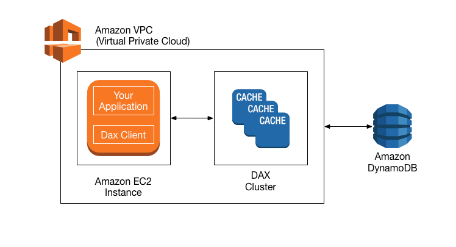

# Coursera: Architecting Solutions on AWS

See https://www.coursera.org/learn/architecting-solutions-on-aws/lecture/GbqGC/customer-1-solution-overview.

## Architecture Optimization for Week 1

With our Week 1 solution, we have several ways that we could potentially optimize for performance and cost.

### Caching with Amazon DynamoDB Accelerator

Because we are using Amazon DynamoDB to store orders, we could improve performance to microsecond latency by using Amazon DynamoDB Accelerator (DAX).

DAX is a fully managed, highly available, in-memory cache for DynamoDB. It can provide a 100x performance improvement -- from milliseconds to microseconds.

DAX is compatible with DynamoDB API calls, so you won't have to modify application logic to integrate with it.

DAX is designed to run within an Amazon VPC. You can launch a DAX cluster in your virtual network and the control access to the cluster by using Amazon VPC security groups.

### AWS Lambda Power Tuning

You could also optimize the memory or power configuration for AWS Lambda functions with **AWS Lambda Power Tuning**, an open-source tool for visualization of resources for AWS Lambda function.

To work with AWS Lambda Power Turing, you provide a Lambda function Amazon Resource Name (ARN) as input. The state machine then invokes that function with multiple power configurations (from 128 MB to 10 GB—you decide which values). Then, it analyzes all the execution logs and suggests the best power configuration to minimize cost or maximize performance.

The state machine generates a visualization of average cost and speed for each power configuration.

### AWS Lambda Powertools

AWS Lambda Powertools is a suite of utilities for AWS Lambda functions that is designed to make it easier to adopt best practices such as tracing, structured logging, custom metrics, idempotency, batching, and more.

### AWS Lambda execution environment reuse

Another way to improve Lambda function performance is by moving certain intialization tasks outside of the handler, so they can be reused across invocations.

Examples of execution environment reuse include initializing SDK clients and database connections outside of the function hander. Also, static assets can be cached locally in the `/tmp` direcory. Subsequence invocations that are processed by the same AWS Lambda function instance can then reuse these resources.

To avoid potential data leaks across invocations, don't use the execution environment to store user data, events, or other information with security implications.

## Next

https://www.coursera.org/learn/architecting-solutions-on-aws/lecture/p5g8W/week-2-introduction