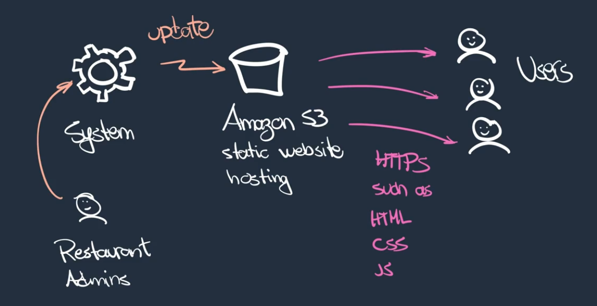

# Coursera: Architecting Solutions on AWS

See https://www.coursera.org/learn/architecting-solutions-on-aws/lecture/p5g8W/week-2-introduction.

## Week 2 Introduction

The second customer is a software company that develops a solution for providing restaurant menus by using QR codes. They have coding expertise, but they need help arhictecting a data analytics infrastructure to ingest, process, and visualize their data.

We'll be looking at Amazon S3, data ingestion, processing, and visualization for this architecture.

## Customer #2 Use Case and Requirements

The customer already has a solution that uses an S3 static website to host HTML webpages containing restaurant menus. Restaurant admins can log into their system and update the object in the S3 bucket, when they want to edit the menu.

They also have a system to generate a QR code pointing to the bucket, so restaurants use that to print the QR code and add it to their restaurant tables.

The customer also has a third-party payment-processing service. They **would like** to add an "Order This Item" option to the static HTML websites, that calls an API that they already have.

The customer has also already written a client-side JavaScript library that will send clickstream data, containing "session data". This session data is information like if a user expands an item's details, but does not order the item. Or it could be information like the amount of time from when the customer views an item until they pay for it. This session data will allow BI analysts to make reports to help restaurants, and even suggest specfic dishes (i.e. a user ordered a specific dish from Restaurant A, so they might be interested in ordering a certain item from Restaurant B).

The customer **would like** a RESTful HTTPS endpoint where they can send the session data. They would prefer managed services, because they're operating with a reduced staff right now. And where possible, they would like to have the data ingested and available as a backup in another AWS Region with encryption.

## Customer #2 Requirements Breakdown

So what does the customer currently have? They have Amazon S3 static website hosting, which can deliver HTML, CSS, and JS over HTTPS. They also have a system that can update the S3 bucket, and restaurant admins can use that system to update the restaurant menus:

In addition, the customer developed a client-side JavaScript library that can send clickstream session data. They need somewhere to send that data.

* **Requirement #1**: Provide HTTPS endpoint for data collection.

* **Requirement #2**: Use AWS managed services where possible.

With the first two requirements, API Gateway seems like a logic option for receiving the HTTPS requests.

* **Requirement #3**: Prefer services with per-usage billing, not per-time billing.

As a result, we'll avoid using services that involve EC2 instances. Instead, we'll lean towards serverless options.

* **Requirement #4**: Have cross-region data replication and encryption.

Because we're using managed services, there are options to enable this.

* **Requirement #5**: Use different storage classes to save on cost and encryption.

This is easy to achieve in the cloud.

