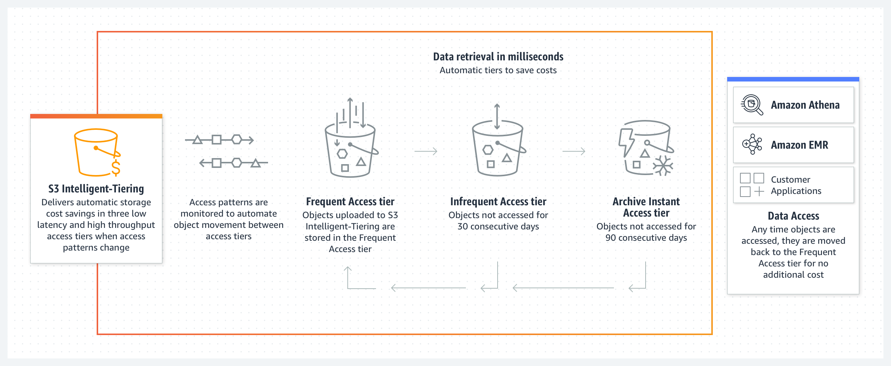
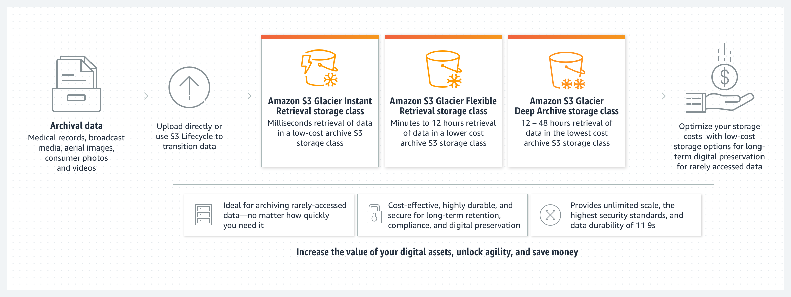

# Coursera: Architecting Solutions on AWS

See https://www.coursera.org/learn/architecting-solutions-on-aws/lecture/EwHiY/an-overview-of-data-analytics-on-aws.

## An Overview of Data Analytics on AWS

Data analytics is about using collected data to product information that would be useful for business needs. Those are called **insights**. If you control how the data is produced, then data analytics is dramatically easier, because you don't have to do any data transformation.

The number one tip is to think about how data is going to come into the architecture you're designing. Also, "use the right tool for the job". AWS has four categories of data services:

* Analytics
* Data movement
* Data lake
* Predictive analytics and machine learning

Sometimes the requirements & needs are satisfied by more than one AWS service. In those cases, it's time to call the customer to ask clarifying questions:

* What latency is acceptable between ingesting the data and making it available? Can the customer afford to wait some time to get the data?

* Where is the data coming from? Are we talking about a database migration, clickstream data ingestion, or batch file upload?

* Is this using software that the customer already has licenses and support for?

* Is this using the customer's own credential federation and existing identity provider?

## A Look into AWS Data Services

AWS provides various analytics services that meet your need for data analytics.

### Data lakes and data storage

#### Amazon S3

Amazon Simple Storage Service (Amazon S3) is an object storage service that offers scalability, data availability, security, and performance. Customers of any size or industry can store and protect data for use cases like data lakes, cloud-native applications, and mobile apps.

A data lake is a centralized repository that stores large amounts of data in its raw, original format, without pre-defined schemas or structure. A data lake can be used to run big data analytics, AI, ML, and HPC applications to unlock data insights.

#### Amazon S3 Glacier

Amazon S3 Glacier storage classes are purpose-built for data archiving. They provide unlimited scalability and are designed for 99.999999999% (11 lines) of data durability.

#### AWS Lake Formation

AWS Lake Formation is a service that you can use to set up a secure data lake in days.

### Data analytics

#### Amazon Athena

Amazon Athena is an interactive query service that you can use to analyze data in Amazon S3 by using SQL. Athena is serverless and straightforward. You point to your data in Amazon S3, define the schema, and start querying by using standard SQL.

#### Amazon EMR

Amazon EMR is a big data solution for petabyte-scale data processing, interactive analytics, and machine learning. It uses open-source frameworks like Apache Spark, Apache Hive, and Presto.

In this scenario, it's not a good candidate for the customer, because it requires a learning curve to operate the open-source frameworks that it uses.

#### Amazon OpenSearch Service

Amazon OpenSearch is an open source, distributed search and analytics suite that is dervied from Elasticsesarch. Amazon OpenSearch Service is the successor to Amazon Elasticsearch Service. It offers the latest versions of OpenSearch, support for 19 versions of Elasticsearch, and visualization capabilities that are powered by OpenSearch Dashboards and Kibana

### Data movement

#### Amazon Kinesis

Amazon Kinesis allows you to collect, process, and analyze real-time, streaming data so that you can get timely insights and react quickly to new information. Amazon Kinesis offers key capabilities to cost-effectively process treaming data at virtually any scale.

#### AWS Glue

AWS Glue is a serverless data integration service that you can use to discover, prepare, and combine data for analytics, machine learning, and application development. AWS Glue provides capabilities that are needed for data integration so that you can start analyzing your data and using your data in minutes.

Data integration is the process of preparing and combining data for analytics, machine learning, and application development. It involves multiple tasks, such as discovering and extracting data from various sources; enriching, cleaning, normalizing, and combining data; and loading and organizing data in databases, data warehouses, and data lakes.

#### AWS DMS

AWS Database Migration Service (AWS DMS) allows you to migration databases to AWS quickly and securely.

### Predictive analytics and machine learning

#### Amazon SageMaker

SageMaker can be used for any generic ML solution. You can use it to build, train, and deploy ML models for virtually any use case with fully managed infrastructure, tools, and workflows. There is a bit of a learning curve to SageMaker.

#### Amazon Rekognition

Amazon Rekognition is easy to use and serverless. You interact with it through a collection of API colls, so it's a bit abstracted.

Amazon Rekognition allows you to automate image and video analysis by tadding pretrained or customizable computer vision API operations to your own applications.

#### Amazon Comprehend

Amazon Comprehend is a natural-language processing (NLP) service that uses ML to uncover valauble insights and connections in text. As an example, you could mine business and call center analytics or process financial documents.

## Why Amazon S3 for Storage?

Amazon offers many storage options, including Amazon EFS, Amazon EBS, and Amazon S3.

**Why not Amazon EBS?** Amazon Elastic Block Store (Amazon EBS) is a service that provides block-level access when you need a file system. However, it does not align well with the customer's requirements.

Amazon EBS needs to have an EC2 instance attached. Additionally, you have to allocate storage capacity up-front, and you pay for your allocated storage. So if you allocate a 50-gigabyte volume, you'll pay for 50 gigabytes. Also, S3 replicates data across an entire AWS Region, while Amazon EBS does not support this replication.

**Why not Amazon EFS?** Amazon Elastic File System (Amazon EFS) can replicate data across an AWS Region, unlike Amazon EBS. However, it also needs to be attached to aresources like EC2, containers, or servers.

You can interact with Amazon S3 by doing API calls, and you can do these API calls from your laptop or a webpage or virtually everywhere. S3 is ideal for separating storage from data processing. Having a layer that stores only data is convenient because you can use different data-processing services or ingestion mechanisms.

## Amazon S3 Cross-Region Replication and Object Lifecycle

### S3 CRR

**S3 Cross-Region Replication (CRR)** allows you to replicate objects -- and their respective metadata and object tags -- into other AWS Regions for reduced latency, compliance, secure, and disaster recovery. CRR can be configured to replicat objects from a single source Amazon S3 bucket to one or more destination buckets in another AWS Region.

You can set up CRR to replicate at a bucket level, a shared prefix leve, or an object level.

### S3 Lifecycle

You can add rules in an S3 Lifecycle configuration to tell Amazon S3 to transition objects to another Amazon S3 storage class. This might be useful when you know that objects are infrequently access, so you might transition them to the S3 Standard-IA storage class. Or you might want to archive objects to S3 Glacier Flexible Retrieval storage class when you don't need to access them in real time.

What if you're not sure about the data access patterns?

#### Amazon S3 Intelligent-Tiering storage class

S3 Intelligent-Tiering is a good option for data with unknown, changing, or unpredicable access patterns.

S3 Intelligent-Tiering is the only cloud storage class that’s designed to deliver automatic storage cost savings when data access patterns change, without performance impact or operational overhead. It is designed to optimize storage costs by automatically moving data to the most cost-effective access tier when access patterns change.

There are no retrieval charges in S3 Intelligent-Tiering. S3 Intelligent-Tiering has no minimum eligible object size, but objects smaller than 128 KB are not eligible for automatic tiering.

#### Amazon S3 Glacier storage classes

You can use Amazon S3 Lifecycle policies to transition obejcts to Amazon S3 Glacier storage classes, which are purpose-built for data archiving.

## Next

https://www.coursera.org/learn/architecting-solutions-on-aws/lecture/bFJUZ/choosing-a-service-for-data-ingestion