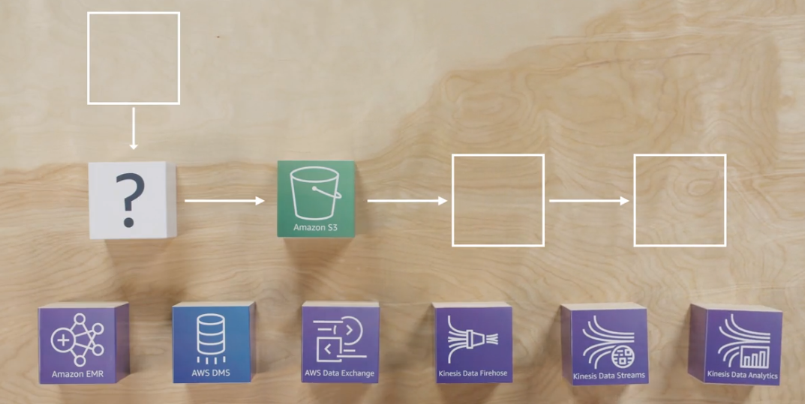

# Coursera: Architecting Solutions on AWS

See https://www.coursera.org/learn/architecting-solutions-on-aws/lecture/bFJUZ/choosing-a-service-for-data-ingestion.

## Choosing the Service for Data Ingestion

Now that we've chosen Amazon S3 for our data storage, we need to choose the service we will use for data ingestion. Amazon offers many options for this, each one tailored to a different use case. For this scenario, we will consider AWS Data Exchange, AWS DMS, Amazon EMR, Kinesis Data Firehose, Kinesis Data Streams, and Kinesis Data Analytics.

Clickstream ingestion can potentially be handle by using **Amazon EMR** with a managed Hadoop cluster and a streaming framework like Spark Streaming. While this would work, Amazon EMR runs within an EMR cluster, which charges per-time. It also requires extensive big data knowledge, which is not a good option for this customer currently operating with reduced staff.

Next, **AWS DMS** is a service for migrating databases into AWS. Because our data is clickstream data and does not involve databases, AWS DMS is also not a good candidate for this solution.

**AWS Data Exchange** is a data analytics service that provides data catalogs, and is more suitable for integrating third-party data into a data lake for further analysis. For that reason, it is also not being considered for this solution.

### Amazon Kinesis

So we're left with three **Amazon Kinesis** options. Amazon Kinesis is a family of services designed to ingest large amounts of small bits of data.

#### Amazon Kinesis Data Analytics

Amazon Kinesis Data Analytics is a service for real-time data processing of data that is being ingested. That processing can be data transformation, aggregation, filtering, cleaning, or any other manipulation. Because our customer owns the component that will be sending the clickstream data, we should not need any data transformation. Therefore, we will not use Kinesis Data Analytics here.

#### Amazon Kinesis Data Streams and Amazon Kinesis Firehose

One of the main differences between Kinesis Data Streams and Kinesis Data Firehose is that Kinesis Data Streams requires writing some additional code for the data producer and consumer, so it's less convenient than Kinesis Data Firehose, but it supports lower latency between the moments the data is ingested and when it is available for querying.

Kinesis Data Firehose can potentially take several *minutes* for the data to be available in the S3 bucket. Therefore, it would not be a good candidate for scenarios like real-time monitoring and metrics.

However, our customer is using it for asynchronous business insights, and they have confirmed that they don't need the data available immediately. Therefore, we will use **Kinesis Data Firehose**.

### Interacting with Amazon Kinesis

Lastly, we need a way to integrate with Amazon Kinesis. Amazon Kinesis exposes an API with calls like `PutRecord`. One option would be the **Amazon Cognito** service, but that's more for doing user authentication. Acting alone, Amazon Cognito would not give us the ability to send data to Amazon Kinesis.

Since the customer will send data from their own Javascript library, **API Gateway** is a good fit. It exposes a simple REST API, and it integrates with many AWS services, including Amazon Kinesis.

## Differences Between Amazon Kinesis Services

### Amazon Kinesis Family

The Amazon Kinesis family of services is used to ingest real-time data such as video, audio, application logs, website clickstreams, and Internet of Things (IoT) telemetry data. It is often used for analytics and machine learning. You can use Amazon Kinesis to process and analyze data as it arrives, which means that you can respond quickly instead of waiting until all your data is collected before it’s processed.

### Amazon Kinesis Data Streams

Amazon Kinesis Data Streams is designed to capture gigabytes of data per second from hundreds of thousands of sources. The data that’s collected is typically available in milliseconds, which means that you can use Kinesis Data Streams for real-time analytics, such as real-time dashboards, real-time anomaly detection, and dynamic pricing.

### Amazon Kinesis Data Firehose

Amazon Kinesis Data Firehose is designed to reliably load streaming data into data lakes, data stores, and analytics services. It can capture, transform, and deliver streaming data to Amazon Simple Storage Service (Amazon S3), Amazon Redshift, Amazon Elasticsearch Service, generic HTTP endpoints, and service providers like Datadog, New Relic, MongoDB, and Splunk.

Firehose is a fully managed service that automatically scales to match the throughput of your data and requires virtually no ongoing administration. It can also batch, compress, transform, and encrypt your data streams before loading, which minimizes the amount of storage that you use and increases security.

While it’s easier to operate than Amazon Kinesis Data Streams, Kinesis Data Firehose delivery streams have a higher latency from the moment that data is ingested. You can set the batch interval to **60 seconds** if you want to receive new data within 60 seconds of sending it to your delivery stream. However, you could have latencies that are lower than 1 second when you use Amazon Kinesis Data Streams.

### Amazon Kinesis Data Analytics

Amazon Kinesis Data Analytics is designed to transform and analyze streaming data in real time with Apache Flink, an open-source framework and engine for processing data streams.

Amazon Kinesis Data Analytics reduces the complexity of building, managing, and integrating Apache Flink applications with other AWS services. Amazon Kinesis Data Analytics is designed to take care of everything that’s required to run streaming applications continuously. With Amazon Kinesis Data Analytics, there are no servers to manage, no minimum fee or setup cost, and you only pay for the resources that your streaming applications consume.

### Amazon Kinesis Video Streams

Amazon Kinesis Video Streams is designed to securely stream video from connected devices to AWS for analytics, machine learning (ML), and playback. Kinesis Video Streams automatically provisions and elastically scales the infrastructure that’s needed to ingest streaming video data from millions of devices. It’s designed to durably store, encrypt, and index video data in your streams, and you can access your data through the Kinesis Video Streams APIs.

You can also use Amazon Kinesis Video Streams to quickly build applications for computer vision or video analytics through integration with Amazon Rekognition Video and libraries for ML frameworks (i.e. Apache MXNet, TensorFlow, and OpenCV). Kinesis Video Streams also supports WebRTC, an open-source project that uses APIs to facilitate real-time media streaming and interaction between web browsers, mobile applications, and connected devices. Typical uses for WebRTC include video chat and peer-to-peer media streaming.

## Next

https://www.coursera.org/learn/architecting-solutions-on-aws/lecture/KDPHK/accessing-the-ingested-data