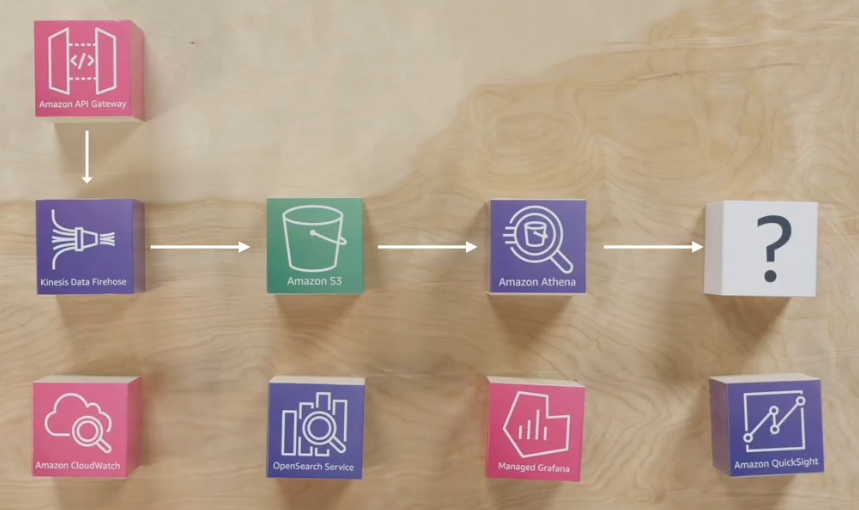

# Coursera: Architecting Solutions on AWS

See https://www.coursera.org/learn/architecting-solutions-on-aws/lecture/KDPHK/accessing-the-ingested-data.

## Accessing the Ingested Data

Separate data storage from processing is important, because we can then use the right tool for the job. In our case, we want to process clickstream data that sits in S3 with large amounts of small files. Candidates are:

* Amazon S3 Select
* AWS Glue
* Amazon EMR
* Amazon Athena

**Amazon S3 Select** can perform SQL queries to filter the contents of S3 objects. It meets customer requirements because it is serverless and managed. However, S3 Select queries can only be run on one file, not lots of small files. This won't work, unless we intend to run something else to aggregate the clickstream data.

How about **AWS Glue** or **Amazon EMR**? These services are especially useful for processing unstructured data using big data frameworks. They could be used for converting data formats, performing data aggregation, or using AI/ML when processing data. None of these are a current need for our solution.

Additionally, these services have a bit of a learning curve, which doesn't align with our customer's requirement to keep the architecture minimal due to reduced staff, cost, and maintenance.

This leaves **Amazon Athena** as the best choice. According to the [Amazon Athena](aws.amazon.com/athena) website:

> "Amazon Athena is an interactive query service that simplifies data analysis in Amazon S3 using standard SQL. Athena is serverless, so there is no infrastructure to set up or manage, and you only pay for the resources your query needs to run."

It's important to note that Amazon Athena does not make a copy of your data. Instead, the data remains on S3, still providing a centralized data repository, and allowing us to use the best tool for the job.

## Exploring Amazon Athena

Athena is extremely easy to use. You create tables, and you point the tables to S3 buckets. The S3 buckets must have files that are in one of the standardized formats that Athena understands (like CSV, JSON, or Paraquet, which is a coluumnar data storage).

Once you have the files in the bucket and the Athena table correctly configured to know where to look, you can start querying the data, and even joining multiple Athena tables.

## Visualizing the Data

Our data analytics architecture is almost ready. We have decided to use API Gateway, Amazon Kinesis Data Firehose for data ingestion, Amazon S3 for storage, and Amazon Athena for acquiring the data. Now, it is time to add a data visualization layer to complete the solution.

There are multiple data visualization options in AWS. Candidates include:

* Amazon CloudWatch
* Amazon OpenSearch Service
* Amazon Managed Grafana
* Amazon QuickSight

**Amazon CloudWatch** offers dashboards, which is why it could be considered for data visualizations. However, Amazon CloudWatch is primarily a monitoring service for *operational* metrics. This includes data like CPU utilization for EC2 instances, number of objects in an S3 bucket, and other data related to the operation of the services.

Although it can be used to create alarms and detect anomalous data, it is not designed for BI as part of a data analytics architecture.

**Amazon OpenSearch Service** is a search and analytics suite for a wide variety of use cases. However, when an OpenSearch cluster is created, it comes with storage and processing power embedded. We want to use Amazon S3 for storage. Additionally, the embedded processing of OpenSearch Service likely means higher costs than another data visualization service.

**Amazon Managed Grafana** is an open-source analytics platform that can query, visualize, alert, and understand your metrics. Grafana really shines when you need to visualize time series data. Time series databases are built specifically for handling metrics or measurements that are timestamped.

Our clickstream data may be time series data, so it could work here.

One other offering is **Amazon QuickSight**, which is a data visualization service that integrates with other AWS services like Amazon Athena. Amazon QuickSight has no servers to manage, offers a pay-per-use pricing model, and provides native AWS service integrations with built-in security.

We have settled on Amazon QuickSight, because our customer is already using it for other projects. This works well, since the BI team is already familiar with the tool.

## Next

https://www.coursera.org/learn/architecting-solutions-on-aws/supplement/3TIPS/amazon-quicksight-features