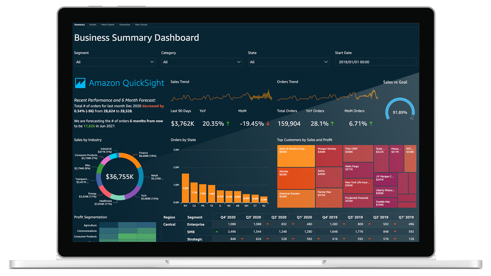
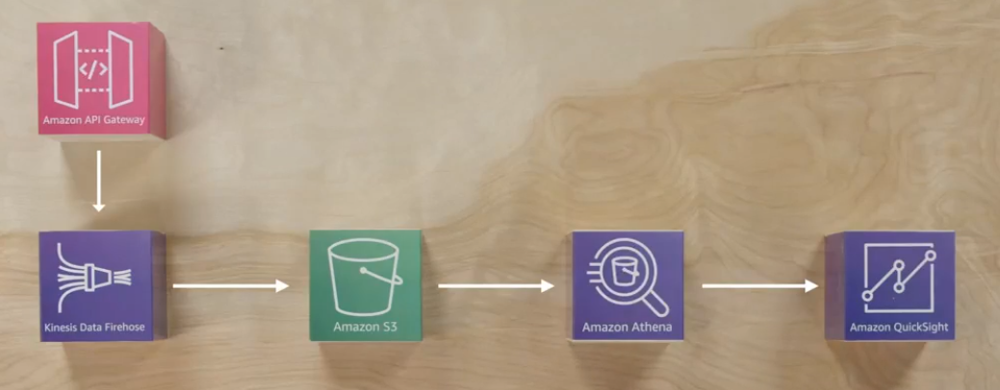
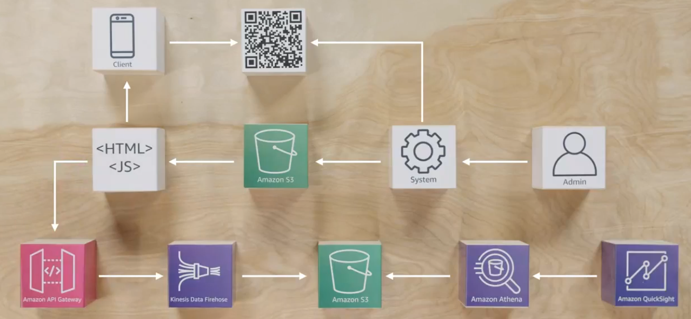
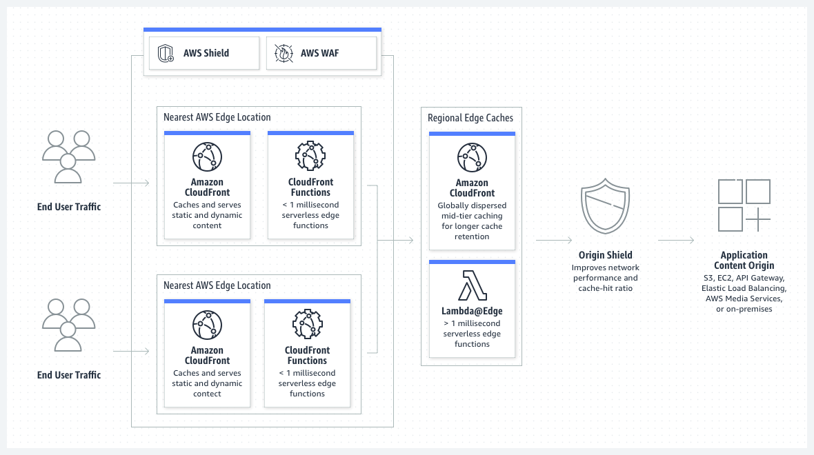

# Coursera: Architecting Solutions on AWS

See https://www.coursera.org/learn/architecting-solutions-on-aws/supplement/3TIPS/amazon-quicksight-features.

## Amazon QuickSight Features

Amazon QuickSight allows users to explore interactive dashboards and ask questions about the data using natural language. QuickSight automatically looks for patterns and outliers, a feature powered by machine learning.

QuickSight offers several benefits:

* Connect and scale all your data
  * Connects to data in AWS, in third-party cloud service providers, or on premises
  * Use SPICE (Super-fast, Parallel, In-memory Calculation Engine) storage to scale data exploration
* Build customizable dashboards
  * The dashboards can deliver personalized email reports and alerts to end users
* Use machine learning (ML) integrations for insights
  * Use Anomaly Detection to analyze data for anomalies and variations.
  * Forecast business metrics and perform interactive what-if analyses
* Enable self-service business intelligence (BI)
  * Dive deep into data through simple questions, without BI training
  * Create visual analyses of data by using a web-based authoring interface
  * Embed QuickSight capabilities in applications for data-driven user experiences
* Use native integration with AWS
  * Use private VPC connectivity for secure AWS access to Amazon Redshift, Snowflake, RDS, and more
  * Use native AWS IAM permissions for Amazon S3 and Amazon Athena
* Take advantage of no servers to manage, and paying by usage
  * Automatically scales to hundreds of thousands of users with high availability
  * Provides consistent, fast response times for end users and analysts through the auto-scaling capabilities of SPICE storage
  * Optimizes the costs through pay-per-session model to pay for actual usage
* Take advance of built-in security, governance, and compliance
  * Use end-to-end data encryption, along with encryption at rest for data in SPICE
  * Use row-level and column-level security with API support for control at the user or group level.

## Consider this Scenario

> You are a solutions architect who is working with a customer to design solutions on AWS to meet their business needs. Your customer wants to create a solution for ingesting data into a data lake on AWS. This data lake must be scalable and highly available. It must also be able to store both structured and unstructured data in the same storage location. After the data is stored, it will need to be transformed into different formats so that it can be used for analytics and to derive insights. The customer wants to store raw data without any modification, and they also want to store processed data in a separate location.

To meet the customer’s requirements for a scalable, highly available data lake that supports both structured and unstructured data, Amazon S3 (Simple Storage Service) is the foundational choice for storage. S3 is designed for 99.999999999% durability and offers virtually unlimited scalability, making it ideal for storing raw and processed data in separate S3 prefixes or buckets (e.g., s3://datalake/raw/ and s3://datalake/processed/). It supports all types of data formats—from CSV and JSON to images and video files—making it suitable for both structured and unstructured data.

For data ingestion, Amazon Kinesis Data Firehose or AWS Glue can be used depending on the source and format of the incoming data. Kinesis Data Firehose is a fully managed service that can automatically ingest and deliver streaming data into S3 with optional transformation via AWS Lambda. This is ideal for real-time data sources. For batch ingestion or data coming from sources like databases, files, or APIs, AWS Glue provides managed extract, transform, and load (ETL) capabilities. It can crawl the raw data in S3 to infer schema and catalog metadata, which is then made available through the AWS Glue Data Catalog, a central metadata repository integrated with analytics tools.

To transform and process data into different formats (e.g., converting CSV to Parquet for efficient querying), AWS Glue jobs or Amazon EMR (Elastic MapReduce) can be utilized. Glue offers serverless ETL capabilities using Python or Scala and works well for moderate-scale transformations. For large-scale or custom processing using frameworks like Apache Spark or Hive, Amazon EMR offers more control and power. The transformed data can be written back to the "processed" S3 location.

Once the data is processed, analytics can be performed using Amazon Athena, which allows users to run SQL queries directly on S3-stored data, or Amazon Redshift Spectrum for queries that span Redshift-managed data and external data in S3. These services natively integrate with the Glue Data Catalog for schema discovery, ensuring seamless querying capability without data movement.

In summary, Amazon S3 provides the core storage layer for the data lake, AWS Glue or Kinesis Data Firehose handles ingestion and transformation, and Athena or Redshift enables analytics.

## Customer #2: Solution Overview

As a recap, the customer has a clickstream data JavaScript library, and they need an HTTP endpoint where they can send their data for analysis on the backend.

API Gateway provides the HTTPS endpoint, and Amazon Kinesis Data Firehose is the data ingestion mechanism. We don't want to expose Kinesis Data Firehose API endpoints on the internet.

API Gateway also allows them to specify their custom domain name and set custom certificates, without needing to modify their JavaScript code.

The data is sent from Firehose to S3. S3 is a good option, because it's a fully-managed service. It is detached from any processing or compute or visualization layer.

The S3 bucket is connected to Amazon Athena, so that we can use standardized SQL queries for processing the data.

**What if the data arrives in the wrong format?** There are a couple of options:

* There is some opportunity for data manipulation within Kinesis Data Firehose.

* There's also the opportunity to use an S3 feature called Bucket Actions, which would allow us to run a Lambda function on every S3 `PutObject` call, so we could sanitize the data then.

## Architecture Optimizations for Week 2

If we look at the customer's solution, there are several places for potential optimization. Many of these would target the JavaScript library and the menu-serving components, areas that we did not previously look into.

### Serverless on AWS

The system that generates QR codes currently runs on an EC2 instance. This means that the customer is incurring costs even when the solution is not being used, like overnight.

To address this, we could potentially switch that to AWS Lambda, an event-driven compute service that natively integrates with AWS services and SaaS applications.

### Amazon CloudFront

Also, instead of having the JavaScript library pull directly from the S3 bucket to retrieve restaurant menus, we could have it interact with Amazon CloudFront. CloudFront speeds up distribution of dynamic & static web content by caching the data in a worldwide network of data centers that are called edge locations.

Amazon CloudFront allows custom SSL certificates, custom domain names, and further DDoS protection powered by AWS WAF and AWS Shield.

### Amazon Cognito

We chose API Gateway, because the customer did not want to modify their current JavaScript library, and they requested an HTTP endpoint.

However, Amazon Cognito can be used to add user sign-up, sign-in, and access control to web applications and mobile apps. It scales to millions of users and supports sign-in with social identity providers like Apple, Facebook, Google and Amazon. It also supports enterprise identity providers through SAML 2.0 and OpenID Connect.

With Amazon Cognito, the mobile JavaScript library can assume a role with a web identity. That role would have a strict policy associated with it—for example, the policy could allow only the PutRecord API operation on a specific Kinesis data stream.

### Amazon CloudFormation and Infrastructure as Code (IAC)

Transforming the entire environment into a template could allow for creating replications fro each of the customer's clients. This can be achieved with AWS CloudFormation.

CloudFormation helps you model and set up your AWS resources so that you can spend less time managing those resources, and more time focusing on your applications that run in AWS. You create a template that describes all the AWS resources that you want, and CloudFormation provisions and configures those resources for you.

Creating infrastructure templates is important because you can replicate customer workloads across multiple AWS accounts or Regions.

### Error retries and exponential backoff in AWS

Numerous components on a network—such as DNS servers, switches, load balancers, and others—can generate errors anywhere in the life of a given request. The usual technique for dealing with these error responses in a networked environment is to implement retries in the client application. This technique increases the reliability of the application and reduces operational costs for the developer.

If you are using one of the AWS SDKs, they already practice exponential backoffs by default. This default behavior would be one benefit of using Amazon Cognito on the client side to send data to Kinesis, instead of using a custom routine that sends data to API Gateway. You should implement a maximum delay interval and a maximum number of retries. The maximum delay interval and maximum number of retries are not necessarily fixed values. These values should be set based on the operation that’s being performed and other local factors, such as network latency.

### Data optimizations for Amazon Athena

The top three data best practices for Athena are compressing, partitioning, and converting your data into columnar formats.

Amazon Athena is a service that charges per amount of data scanned. By compressing the data, we reduce file sizes, which means Athena scans less data per query.

Another common practice is to partition the data based on time, which often leads to a multi-level partitioning scheme.

One other strategy is to use an AWS service to convert bucket data into columnar data formats. If the data is being provides to S3 as XML or JSON, it could be converted to Apache Parquet or ORC for fast retrieval of data by AWS analytical applications.

## Build a Proof of Concept

See https://aws-tc-largeobjects.s3.us-west-2.amazonaws.com/DEV-AWS-MO-Architecting/exercise-2-analytics.html.

## Next

https://www.coursera.org/learn/architecting-solutions-on-aws/lecture/ijWr9/week-3-introduction