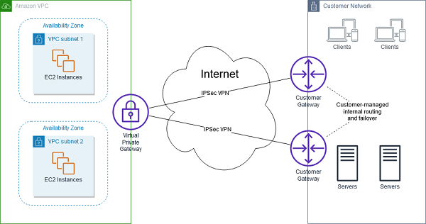

# Coursera: Architecting Solutions on AWS

See https://www.coursera.org/learn/architecting-solutions-on-aws/lecture/ijWr9/week-3-introduction.

## Week 3 Introduction

In this week's scenario, the enterprise customer is working on migrating some containers to AWS. In this case, we will focus on specific aspects of the architecture without diving into other aspects. Actually solving this problem in real life would be much more complicated, and we would likely see the requirements shift over time.

## Use Case and Requirements

The customer is an insurance company that has been migrating workloads to AWS as data contracts expire. About half of their contracts are expired, and they would like to move those into AWS now. They will need to have a connection between their AWS services and the on-premise services. Also, they want to have the lowest latency possible between these two environments.

The on-premises services will create data that needs to be accessed in AWS, so they would like to store those files in AWS.

The customer's services are all running in containers, and they would like the containers' orchestrators to be the same between environments. The databases are **not** running in containers. They do not want to change this when they move the databases to AWS.

## Requirements Breakdown

* The customer is running containers on-premises.
* The customer is also running PostgreSQL databases on-premises.
* Half of the workloads are running in data centers with their contracts expiring. The other half of the applications will remain on-premises until the data center contracts expire.

Requirements:
* We need to host PostgreSQL on AWS.
* We want orchestration tools that can work both on-premises and in AWS.
* We want the containers on-premises to be able to access the data in AWS.
* The customer wants to optimize for resilience and fault-tolerance.

## Hybrid Networking and Connectivity Services

We have the customer data center, and we have the AWS cloud. For hosting the data in AWS cloud, we'll have **one VPC** in **one AWS account**. The customer specified that they have applications that do not need internet connectivity, so we'll handle that by utilizing more private subnets than public subnets.

We will not be using the public internet for connectivity between the data center and the AWS cloud, because:
* Non-encrypted connections are not secure.
* Throughput is shared.

Another alternative would be **AWS Virtual Private Network (VPN)**. VPNs are a popular way to securely connect two different networks. AWS VPN is comprised of two different services:
* AWS Site-to-Site VPN
* AWS ClientVPN

AWS Site-to-Site VPN is used to connect a remote network, like a data center, to a VPC or AWS Transit Gateway. So this would allow resources living in a customer-managed data center to connect to AWS:

Then there's AWS Client VPN. This is for connecting administrators or clients to an AWS VPN or a data center:

AWS VPNs are still at the will of the internet, so if bandwidth is not available, throughput will be lower. One other option is AWS Direct Connect, which is a **dedicated** private connection to AWS through a Direct Connect Delivery Partner or through AWS:

The data never hits the public internet. This reduces the chance of hitting bottlenecks or unexpected increases in latency.

## Hybrid Networking and Connectivity

After considering multiple architecture choices, we chose AWS Direct Connect because of the requirement for consistent, dedicated throughput for the high volume of data that flows between the data center and AWS.

### AWS Direct Connect

When you create a new connection on AWS Direct Connect, you can  choose between a hosted connection that's provided by an AWS Direct Connect Delivery Partner or by AWS directly. With AWS Direct Connect SiteLink, you can send data between AWS Direct Connect locations to create a private network connection between offices or data centers.

Each AWS Direct Connect connection consists of a single dedicated connection between ports on your router and an AWS DIrect Connect device. Establishing a second connection is recommended for redundancy.

An alternative is to have a backup IPsec VPN connection, so the VPC traffic can fail over to the VPN connection automatically. In this case, traffic to or from public resources, such as S3 buckets, will be routed over the internet. If a backup AWS Direct Connect link or IPsec VPN link is not used, then Amazon VPC traffic will be dropped if a failure occurs.

### AWS Managed VPN

#### AWS Site-to-Site VPN

To establish a connection between an on-premises network and an AWS VPC over public internet, an AWS Site-to-Site VPN connection is an option. This is an IPsec VPN connection.

The **virtual private gateway** is the VPN concentrator on the Amazon side of the Site-to-Site VPN connection. A virtual private gateway is attached to the VPC where you want to create a Site-to-Site VPN connection.

A virtual private gateway also supports and encourages multiple user gateway connections for redundancy and failover on the on-premises network side of the VPN connection:

A **customer gateway** is the physical or software application that you own or manage in your on-premises network to work with the Site-to-Site VPN connection.

#### AWS Client VPN

AWS Client VPN is a fully managed, remote-access VPN solution that the remote workforce can use to securely access resources within both AWS and the on-premises network. AWS Client VPN supports the OpenVPN protocol.

### AWS Transit Gateway

AWS Transit Gateway connects your VPCs and on-premises networks through a central hub. This arrangement simplifies your network and minimizes complex peering relationships. Transit Gateway acts as a cloud router -- each new connection is made only once.

#### Without AWS Transit Gateway

Consider the following solution, which shows how an on-premises network would connect to four AWS VPCs without using AWS Transit Gateway:

This is complex and can be difficult to manage.

#### With AWS Transit Gateway

By using AWS Transit Gateway, you can make the network easier to manage. Transit Gateway is the hub for the connections between the different networks. You can apply route tables so that the transit gateway can connect networks to each other in a more centralized manner:

Each transit gateway can manage multiple VPCs within one AWS region.

## Next

https://www.coursera.org/learn/architecting-solutions-on-aws/lecture/SRyYi/running-containers-on-aws