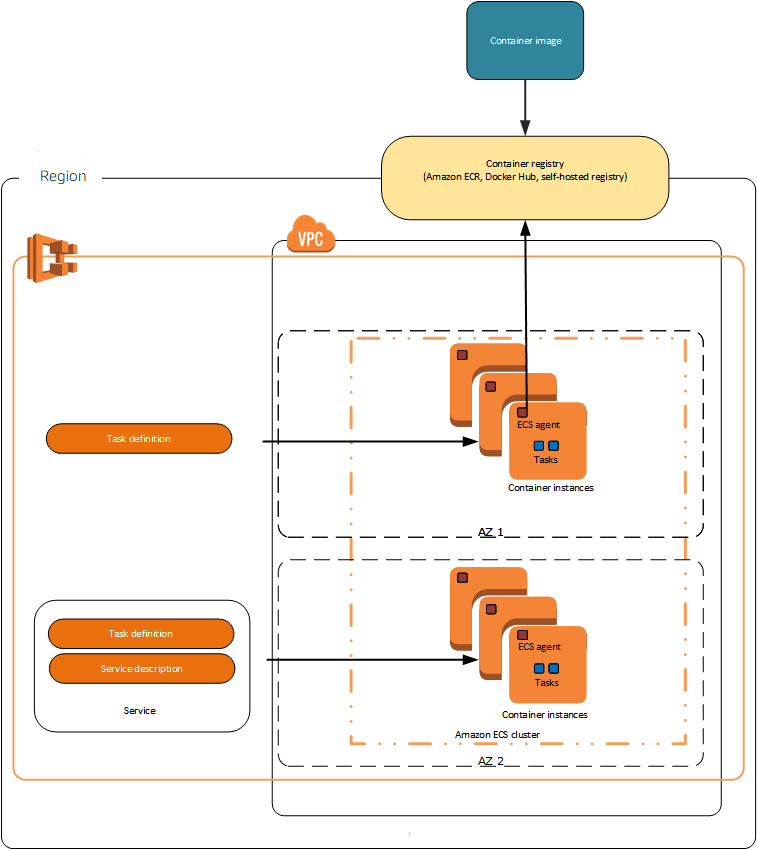
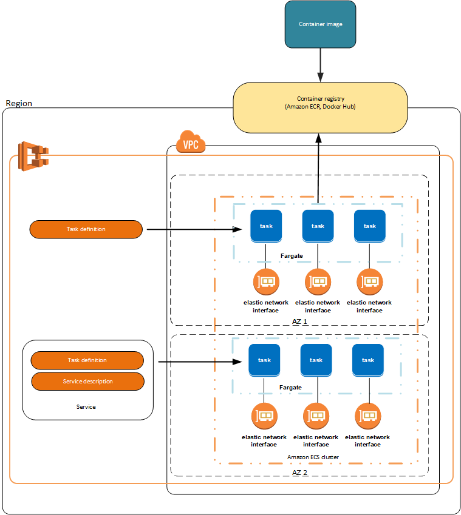
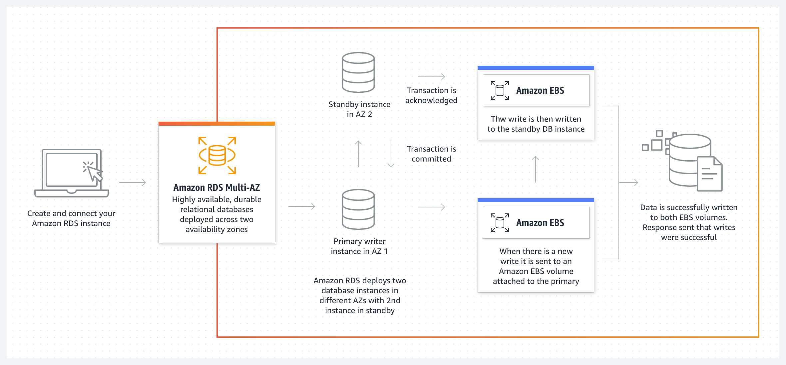

# Coursera: Architecting Solutions on AWS

See https://www.coursera.org/learn/architecting-solutions-on-aws/lecture/SRyYi/running-containers-on-aws.

## Running Containers on AWS

AWS offers two container orchestration services -- Elastic Kubernetes Service (EKS) and Elastic Container Service (ECS). These run on top of a computer platform, either an EC2 instance or an AWS Fargate Cluster.

**AWS EKS** is most often chosen by customers who are already running Kubernetes on-premises, or by customers who want the flexibility to run their containers anywhere. This flexibility comes at the cost of a steep learning curve.

**AWS ECS** was designed for **simplicity**. ECS is built to integrate with other AWS services natively, so there is no additional effort to create custom integrations.

Then for the compute platform, **EC2** is more on the "control" end of the control vs. convenience spectrum. It allows you to choose your AMI for your cluster, and you control the patching and scaling of the cluster. You also have the ability to SSH into the cluster, if desired and needed.

By comparison, a **Fargate** cluster does not have these options. It is much simpler to setup, but you cannot choose your AMI or use SSH.

Based on discussions with the customer, they shied away from Kubernetes in the past, due to its complexity. Also, they would like the ability to SSH into their cluster, since that's how they currently perform many of their support tasks. Therefore, we are recommending **ECS** running on **EC2**.

### NAT Gateway

Lastly, the customer will need the ability to access the internet from their EC2 instances. This can be done by a NAT Gateway or NAT Instance.

A **NAT Instance** is NAT software running on an underlying EC2 instance. Its performance and throughput is based on the type and size of the underlying EC2 instance.

NAT instances are not inherently redundant, so you would need to run multiple NAT instances in different Availability Zones to ensure redundancy. Also, failover doesn't happen automatically, so you would typically need to manage it with scripts.

The alternative is a **NAT Gateway**, which is a managed service by AWS. You will want to deploy one NAT Gateway per availability zone, so that the workload is AZ independent (that's true for most services that go within a VPC).

Given the customer's desire for high availability, we recommend using NAT Gateways for this solution.

## Running Containers on AWS and NAT Gateways

This week's customer does not require **inbound** traffic from the internet to their containers or EC2 instances. However, they may require **outbound** traffic from the EC2 instances, so they can perform tasks like downloading upgrades from the internet.

We ultimately settled on using **ECS** running on **EC2**. Let's explore all of the options that are available, and the benefits of each one.

### ECS Launch Types

There are two possibilities for how to launch containers -- either on an EC2 cluster or on a Fargate cluster.

With EC2, an instance of the ECS Agent is running on each of the EC2 nodes:

The ECS Agent enables the orchestration tool that Amazon ECS uses to manage the nodes.

By comparison, AWS Fargate is the serverless way to host your Amazon ECS workloads. Below is the architecture when using AWS Fargate:

### NAT Devices

You can use a NAT device to allow resources in private subnets to connect to the internet, other VPCs, or on-premises networks. These instances can communicate with services outside the VPC, but they can’t receive unsolicited connection requests.

You can use a managed NAT device that’s offered by AWS, which is called a *NAT gateway*. You can also create your own NAT device on an EC2 instance, which is called a *NAT instance*.

It is recommended to use NAT gateways, because they provide better availability and bandwidth, and administering NAT gateways requires less effort on your part. You can manage how the traffic flows from the private resources to the NAT device by using route tables.

## Amazon RDS

The customer would like to migrate their on-premises PostreSQL databases to AWS. For that, we are recommending Amazon Relational Database Service (RDS).

### Multi-AZ Support

With Amazon RDS, you need to be explicit to ensure your RDS database has multi-AZ support.

In a Multi-AZ deployment, Amazon RDS automatically creates a primary database (DB) instance and synchronously replicates the data to an instance in a different Availability Zone. When it detects a failure, Amazon RDS automatically fails over to a standby instance without manual intervention. This failover mechanism meets the customer’s need to have a highly available database.

If desired, you could even deploy to more than two Availability Zones for additional redundancy.

### Read Replicas

Amazon RDS read replicas provide enhanced performance and durability for Amazon RDS DB instances. For read-heavy database workloads, read replicas make it easier to elastically scale out beyond the capacity constraints of a single DB instance.

So you might use a read replica for handling requests from Business Intelligence (BI) queries and reporting, since those tend to be read-only. Then you could use the primary instance for handling queries from the business application.

### Scaling Amazon RDS instances

#### Scale up vertically

When you want to scale your DB instance, you can vertically scale the instance and choose a larger instance size. This might be the route you choose to take when you need more CPU and storage ability for an instance.

#### Use read replicas

If you need more CPU capabilities but don’t need more storage, you might choose to create read replicas to offload some of the workload to a secondary instance.

#### Enable RDS Storage Auto Scaling

If you need more storage, but don’t need more CPU, then you could scale the storage horizontally. This can be done with **RDS Storage Auto Scaling**, which automatically scales storage capacity in response to growing database workloads, with virtually zero downtime.

#### Change the storage type for increased performance

For better performance, one additional option is to use a different storage type. The three storage types are:

* **General Purpose SSD**: Cost-effective storage that works well for a broad range of workloads.

* **Provisioned IOPS**: Designed to meet the needs of I/O-intensive workloads.

* **Magnetic**: Supported for backward compatibility. This is a very cost-effective option, but it also offers low performance.

## Next

https://www.coursera.org/learn/architecting-solutions-on-aws/lecture/zFQRc/where-should-our-customer-store-their-data