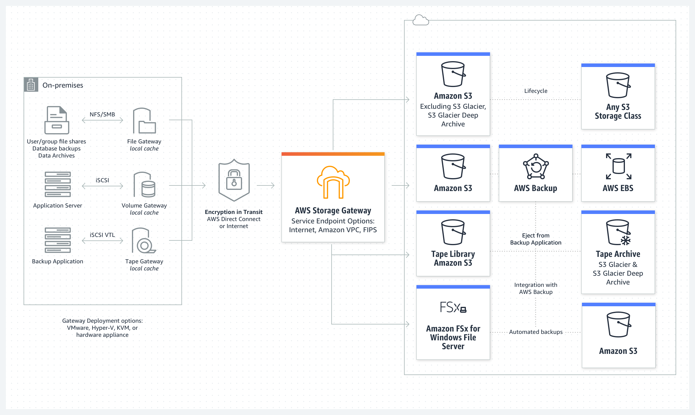
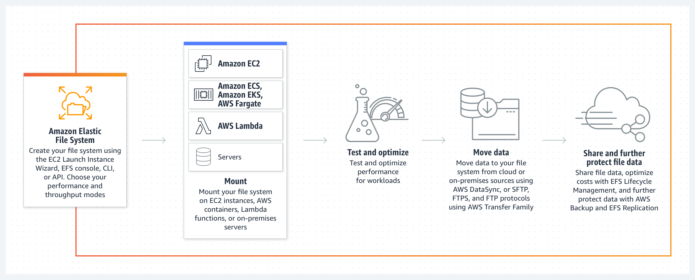

# Coursera: Architecting Solutions on AWS

See https://www.coursera.org/learn/architecting-solutions-on-aws/lecture/zFQRc/where-should-our-customer-store-their-data.

## Where Should Our Customer Store Their Data?

### Available options on AWS

AWS offers several options for storing data:

* **Amazon S3**
  * Object storage
  * Managed service
  * REST API for accessing and modifying data
  * Offers scalability and lifecycle management

* **Amazon Elastic File System (EFS)**
  * Managed file storage
  * NFS protocol
  * Automatic scaling up and down

* **Amazon FSx**
  * Managed file storage
  * Support for file systems like NetAPP ONTOP, OpenZFS, Windows File System, and Lustre

* **Amazon Elastic Block Storage (EBS)**
  * Block storage
  * Must be attached to an EC2 instance
  * Multiple sizes and types for different use cases

### Additional information from our customer

* The data is generated by the applications and stored on a file system.
* The data is **used** mostly for business analytics and machine learning, which are the applications that will be migrated to AWS.
* Would like to have lifecycle management. The data is typically used extensively for a few weeks after creation, then a couple of times for the next few months, and then not used after a year.
* Protocol used on-premises is a Linux File System with **NFS**.
* They intend to eventually refactor their applications to use cloud-native storage options.
* They would like the lowest possible latency for **writing** files.

### Proposed Solution

If we were to use EFS for storage, latency would potentially be a problem on the data writes. The write would need to wait for the data to traverse the internet, and then for the response to come back. This could introduce additional latency, especially with large files.

Another good option woudl be to use **AWS Storage Gateway**, which is a local caching solution to eliminate latency. Additionally, we can continue to support the NFS protocol, while having S3 as our storage solution.

## Hybrid Solutions and Connectivity Services

## AWS Storage Services

### AWS Storage Gateway

AWS Storage Gateway connects an on-premises software appliance with cloud-based storage to provide near-seamless integration with data security features between your on-premises IT environment and the AWS storage infrastructure. You can use the service to store data in the AWS Cloud for scalable and cost-effective storage that helps maintain data security.

### Amazon S3 File Gateway

Amazon S3 File Gateway supports a file interface into Amazon S3, and it combines a service and a virtual software appliance. By using this combination, you can store and retrieve objects in Amazon S3 by using industry-standard file protocols, such as NFS and Server Message Block (SMB).

### Amazon EBS

An Amazon Elastic Block Store (Amazon EBS) volume is a durable, block-level storage device that you can attach to your Amazon Elastic Compute Cloud (Amazon EC2) instances. After you attach a volume to an instance, you can use it as you would use a physical hard drive.

Note that the number of available IOPs increases with the size of the volume. Thus, if you need more IOPs, you must vertically scale the volume.

### Amazon EFS

Amazon Elastic File System (Amazon EFS) provides a simple, serverless elastic file system that you can use with AWS Cloud services and on-premises resources. It is built to scale on demand to petabytes without disrupting applications.

### Amazon S3

Amazon S3 is an object storage service that stores data as objects within buckets. An *object* is a file and any metadata that describes the file. A *bucket* is a container for objects.

If the access patterns for the data are changing or unknown, you can store data in S3 Intelligent-Tiering, which optimizes storage costs by automatically moving your data between four access tiers when your access patterns change. These four access tiers include two low-latency access tiers, which are optimized for frequent and infrequent access. The four access tiers also include two opt-in archive access tiers that are designed for asynchronous access to rarely accessed data.

## Next

https://www.coursera.org/learn/architecting-solutions-on-aws/lecture/6x2Dn/hybrid-solutions-on-aws