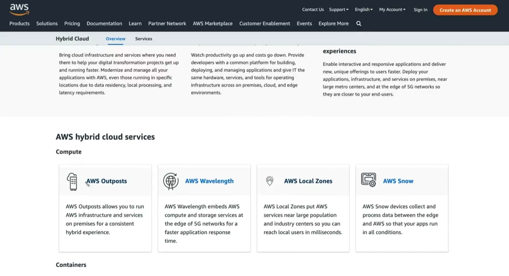
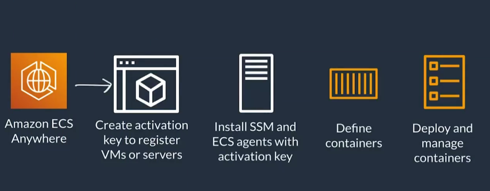
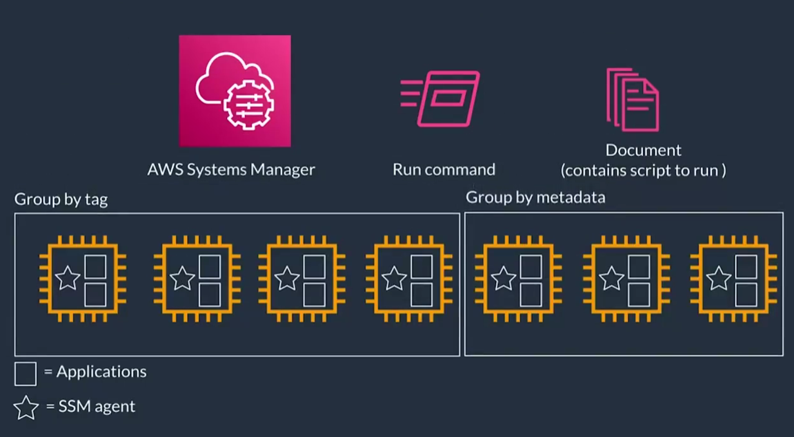
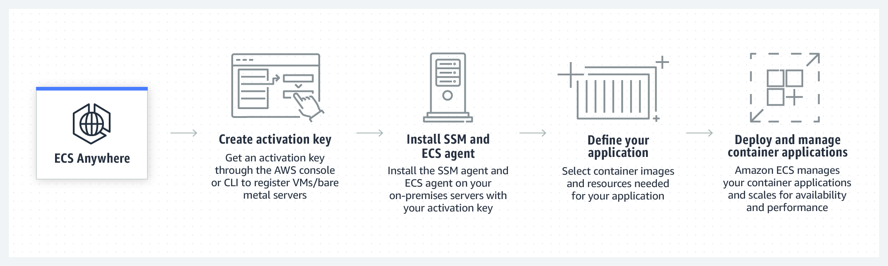
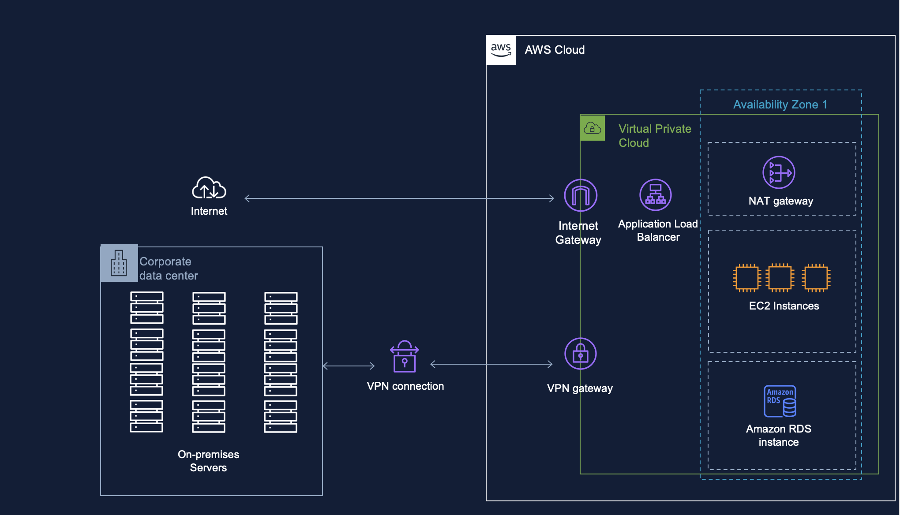

# Coursera: Architecting Solutions on AWS

See https://www.coursera.org/learn/architecting-solutions-on-aws/lecture/6x2Dn/hybrid-solutions-on-aws.

## Hybrid Solutions on AWS

AWS offers many services and tools for managing hybrid deployments that exist both on AWS and on-premises. These services are listed on the website aws.amazon.com/hybrid.

**AWS Outposts** involves the deployment of actual AWS hardware to your on-premises data center. As a result, you have the ability to use AWS features like AWS ECS for your local deployments. This is useful for highly-regulated industries where the components have to run from a specific location.

**AWS ECS Anywhere** and **AWS EKS Anywhere** allow you to define and deploy containers on-premises.

For storage, AWS offers **AWS Storage Gateway**, which we discussed previously. There's also **AWS Backups**, which makes it easy to manage the backup of data across environments. This could be a good option for our customer.

For management, there are services like **AWS Directory Services**, **AWS IAM**, **Amazon Cloudwatch**, and **AWS X-Ray**. There is also **AWS System Manager**, which is all about tracking and resolving operational issues **at-scale** across AWS and on-premises environments.

As long as the instances have the SSM agent installed on them, it's easy to run a specific script or command on a specific subset on those instances:

## AWS Systems Manager

AWS Systems Manager is a big collection of services to help you gain operational insights and take actions on your resources. The services are broken up into categories.

With **Operations Management Explorer**, we can quickly configure dashboards related to operations across accounts or regions.

**AWS Systems Manager Parameter Store** allows us define key-value pairs to make the system easily configurable. For example, we could define the name of an S3 bucket here, since renaming a bucket is not easily achievable.

With **Change Management's** **Maintenance Window**, we can select or create a maintenance window during which we can execute tasks on our fleet of instances. We can also select or define tasks that will run during those maintenance windows. This can be a good approach to patching instances.

## AWS Services for Hybrid Deployments

### Amazon ECS Anywhere

Amazon ECS Anywhere allows you to run and manage container workloads on customer-managed infrastructure. Cluster management, workload scheduling, and monitoring will be similar to what you already know from Amazon ECS. Amazon ECS Anywhere can help you meet compliance requirements and scale your business while retaining your on-premises investments.

### AWS Systems Manager

AWS Systems Manager gives visibility and control of your infrastructure on AWS. It provides a unified user interface that you can use to view operational data from multiple AWS services and automate operational tasks across your AWS resources.

With Systems Manager, you can group resources—such as Amazon Elastic Compute Cloud (Amazon EC2) instances, Amazon Simple Storage Service (Amazon S3) buckets, or Amazon Relational Database Service (Amazon RDS) instances—by application. You can also view operational data for monitoring and troubleshooting, and take action on your groups of resources.

## Review the Architecture Diagram

What recommendations would you make to improve the resilience of this architecture?

This architecture is a common hybrid AWS-cloud setup with a corporate data center connected to an AWS VPC via a VPN tunnel. While functional, it has several single points of failure and limited fault tolerance. To improve **resilience and availability**, consider the following recommendations:

---

### 🔁 **1. Multi-AZ Redundancy**

**Problem:** Only one Availability Zone (AZ) is used.
**Recommendation:**

* Deploy resources (EC2 instances, NAT Gateway, RDS) across **multiple Availability Zones** to ensure high availability during an AZ outage.
* Configure **RDS Multi-AZ** for automatic failover to a standby instance in another AZ.

---

### 🌐 **2. Add Redundant VPN Connections**

**Problem:** A single VPN connection is a point of failure.
**Recommendation:**

* Use **multiple VPN tunnels** in an AWS **VPN connection** (this is supported by AWS Site-to-Site VPN by default).
* Consider **AWS Direct Connect** for a dedicated, highly available connection, potentially in conjunction with VPN as a backup (called a hybrid connectivity model).

---

### ☁️ **3. Improve Internet Gateway & Load Balancer Resilience**

**Problem:** Only one Application Load Balancer (ALB) is shown.
**Recommendation:**

* AWS ALBs are already highly available across AZs, but ensure your **target groups** include EC2 instances in multiple AZs.
* Confirm **health checks** are configured to automatically deregister unhealthy targets.

---

### 🛡️ **4. Use Auto Scaling Groups for EC2**

**Problem:** EC2 instances are static.
**Recommendation:**

* Implement **Auto Scaling Groups** with instances distributed across multiple AZs to handle failures and adjust to load changes.
* Use **launch templates** and health checks for automatic replacement of failed instances.

---

### 🧭 **5. NAT Gateway Resilience**

**Problem:** Single NAT Gateway in one AZ.
**Recommendation:**

* Create **one NAT Gateway per AZ** and route traffic from private subnets to the NAT Gateway in the same AZ.
* This avoids cross-AZ data transfer charges and improves resilience if an AZ fails.

---

### 🧰 **6. Backup and Recovery**

**Recommendation:**

* Enable **automated backups** and snapshots for Amazon RDS and EC2 EBS volumes.
* Implement **cross-region backup replication** for disaster recovery.

---

### 🧪 **7. Test for Failure Scenarios**

**Recommendation:**

* Conduct **resilience testing** (e.g., Chaos Engineering) to validate system behavior under failure conditions like:

  * VPN tunnel drop
  * AZ loss
  * RDS failover
  * EC2 instance crash

## Next

https://www.coursera.org/learn/architecting-solutions-on-aws/lecture/FoHUJ/customer-3-solution-overview