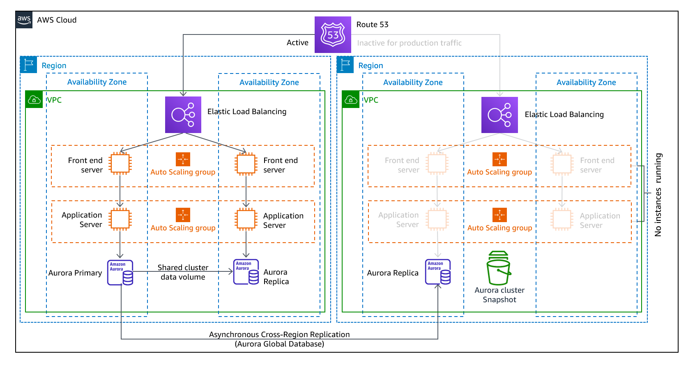

# Coursera: Architecting Solutions on AWS

See https://www.coursera.org/learn/architecting-solutions-on-aws/lecture/FoHUJ/customer-3-solution-overview.

## Customer #3: Solution Overview

Here is a detailed picture of our architectural diagram for our customer:

Here are some key points to take away from this architecture:

* Network connectivity will be handled by **AWS Direct Connect**. This is because the customer needs to send a high volume of data to the data center, **and** they need consistent throughput.
* The containers that will be run in AWS will be orchestrated by AWS ECS. Then the containers running in the on-premises data center will run in AWS ECS Anywhere.
  * This will require defining task definitions for all of the containers. But the code within those containers is unlikely to need to be changed.
  * The customer can continue to use DockerHub as their container registry. Alternatively, they may want to eventually transition to **Amazon ECR**.
* They will be running the containers on Amazon ECS EC2 instances. Scaling will be handled with **Amazon EC2 Auto Scaling**. Traffic will be distributed with an Application Load Balancer.
* The EC2 instances will be distributed across two AZs in order to provide additional resilience.
* AWS Storage Gateway will allow them to write their files locally using NFS protocol. AWS Store Gateway will then handle transferring the files and writing them out to S3.
* NAT Gateways will run in **public subnets** of the VPCs, separated from the EC2 instances and the RDS instances. The NAT gateways give the ability for the containers to reach out to the public internet, so they can download content or apply patches.
* AWS Systems Manager will allow for running scripts, patching, and other management tasks. This can be used both in AWS and on-premises.
* AWS Backup will allow for managing backups from one central place. This also can be used both in AWS and on-premises.

## Architecture Optimizations for Week 3

### Disaster Recovery

Because this is an enterprise customer, the first recommendation is to consider a disaster recovery (DR) plan that incorporates multiple regions. Depending on the acceptable downtime, AWS offers four different levels of DR.

The first three options are active/passive solutions. With these, the active region handles all of the production traffic, and the passive region is on standby. In the event of a disaster, traffic is then redirected to the passive region.

In an active/active DR solution, both regions are handling traffic. When the primary region fails, all traffic is then routed to the secondary region.

### Backup and restore

Backup and restore is a suitable approach for mitigating against data loss or corruption. This approach can also be used to mitigate against a regional disaster by replicating data to other AWS Regions, or to mitigate a lack of redundancy for workloads that are deployed to a single Availability Zone.

In addition to data restoration, the components and infrastructure would also need to be provisioned in the new region. To support this, IaC is strongly recommended for managing infrastructure.

### Pilot light

With the pilot light approach, you replicate your data from one Region to another, and you provision a copy of your core workload infrastructure. Resources that are needed to support data replication and backup—such as databases and object storage—are always on. Other elements are loaded with application code and configurations, but are turned off. Unlike the backup and restore approach, your core infrastructure is always available.

A best practice is to not deploy the resources that are turned off, and then create the configuration and capabilities to deploy (turn on) those resources when needed.

### Warm standby

The warm standby approach involves provisioning a scaled down—but fully functional—copy of your production environment in another Region. This approach extends the pilot-light concept and decreases the time to recovery because your workload is always-on in another Region.

### Multi-site active/active

 A multi-site active/active approach serves traffic from all Regions where it’s deployed. In contrast, hot standby approach serves traffic from only a single Region, and the other Regions are used only for DR.
 
 With a multi-site active/active approach, users can access your workload in any Regions where it’s deployed. This approach to DR is the most complex and most costly. However, it can reduce your recovery time to near zero for most disasters, with the correct technology choices and implementation.

 

### AWS Direct Connect with AWS Site-to-Site VPN for failover

This setup protects the customer if the AWS Direct Connect connection becomes unavailable. With this setup, the customer is able to fail over to the virtual private network (VPN) connection and remain connected to their AWS resources.

Failure of the AWS Direct Connect connection could happen for a variety of reasons. It could be due to a hardware failure with a router connected to AWS Direct Connect on the on-premises side, or it could be a configuration issue, or it could be a problem with the physical layer itself.

### Automatic scaling for containers

#### Scaling the clusters

Since this solution uses Amazon ECS, the customer can use **Amazon ECS cluster auto scaling** in order to scale up the clusters as needed. This done with an Amazon ECS Auto Scaling group capacity provider that has managed scaling turned on. 

When you use an Auto Scaling group capacity provider with managed scaling, Amazon ECS creates two custom Amazon CloudWatch metrics, and a target tracking scaling policy that attaches to your Auto Scaling group. Amazon ECS then manages the scale-in and scale-out actions of the Auto Scaling group based on the load that your tasks put on your cluster.

#### Scaling the containers

*Automatic scaling* allows for automatically increasing or decreasing the desired count of tasks in your Amazon ECS service automatically. This is done by the **Application Auto Scaling service** in response to CloudWatch alarms.

Amazon ECS Service Auto Scaling supports the following types of scaling policies:

* **Target tracking scaling policies** (Recommended): Increase or decrease the number of tasks that your service runs, based on a target value for a specific metric.

* **Step scaling policies**: Increase or decrease the number of tasks that your service runs, based on a set of scaling adjustments, which are also known as step adjustments. These adjustments vary based on the size of the alarm breach.

### Automatic scaling for Amazon RDS

Amazon RDS does not scale like managed services, because it is not serverless. However, **RDS storage autoscaling** automatically scales up your storage when it detects that you are running out of free database space.

### Amazon S3 Intelligent-Tiering

S3 Intelligent-Tiering is the only cloud storage class that delivers automatic storage cost savings when data access patterns change, thus reducing performance impact or operational overhead. The Amazon S3 Intelligent-Tiering storage class is designed to optimize storage costs by automatically moving data to the most cost-effective access tier when access patterns change. For a small monthly object monitoring and automation charge, S3 Intelligent-Tiering monitors access patterns and automatically moves objects that haven’t been accessed to lower-cost access tiers.

## Next

https://www.coursera.org/learn/architecting-solutions-on-aws/lecture/yRJkX/week-4-introduction