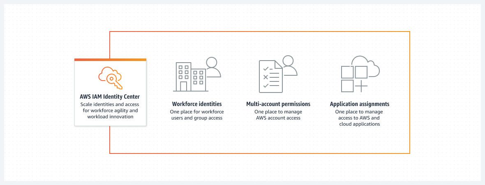

# Coursera: Architecting Solutions on AWS

See https://www.coursera.org/learn/architecting-solutions-on-aws/lecture/hnLKt/iam-roles-the-aws-authentication-core-mechanism.

## IAM Roles - The AWS Authentication Core Mechanism

*AWS Identity Access Management*, or AWS IAM, is a service that manages credentials for access to an AWS account. AWS IAM provides IAM users, IAM groups, and IAM roles.

* IAM users and roles are IAM entities that provide credentials and permissions for access.
* IAM groups are collections of users.
* Users have permanent credentials, and roles provide a temporary credential or a URL for sign in. This operation is called "assume role".

Using roles is important because when you have multiple accounts, you would like to prevent replicating IAM users on every account.

## IAM Roles, Trust Relationships, and Permissions

### IAM Roles

An IAM role is an identity that you can create in your account, and it has specific permissions. IAM roles and IAM users are both AWS identities with permissions policies that determine what the identity can or can’t do in AWS.

However, instead of being uniquely associated with one person, an IAM role can be assumed by anyone who needs it. Also, a role doesn’t have standard long-term credentials (such as a password or access keys) associated with it.

Roles can be used by the following entities:

* An IAM user in the same AWS account as the role
* An IAM user in a different AWS account than the role
* An AWS service, such as Amazon Elastic Compute Cloud (Amazon EC2)
* An external user who was authenticated by an external identity provider (IdP) service

Here are some key terms related to AWS IAM roles:

**AWS service role**: An AWS service role is a role that a service assumes to perform actions in your account on your behalf. When you set up some AWS service environments, you must define a role for the service to assume. This service role must include all the permissions that the service needs to access the AWS resources that it must work with.

**AWS service-linked role**: An AWS service-linked role is a unique type of service role that’s linked directly to an AWS service. Service-linked roles are predefined by the service, and they make setting up a service easier because you don't need to manually add the necessary permissions.

**Delegation**: This is the granting of permissions to someone to allow access to resources that you control. Delegation involves setting up a trust between two accounts.

The *permissions policy* grants the user of the role the needed permissions to carry out the intended tasks on the resource. The *trust policy* specifies which trusted account members are allowed to assume the role.
**
The trust policy is attached to the role in the trusting account, and comprises half of the permissions. The other half is a permissions policy that’s attached to the user in the trusted account. The permissions policy allows that user to switch to (or assume) the role. **A user who assumes a role temporarily gives up his or her own permissions, and instead takes on the role’s permissions.**

**Federation**: Federation is the creation of a trust relationship between an external IdP and AWS. Users can sign in to a web identity provider, such as Login with Amazon, Google, or any IdP that is compatible with OIDC. Users can also sign in to an enterprise identity system that’s compatible with SAML 2.0.

**Federated user**: Instead of creating an IAM user, you can use existing identities from AWS Directory Service, your enterprise user directory, or a web identity provider. These identities are known as *federated users*. AWS assigns a role to a federated user when access is requested through an identity provider.

**Trust policy**: A trust policy is a JSON policy document where you define the principals that you trust to assume the role.

**Permissions boundary**: A permissions boundary is a feature that allows you to use policies to limit the maximum permissions that an identity-based policy can grant to a role.

## AWS IAM Identity Center

AWS IAM Identity Center is the successor to AWS Single Sign-On, and it allows management of single sign-on (SSO) for AWS accounts. By using IAM Identity Center for this week's scenario, the customer will have one place for workforce user and group access, and one place to manage AWS account access.

AWS IAM Identity Center helps you securely create or connect your workforce identities and manage their access centrally across AWS accounts and applications. IAM Identity Center is the recommended approach for workforce authentication and authorization on AWS for organizations of any size and type.

IAM Identity Center includes the following core features:

### Workforce identities

Human users who are members of your organization are also known as *workforce identities* or *workforce users*. You can create workforce users and groups in IAM Identity Center. You can also connect and synchronize to an existing set of users and groups in your own identity source for use across all your AWS accounts and applications.

### Application assignments for SAML applications

Application assignments allow you to grant your workforce users SSO access to Security Assertion Markup Language (SAML) 2.0 applications, such as Salesforce and Microsoft 365. Your users can access these applications in a single place, without the need for you to set up federation separately.

### Identity Center enabled applications

AWS applications and services discover and connect to IAM Identity Center automatically to receive sign-in and user directory services. This feature provides users with a consistent SSO experience for these applications, with no additional application configuration.

### Multi-account permissions

With multi-account permissions, you can plan for and centrally implement IAM permissions across multiple AWS accounts at one time, without the need for you to configure each of your accounts manually. You can create fine-grained permissions based on common job functions, or define custom permissions that meet your security needs. You can then assign those permissions to workforce users to control their access over specific accounts.

### AWS access portal

The AWS access portal provides your workforce users with one-click access to all their assigned AWS accounts and cloud applications through a web portal.

## Next

https://www.coursera.org/learn/architecting-solutions-on-aws/lecture/P8nhy/choosing-services-for-logging