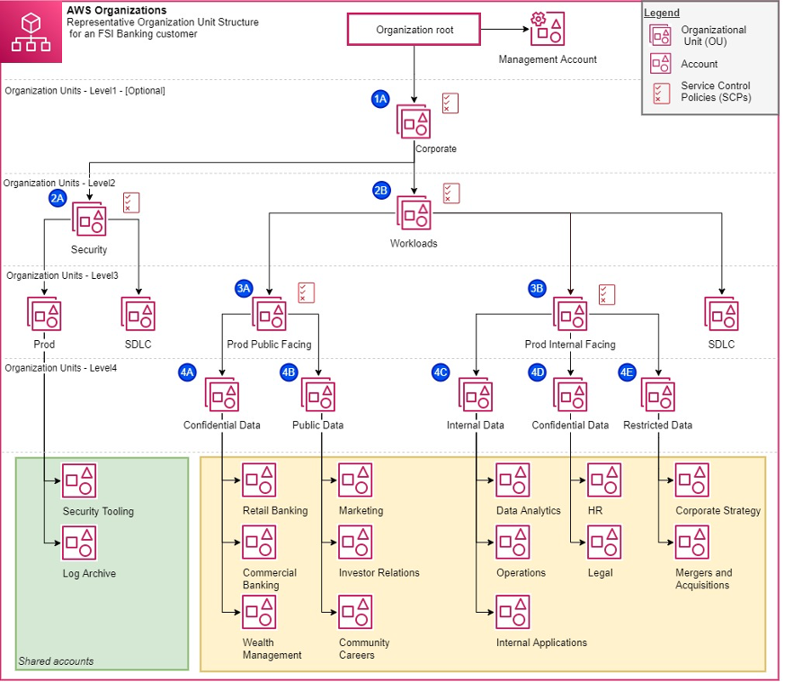

# Coursera: Architecting Solutions on AWS

See https://www.coursera.org/learn/architecting-solutions-on-aws/lecture/P8nhy/choosing-services-for-logging.

## Logging Services

There are multiple AWS services available for infrastructure logging: AWS CloudTrail, AWS Config, VPC Flow Logs, and Amazon GuardDuty.

For the Week 4 scenario, we have chosen to use CloudTrail to concentrate data in the AWS Organizations management account, thus following best practices for account governance.

### AWS CloudTrail

AWS CloudTrail captures AWS API call events and logs them. It monitor and records account activity across your AWS infrastructure, which gives you control over actions for storage, analysis, and remediation.

Events include actions that are performed in the AWS Management Console, the AWS CLI, and the AWS SDKs and APIs.

CloudTrail logs are immediately available. They are typically delivered within an average of 15 minutes after the API call.

A user in an Organizations management account can create an organization trail that logs all events in an Amazon S3 bucket. Member accounts can see the organization trail, but they cannot modify or delete it. This helps uniformly apply and enforce an event-logging strategy.

### AWS Config

AWS Config provides a detailed view of how AWS *resources* are configured in your AWS account. This includes how the resources are related to one another, and how they were configured in the past.

You can get an inventory of the resources that are in your AWS account, and then apply rules for the configuration of those resources.

An AWS *resource* is an entity such an an EC2 instance, EBS, volume, security group, or VPC.

#### Resource administration

AWS Config can notify you when resources are created, modified, or deleted.

You can use AWS Config rules to evaluate the configuration settings of your AWS resources. When a resource violates one of the conditions in your rules, AWS Config will flag the resource as noncompliant and send a notification.

#### Auditing and compliance

For auditing and compliance purposes, you may need to access historical configurations of your resources. AWS Config can provide this information.

#### Managing and troubleshooting configuration changes

AWS Config allows you to view how one resource is related to other resources, so that you can assess the potential impact of a configuration change.

#### Security analysis

When AWS Config is recording, it also maintains the historical configuration of AWS IAM permissions.

So AWS Config can be used to determine the permissions that beloned to a user at a specific time.

You can also use AWS Config to view the configuration of your Amazon security groups.

### VPC Flow Logs

VPC Flow Logs allow you to capture information about IP traffic that goes to and from network interfaces in your VPC. Flow logs can help you with various tasks:

* Diagnosing overly restrictive security group rules

* Monitoring the traffic that reaches your instance

* Determining the direction of the traffic to and from the network interfaces

Flow log data is collected outside the path of your network traffic. Therefore, it doesn’t affect network throughput or latency.

### Amazon GuardDuty

Amazon GuardDuty is a security monitoring service that analyzes and processes data sources, such as CloudTrail data events for Amazon S3 logs, CloudTrail management event logs, DNS logs, Amazon EBS volume data, Amazon EKS audit logs, and Amazon VPC flow logs.

It uses threat intelligence feeds and machine learning to identify unexpected, potentially unauthorized, and malicious activity within your AWS environment. This activity can include issues such as the escalation of privileges, use of exposed credentials, communication with malicious IP addresses or domains, or the presence of malware on your EC2 instances and container workloads.

## Automatic Account Provisioning

To automatically configure newly created accounts, the customer should consider using AWS Control Tower. We can then use AWS Service Catalog to determine which portofolio of solutions is available in each account.

### AWS CloudFormation

AWS Control Tower and AWS Service Catalog use AWS CloudFormation templates. CloudFormation is an infrastructure-as-code (IaC) service. It helps you model and set up AWS resources, thereby reducing the amount of time needed managing those services.

With CloudFormation, you can create a template that describes all the AWS resources that you want. CloudFormation then provisions and configures those resources for you.

### AWS Control Tower

AWS Control Tower offers the ability to set up and govern an AWS multi-account environment that follows prescriptive best practices. It helps prevent *drift* (or divergence from best practices) by applying preventive and detective controls (or *guardrails*).

AWS Control Tower uses CloudFormation StackSets to set up resources in your accounts. Each stack set has stack instances that correspond to account, and to AWS Regions per account.

### AWS Service Catalog

AWS Service Catalog allows you to create and manage catalogs of AWS IT services that are approved for each account. These services can include VM images, servers, software, databases, and more. AWS Service Catalog is designed to help achieve consistent governance and meet compliance requirements.

AWS Service Catalog provides the following benefits:

* **Standardization**: Administer and manage approved assets by restricting where the product can be launched, the type of instance that can be used, and many other configuration options.

* **Self-service discovery and launch**: Users browse listings of services & applications that they can access, and launch it as their own provisioned product.

* **Fine-grained access control**: Administrators assemble portfolios of products from their catalog, and add constraints and resource tags that will be used when the products are provisioned. Administrators then grant access to the portfolio through AWS IAM users and groups.

* **Extensibility and version control**: Administrators can add a product to different portfolios and restrict it without creating another copy. When the product is updated to a new version, the update is propagated to the product in every portfolio that references it.

## Multi-Account Best Practices

Implementing multi-account best practices is an ongoing effort. AWS provides several useful resources for further information on the topic.

### Multi-account environments

The *AWS for Industries Blog* includes a blog post called 
[Best Practices for AWS Organizations Service Control Policies in a Multi-Account Environment](https://aws.amazon.com/blogs/industries/best-practices-for-aws-organizations-service-control-policies-in-a-multi-account-environment/). It provides suggestions about using different organizational unit (OU) structures for different use cases (such as a corporate OU, a production public-facing OU, a production internal-facing OU, and a security OU). At the end, you might have a complex structure that looks like the following diagram:



[Organizing Your AWS Environments Using Multiple Accounts](https://docs.aws.amazon.com/whitepapers/latest/organizing-your-aws-environment/organizing-your-aws-environment.html) is an AWS Whitepaper that talks about the AWS Well-Architected Framework.

And the *AWS Organizations* website also has another reference for further reading, called [Establishing your best practice AWS environment](https://aws.amazon.com/organizations/getting-started/best-practices/).

### Tag policies and SCPs

AWS Organizations allows you to set tag policies, which can be used to maintain standardized tags for AWS resources.

If you're using IAc to provision environments, you could ensure that the environments are created from a specific CloudFormation template, and you can embed the tag policies in the template.

For example, you could for all EC2 instances for an account to have the `Environment` tag `Production`:
```
{
  "tags": {
    "Environment": {
      "tag_key": {
        "@@assign": "Environment"
      },
      "tag_value": {
        "@@assign": [
          "Production"
        ]
      },
      "enforced_for": {
        "@@assign": [
          "ec2:instance"
        ]
      }
    }
  }
}
```

*However, if you want to prevent the creation of new AWS resources that aren't tagged, you need to use SCPs.* For example, you could prevent running EC2 instances without the `Environment` tag by using this SCP:
```
{
  "Version": "2012-10-17",
  "Statement": [
    {
      "Sid": "DenyRunInstanceWithNoProjectTag",
      "Effect": "Deny",
      "Action": "ec2:RunInstances",
      "Resource": [
        "arn:aws:ec2:*:*:instance/*",
        "arn:aws:ec2:*:*:volume/*"
      ],
      "Condition": {
        "Null": {
          "aws:RequestTag/Project": "true"
        }
      }
    }
  ]
}
```

## Capstone Project

**Scenario**: You are working for a customer that runs their workloads on premises. Your customer has two workloads:

* A three-tier architecture composed of a frontend (HTML, CSS, JavaScript), backend (Apache Web Server and a Java application), and database (MySQL). The three-tier application hosts a dynamic website that accepts user traffic from the internet.

* A data analytics workload that runs Apache Hadoop. The analytics workload analyzes a massive amount of data that stored on premises and it also uses visualization tools to derive insights.

You have been tasked with designing a solution that uses AWS services to decouple the application layers (frontend, backend, and database), and that hosts both the application and the data analytics workload in the cloud. You can use managed services and advocate for refactoring the code to take advantage of cloud-native technologies, or you can do a lift and shift and advocate for minimal refactoring. Also, the data analytics solution currently runs on Hadoop and you have a requirement to spin up an Amazon EMR cluster for it. However, it’s up to you to choose which AWS services you want to use for the ingestion, storage, and visualization of data.

### Solution

For the three-tier web application, I would migrate it largely as-is to a cloud-native solution:

* The front-end components (HTML, CSS, JavaScript) would be hosted in S3 and served with Amazon CloudFront.
* If possible, I would transition the Java application to Lambda functions with well-defined REST endpoints and called by API Gateway. If this is not possible, I would create an EC2 auto-scaling group running Java + WARE to host the Java applications.
* The MySQL database would be migrated with AWS DMS to RDS with MySQL.

For the back-end analytics, I would prefer AWS DataSync agent on-prem to incrementally move the data to AWS. However, if it is petabytes of data, I would use AWS Snowball to transfer the initial snapshot of the data.

I would store the data in Amazon S3 buckets, and I would use AWS Glue Data Catalog to store the table/partition metadata. This information could then be used by EMR, QuickSight, and other solutions for querying.

To query and visualize the data, I would use Amazon QuickSight for embedded dashboards.