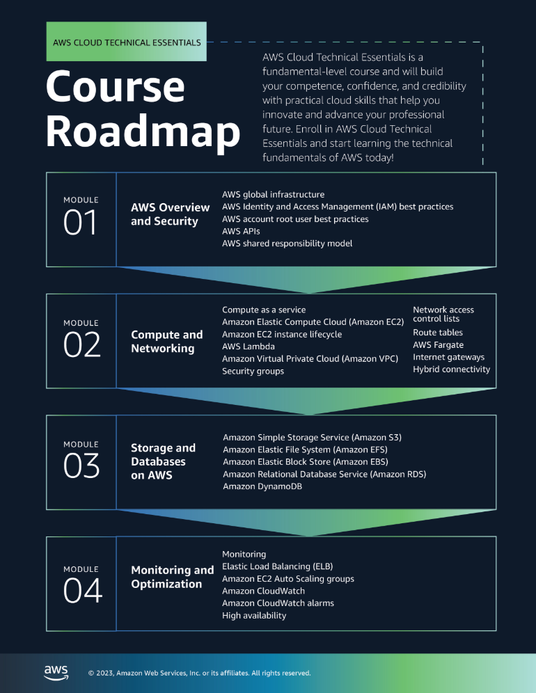
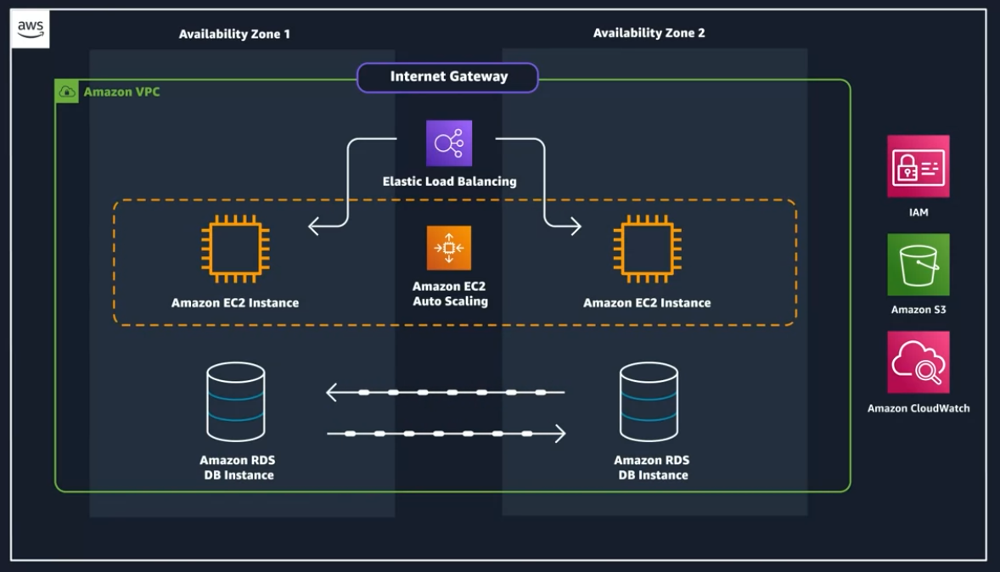
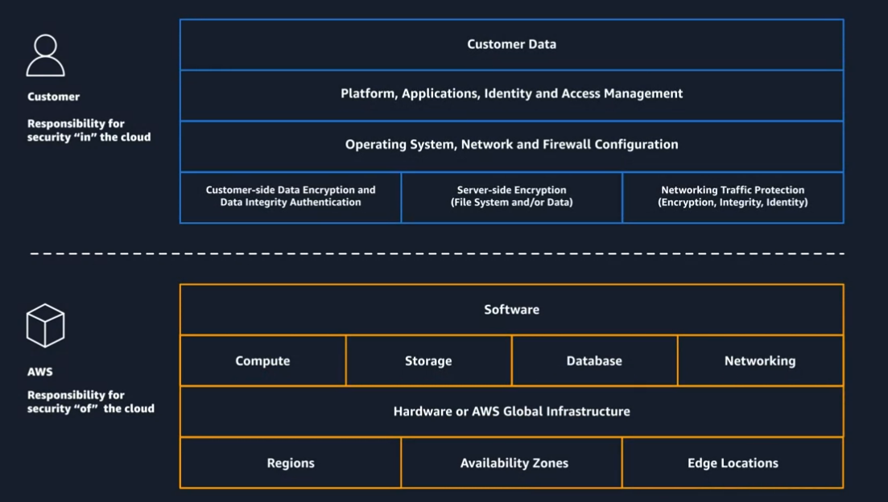

# Coursera: AWS Cloud Technical Essentials

See https://www.coursera.org/learn/aws-cloud-technical-essentials.

* Week 1: Getting Started with AWS Cloud 
  * AWS Regions and Availability Zones
  * Ways to interact with AWS
  * AWS Identity and Access Management (IAM)
* Week 2: AWS Compute & Networking
  * Amazon Elastic Compute Cloud (EC2)
  * Container vs VM
  * Serverless technologies
  * Amazon Virtual Private Cloud (VPC)
* Week 3: Storage & Databases on AWS
  * Amazon Simple Storage Service (S3)
  * Amazon Elastic Block Store (EBS)
  * Databases on AWS, and their use cases
* Week 4: Monitoring, Optimizing, and Going Serverless on AWS
  * Elastic Load Balancing (ELB)
  * Vertical and horizontal scaling

Where to ask questions: [AWS Report](https://repost.aws)

## Course Project

We will be developing an Employee Directory app, which will have basic CRUD operations to keep track of employees within a company.

The architecture:

## Six Benefits of Cloud Computing

* Pay as you go.

* Benefit from massive economies of scale.

* Stop guessing capacity.

* Increase speed and agility.

* **Stop spending money running and maintaining data centers.** Stop focusing on "undifferentiated heavy lifting", i.e. the heavy lifting of racking, stacking, and powering physical infrastructure.

* Go global in minutes.

## AWS Global Infrastructure

A cluster of data centers is called an **availability zone** (AZ). The cluster of data centers provides automatic backup & redundancy.

Sometimes natural disasters could impact an entire AZ. To address this, a cluster of availability zones is called a **region**.

We get to choose our AZ and region.

### AWS Region Considerations

* **Compliance**: Do we have requirements to operate within a specific region?
* **Latency**: How close are the IT resources to the user base?
* **Pricing**: Pricing varies from region to region, due to different tax structures.
* **Service availability**: New services are not deployed to every region right away.

Additionally, we can use Edge locations and regional Edge caches to cache frequently access content. This will reduce latency for users that are not close to the selected AWS region.

We can use services like Amazon CloudFront to cache content using the Edge locations.

### Scope of AWS Services

AWS services can be deployed at the AZ, region, or global level.  As an example, an Elastic Block Store (EBS) volume is created within a specific **Availability Zone**.

If we would like an EC2 instance from another AZ to interact with the EBS volume, we would need to create a snapshot of the volume and restore it in the desired AZ.

## Interacting with AWS

Because we cannot interact physically with the AWS infrastructure, we manage it instead with the AWS API.

We can make these API calls through the AWS Management Console, the AWS CLI, and the AWS SDKs.

**AWS Management Console** is great when first getting started with aWS. It allows us to get started without any previous knowledge of a service.

Once we become comfortable with a process manually through the Management Console, we will want to transition to a tool that allows us to script or program our API calls. This reduces the risk of human error.

## Security in the AWS Cloud

**Who is responsible for securing the AWS environment?** Both the customer and AWS. Solutions built on AWS are a collection of parts that build on each other. AWS is responsible for some of those parts, and customers are responsible for the other parts.

* AWS is responsible for security **of** the cloud.
* The customer is responsible for security **in** the cloud.

As an example, let's say a customer wants to host some virtual machines in the cloud. This would be done using EC2. In this use case, AWS is responsible for patching and updating the physical host, the host operating system, and the hypervisor. Essentially, AWS will handle security of everything up through the hypervisor level.

The custoemr will be responsible for patching everything **above** the hypervisor level:
* Patching hte operating systems of the VMs
* Encrypting data in transit and at rest
* Configuring firewalls
* Controlling who has access to these resources and how much access they have

### Categories of Service Security

The shared responsibility model in AWS breaks down the level of management based on the type / category of a service.  The three categories are:

#### **1. Infrastructure Services**
**Example:** Amazon EC2 (Elastic Compute Cloud)

- **What it is:** These services provide raw infrastructure components, such as virtual machines, networking, and storage. For EC2, you essentially rent virtual servers (instances) to run your workloads.
  
- **AWS Responsibility:**
  - **Infrastructure and foundation services:** AWS is responsible for the physical hardware, data centers, network infrastructure, power, cooling, and physical security.

- **Customer Responsibility:**
  - You are responsible for configuring and managing the software running on your instances:
    - OS patches and updates (e.g., Linux or Windows updates)
    - Application installation and updates
    - Security configuration (e.g., firewalls, encryption, IAM policies)

- **Analogy:** It's like renting a house where you manage everything inside the house, but the landlord ensures the structure, plumbing, and electricity are in working order.

---

#### **2. Container Services**
**Example:** Amazon RDS (Relational Database Service)

- **What it is:** These services provide managed platforms that reduce the operational overhead for customers. For example, RDS manages relational databases like MySQL, PostgreSQL, or SQL Server for you.

- **AWS Responsibility:**
  - AWS handles:
    - Infrastructure (like EC2).
    - Operating System (OS) management (e.g., patching the OS on the database servers).
    - Application platform (e.g., ensuring the database engine is up to date, backups are taken, and failover works).

- **Customer Responsibility:**
  - Configuring the service for your needs:
    - Database schema design.
    - Query optimization.
    - Data security (e.g., setting up encryption, controlling access).

- **Analogy:** This is like renting an apartment where the landlord maintains the building and fixes issues like plumbing or electricity, but you decide how to organize your furniture and how you use the space.

---

#### **3. Abstracted Services**
**Example:** Amazon S3 (Simple Storage Service)

- **What it is:** These services are highly abstracted and fully managed by AWS. You use them directly without worrying about underlying infrastructure or platforms. For example, with S3, you just upload objects (files) and AWS handles storage, scalability, durability, and availability.

- **AWS Responsibility:**
  - AWS manages **everything**, including:
    - Infrastructure and hardware.
    - Operating systems and application platforms.
    - Security of the service, such as server-side encryption, ensuring data durability, and availability.

- **Customer Responsibility:**
  - Minimal tasks, such as:
    - Managing access controls (e.g., S3 bucket policies and permissions).
    - Enabling encryption (e.g., client-side or additional bucket settings).

- **Analogy:** This is like using a cloud-based photo storage service. You don’t worry about how the storage works behind the scenes—you just upload, organize, and manage access to your files.

---

### **Why the Difference Matters**
The degree of management AWS handles versus what customers are responsible for impacts:
1. **Security**: Customers must configure security controls appropriately for each type of service.
2. **Flexibility vs. Simplicity**: Infrastructure services (like EC2) offer the most flexibility, but also the most responsibility, while abstracted services (like S3) are simpler but more constrained in use cases.
3. **Operational Overhead**: Abstracted and container services reduce the operational burden but limit low-level customization.

### Protect the AWS Root User

The root user has unrestricted access to everything in the account.

A best practice is to enable multi-factor authentication (MFA) as soon as an AWS account is created.  MFA can also be used to control access to specific AWS service APIs.

You should not use the root user for everyday tasks, even administrative ones.  Instead, you should create an IAM user instead.

**Authentication** is verifying that the user is who they say they are.  **Authorization** is determining whether the user can perform an action.

In addition to the username & password, the root user also has a second set of credentials called **access keys**. Access keys consist of two parts:
* An access key ID
* A secret access key

You need both the access key Id and secret access key to authentication your requests via the AWS CLI or AWS API. Access keys should be managed with the same security as an email address and password.

**Never create access keys for the AWS account root user.**

## Next

https://www.coursera.org/learn/aws-cloud-technical-essentials/lecture/LYogr/introduction-to-aws-identity-and-access-management