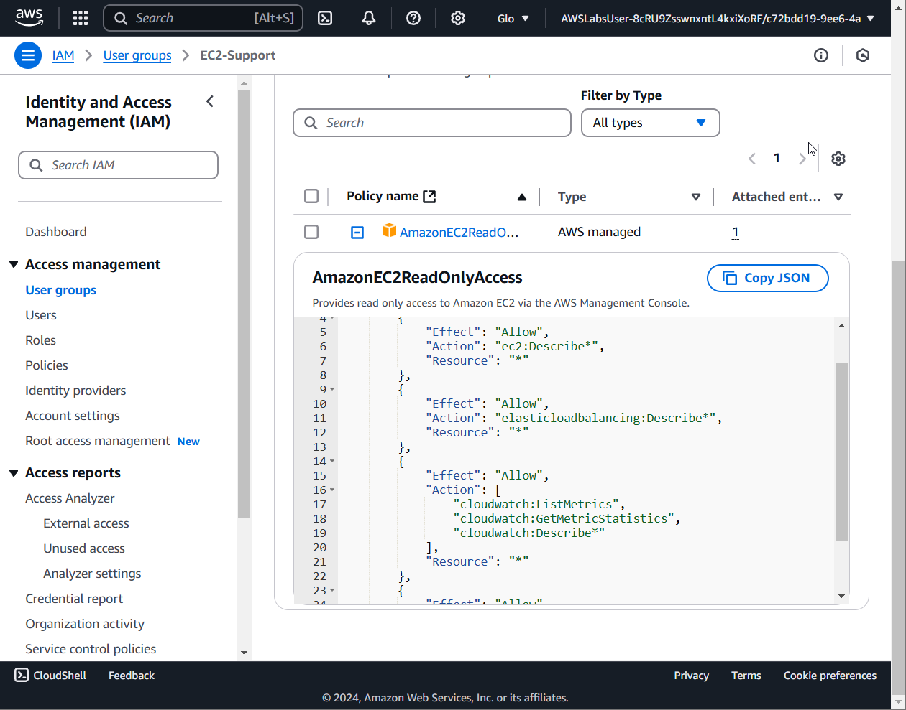
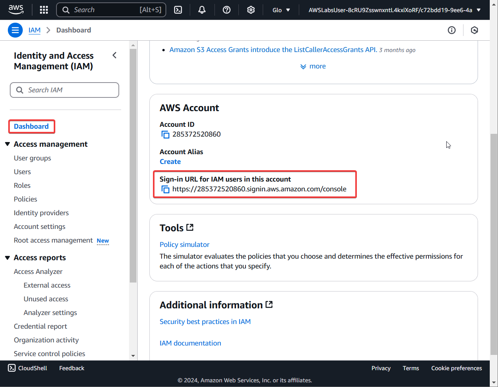
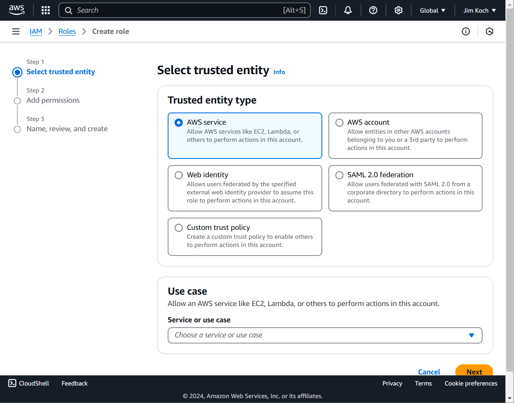
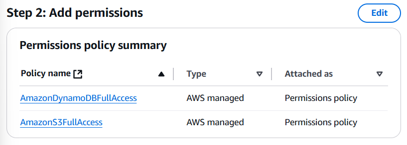
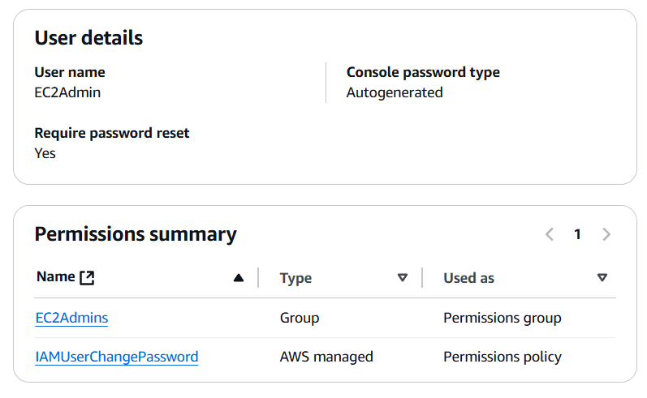

# Coursera: AWS Cloud Technical Essentials (cont)

See https://www.coursera.org/learn/aws-cloud-technical-essentials/lecture/2ijHO/introduction-to-lab-1.

## Week 1 Exercise & Assessment

### Lab 1: Introduction to IAM

This lab introduces us to Amazon's IAM interface.  This can be accessed by opening the Amazon Cloud Console, clicking the Search icon, and typing `IAM`.

The lab automatically provisions an environment with three users (`user-1`, `user-2`, `user-3`) and three user groups.

If we select "User Groups" in the left-hand toolbar, we are shown the three groups. We can select group `EC2-Support`, and we can then look at the Permissions tab.

The `EC2-Support` group was automatically added to the **AmazonEC2ReadOnlyAccess** managed policy. We can click the **`+`** (**Plus**) icon next to **AmazonEC2ReadOnlyAccess** to see the permissions allowed by this managed policy:



> **Note**
> 
> The `EC2-Support` group has the **AmazonEC2ReadOnlyAccess** policy, and the `S3-Support` group has the **AmazonS3ReadOnlyAccess** policy.
> 
> The `EC2-Admin` group has an inline policy:
```
{
    "Version": "2012-10-17",
    "Statement": [
        {
            "Action": [
                "ec2:Describe*",
                "ec2:StartInstances",
                "ec2:StopInstances",
                "cloudwatch:DescribeAlarms"
            ],
            "Resource": [
                "*"
            ],
            "Effect": "Allow"
        }
    ]
}
```

After viewing the users and user groups, we then assigned users to user groups.

### Use the IAM Sign-In URL

You can get your account's IAM sign-in URL from the IAM Dashboard:



For this lab, our URL is https://285372520860.signin.aws.amazon.com/console.

In this lab, we go through the process of:
* Assigning each user to a group.
* Verifying that `user-1` can view the S3 buckets, and `user-1` cannot view the EC2 instances.
* Verifying that `user-2` can view the EC2 instances, but cannot stop an EC2 instance or view the S3 buckets.
* Verifying that `user-3` can view and stop the EC2 instances, but cannot view the S3 buckets.

### Exercise: IAM Roles for Employee Directory App

First, I had to create a personal AWS root user account. After doing that, I enabled MFA.

#### Create a Role

Once my AWS root user was created, I went to **IAM** > **Roles** > **Create role**.

Because I will have my app running under EC2, I select **AWS Service**, and I then specify that it will need access to EC2:



Following the instructions, we create the role **EmployeeWebApp**, and we assign it the managed policies **AmazonS3FullAccess** and **AmazonDynamoDBFullAccess**:



(We will use Dynamo DB later in this course.)

#### Create a User

After creating that role, we create a user **EC2Admin**.

Because we have not created a User Group yet, it has us automatically create a user group. We name that group **EC2Admins**. We specify that **EC2Admins** has the managed policy **AmazonEC2FullAccess**.

Once we add EC2Admin to EC2Admins, we confirm the permissions for EC2Admin:



We then click "Create User".

I then see that the user is created, and I see my Console sign-in details:

https://442426860725.signin.aws.amazon.com/console

We then created an access key for that user for CLI access. Afterwards, we **deactivated** the access key, and then we **deleted** the access key.

## Next

https://www.coursera.org/learn/aws-cloud-technical-essentials/supplement/NYl2w/iam-roles-and-the-employee-directory-application
