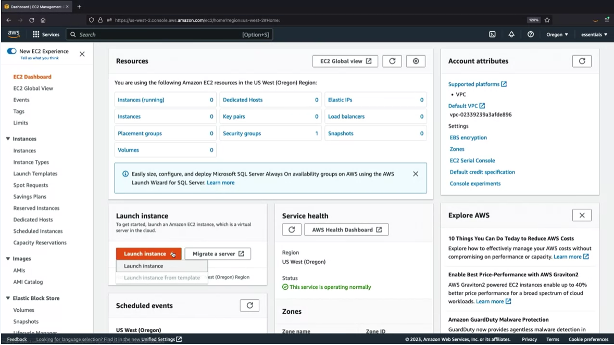
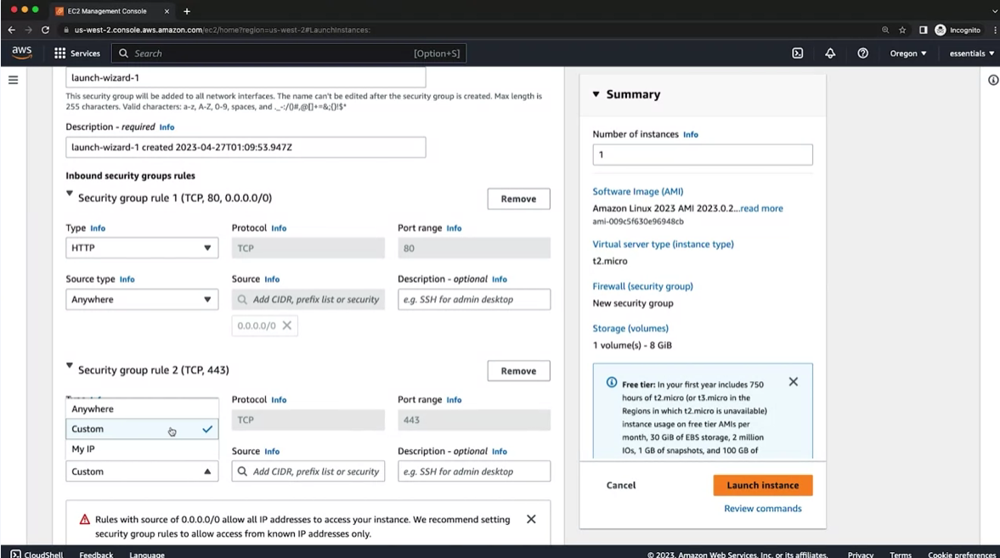

# Coursera: AWS Cloud Technical Essentials (cont)

See https://www.coursera.org/learn/aws-cloud-technical-essentials/supplement/NYl2w/iam-roles-and-the-employee-directory-application.

## Demo EC2 Instance

In this section, they created a sample EC2 instance. They started by going to the EC2 Dashboard, and selecting "Create Instance":



They took the following steps:
1. Gave it a name (`employee-web-app`)
2. Chose an EC2 instance type (t2.micro)
3. Defined inbound policy rules:



4. Expanded **Advanced Details**. Chose **IAM Instance Profile**, and selected the EmployeeWebAppRole profile.
5. Defined a script in the **User data** text field.
6. Clicked **Launch Instance**.

## Running My Own Demo EC2 Instance

Following the instructions above, I have provisioned the demo app. It utilizes the Amazon Linux 2023 AMI, and the following user data script:

```
#!/bin/bash -ex

wget https://aws-tc-largeobjects.s3-us-west-2.amazonaws.com/DEV-AWS-MO-GCNv2/FlaskApp.zip

unzip FlaskApp.zip

cd FlaskApp/

yum -y install python3-pip

pip install -r requirements.txt

yum -y install stress

export PHOTOS_BUCKET=${SUB_PHOTOS_BUCKET}

export AWS_DEFAULT_REGION=us-east-1

export DYNAMO_MODE=on

FLASK_APP=application.py /usr/local/bin/flask run --host=0.0.0.0 --port=80
```

> **Note**
>
> I was then able to access the site via http://<ip_address>:80. I had to specify port 80 for the request.

## Next

https://www.coursera.org/learn/aws-cloud-technical-essentials/lecture/Z72eq/introduction-to-week-2