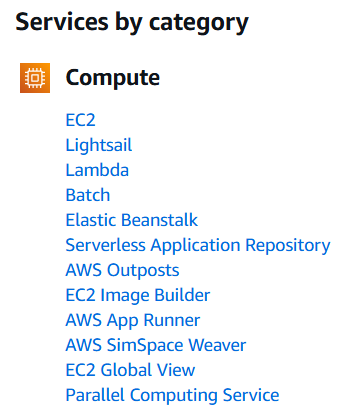
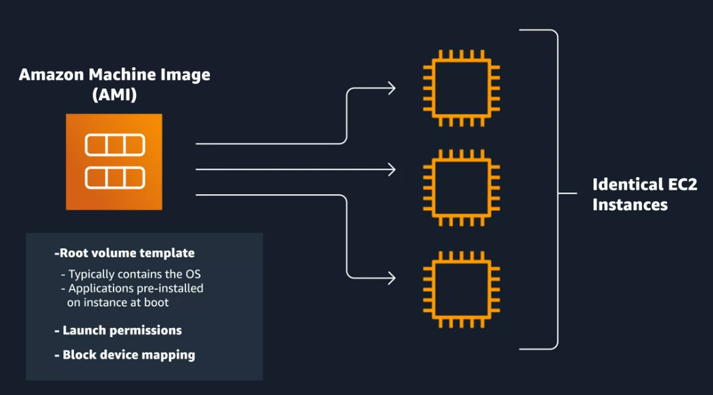
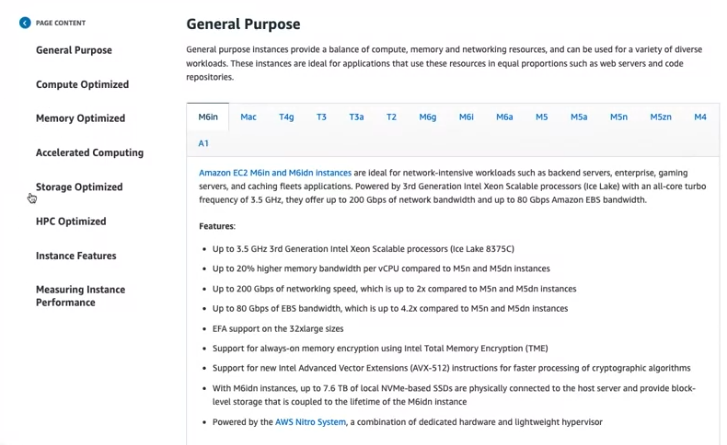

# Coursera: AWS Cloud Technical Essential: AWS Compute

See https://www.coursera.org/learn/aws-cloud-technical-essentials/lecture/Z72eq/introduction-to-week-2.

## Intro to AWS Compute

Last time we launched an EC2 instance to host a Python Flask application. An EC2 instance is just a form of compute, meaning it gives our application power in the form of CPU, memory and networking capacity. There are multiple compute options in AWS. These include Amazon Elastic Container Service (ECS), Amazon Elastic Kubernetes Service (EKS), and AWS Lambda.

## Compute as a Service on AWS

Raw compute capacity is necessary to run applications. If this is handled through physical servers, it involves expensive resources:

* Purchasing the hardware upfront
* Waiting weeks or months for the hardware to be delivered
* Providing appropriate space, either rented or owned
* Providing security for that space

AWS already took care of building and securing the data centers, purchasing and provisioning the servers, and getting the servers online.

EC2 is a service that uses virtual machines (VMs). However, other options like serverless compute or containers may make sense for certain applications:

At a fundamental level, there are three types of compute options: virtual machines, container services, and serverless.

## Introduction to Amazon EC2

AWS EC2 supports a range of operating system types, including Linux, MacOS, Ubuntu, and Windows. To select the operating system for your server, you must choose an Amazon Machine Image (AMI). The AMI contains infromation about how you want your instance to be configured, including the operating system, possible application to be pre-installed upon launch, and other configurations.

You can launch one or many instances form a single AMI:

Beyond the properties determined by the AMI, you can also configure the instance type & size. This corresponds to the amount of compute, memory, and network capabilities available per instance. The instance types are groups according to use cases:

When you launch an EC2 isntance, you will see an instance type & size designation like `t3.medium` or `a1.large`.  The `t3` and `a1` are the **EC2 instance type**.  The `medium` and `large` are the **size**.  You can re-size the EC2 instance through the AWS Management Console, or you can do it programmatically through an API call.

### What Is The Relationship Between AMIs and EC2 Instances?

"When you launch a new instance, AWS allocates a virtual machine that runs on a hypervisor. Then the AMI you selected is copied to the root device volume, which contains the image used to boot the volume. In the end, you get a server you can connect to and install packages and any additional software."

## Next

https://www.coursera.org/learn/aws-cloud-technical-essentials/lecture/O3ccY/amazon-ec2-instance-lifecycle
