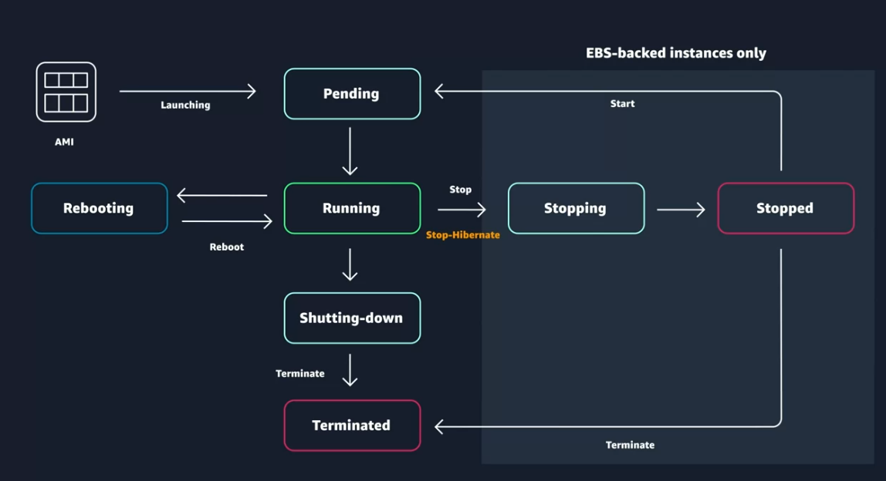

# Coursera: AWS Cloud Technical Essentials: AWS Compute

See https://www.coursera.org/learn/aws-cloud-technical-essentials/lecture/O3ccY/amazon-ec2-instance-lifecycle

## Amazon EC2 Instance Lifecycle

An EC2 instance is started by launching an AMI. This puts the EC2 instance into the **Pending** state. From there, the instance can move through the other instance states -- **Running**, **Rebooting**, **Stopping**, **Stopped**, **Shutting-down**, and **Terminated**:

When an instance is **Stop-hibernated**, its state is still preserved in memory, so it can quickly be started again.

Once an EC2 instance is **Terminated**, its data is gone forever. That data cannot be recovered. Terminated instances remain visible in the AWS Management Console for some time after they have been terminated, but they are definitely deleted!

Terminating an EC2 instance is not necessarily a bad thing and shouldn't be feared. Terminating can be valuable and even necessary in order to allow for upgrading or automatic patching.

### When Am I Charged?

You only get charged for an EC2 instance if you're in the Running state, or if you're in the Stopping state when preparing to Hibernate.

### What Makes Up an EC2 Instance?

EC2 instances are a combination of virtual processors, memory, networking, and in some cases, instance storage and GPUs.

AWS offers a variety of instances, split into different **instance families**.

### What Are the Instance Families?

The instance families are:

* General purpose
* Compute optimized
* Memory optimized
* Accelerated computing
* Storage optimized

### Where Does Your EC2 Instance Live?

By default, your EC2 instances live in a public network called the defaeult Amazon Virtual Private Cloud (VPC). It's possible to change the setting to specify custom VPCs with restricted access.

### Use multiple availability zones for high availability.

While EC2 instances are typically reliable, it's good to architect an application for high availability by using at least two EC2 instances in two separate Availability Zones.

### Pricing

Once an EC2 instance launches in your AWS account, the billing accrues on a **per-second** basis. For simplicity, the prices are stated per-hour.

There are three main purchasing options for EC2 instances: on-demand, reserved, and spot instances.

* **On-demand EC2 instances** are pay-as-you-go.
* **Reserved instances** provided a discounted hourly rate and an optional capacity reservation for EC2 instances. You can select a 1-year or a 3-year term for the reservation, and there are three options:
  * All Upfront offers a higher discount than Partial Upfront
  * Partial Upfront offers a higher discount than No Upfront
  * No Upfront offers a discount over On-Demand
* **Spot instances** allow you to take advantage of unused EC2 capacity on the AWS Cloud. Spot instances are good candidates for fault-tolerant workloads, such as big data, containerized workloads, continuous integration/continuous delivery (CI/CD), web servers, high-performance computing (HPC), image and media rendering, or other test and development workloads.

## Next

https://www.coursera.org/learn/aws-cloud-technical-essentials/lecture/4Bj0S/container-services-on-aws