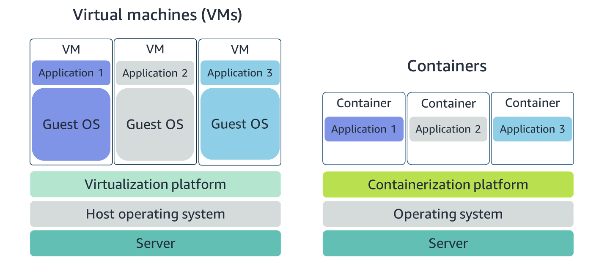
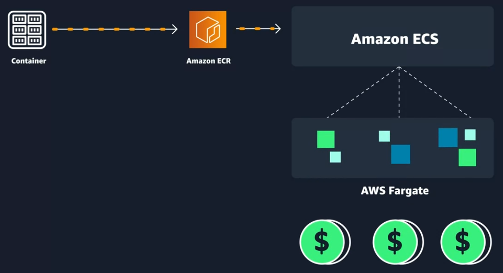
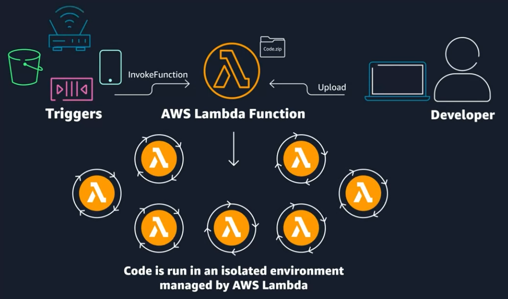

# Coursera: AWS Cloud Technical Essential: AWS Compute

See https://www.coursera.org/learn/aws-cloud-technical-essentials/lecture/4Bj0S/container-services-on-aws

## Container Services on AWS

As an alternative to utilizing VMs on EC2, containers are a great option that provides efficiency and portability. Containers are portable, because they contain everything an app needs to run in a single package:

* Application code
* Dependencies
* Configuration

Therefore, containers are expected to behave the same across different environments, like dev, QA, and prod.

AWS offers container services like Amazon Elastic Container Service (ECS) and Amazon Elastic Kubernetes Service (EKS).  ECS is designed to help you run containerized aplications at scale without the hassle of managing your own container orchestration software.  EKS does essentially the same thing, but usese different tooling with different features.

Both ECS and EKS run on top of EC2.  If you do not want to manage EC2 instances for your containers to run on, you can use a compute platform called AWS Fargate, which handles most of the underlying details for you. Fargate is a serverless compute platform for ECS and EKS.

### What is the difference between containers and VMs?

Containers share the operating system and kernel of the host they exist on, whereas virtual machines contain their operating system. This results in some degree of wasted space. Containers are more lightweight and spin up quicker.

Virtual machines offer you the full strength of an operating system and offer more resources, like package installation, a dedicated kernel, and more.

### Orchestrate Containers

If you run your containers on EC2 instances, you need to know:

* How to place your containers on your EC2 instances
* What happens if your container fails
* What happens if your EC2 instance fails
* How to monitor deployments of your containers

This coordination is handled by a **container orchestration service**, like ECS or EKS.

### Managing Containers with Amazon ECS

Amazon ECS is an end-to-end container orchestration service that allows you to quickly spin up new containers and manage them across a cluster of EC2 instances.

To run and manage your containers, you need to install the Amazon ECS Container Agent on your EC2 instances. This agent is open source and responsible for communicating back to the Amazon ECS service about cluster management details. You can run this agent on both Linux and Windows AMIs. An instance with the container agent installed is often called a **container instance**.

To prepare your application to run on Amazon ECS, you create a **task definition**. The task definition is a text file in JSON format that describes one or more containers. A task definition is similar to a blueprint that describes the resources you need to run that container, such as CPU, memory, ports, images, storage, and networking information.

### Managing Containers with Kubernetes with Amazon EKS

Amazon EKS is conceptually similar to Amazon ECS, but there are some differences:

* An EC2 instance with the CS Agent installed and configured is called a **container instance**. In Amazon EKS, it is called a **worker node**.
* An ECS Container is called a **task**. In Amazon EKS, it's called a **pod**.
* Amazon ECS runs on AWS native technology. Amazon EKS runs on top of Kubernetes.

## Introduction to Serverless

Running container services on top of EC2 is great for eliminating the need for management and operational overhead of hosting the same solutions on-premises.

However, there will still be some management and operational overhead, like ensuring new software packages or security updates are deployed. Not every solution will reuqire that level of control over the underlying environment. You may want to focus on your own business solutions, and let someone else handle the undifferentiated heavy lifting for you.

This is where **serverless** comes in. Serverless means that you cannot see or access the underlying infrastructe or instances that are hosting the solution. Instead, all of the management of the underlying environment from a provisioning, scaling, fault tolerance, and maintenance perspective are taken care of for you.

Serverless shifts up the line between you and AWS in the shared responsibility model. You do not have access to the underlying OS, so you cannot be responsible for carrying out tasks like patching.

## Serverless with Fargate

AWS Fargate is a serverless compute platform for containers that you can use with either ECS or EKS. With AWS Fargate, you run your containers on a managed serverless platform, so you don't have to worry about the underlying operating system or environment. Instead, you define your application content, networking, stoarge, and scaling requirements.

There is no provisioning, patching, cluster capacity management or infrastructure management necessary.

To work with Fargate, you build your containers and push them into Amazon Elastic Container Registry (ECR). You then define memory and compute resources for your task (ECS) or pod (EKS), and then you run your containers.

## Introduction to AWS Lambda

AWS Lambda is another serverless compute option available on AWS. Lambda allows you to package and upload your code to the Lambda service, creating what is called a Lambda function.

Lambda functions aren't running all of the time. Instead, Lambda functions run in response to **triggers**. A couple of common examples of triggers for Lambda functions are an HTTP request, an upload of a file to Amazon S3, or even in-app activity from mobile devices.

There are three primary components of a Lambda function: the trigger, code, and configuration.The code is source code, that describes what the Lambda function should run. This code can be authored in three ways.

* You create the code from scratch.

* You use a blueprint that AWS provides.

* You use same code from the AWS Serverless Application Repository, a resource that contains sample applications, such as “hello world” code, Amazon Alexa Skill sample code, image resizing code, video encoding, and more.

Lambda has a runtime of under 15 minutes.

One of the best things about Lambda is you don't get billed for code that isn't running. You only get billed for the resources that you use, rounded up to the nearest one millisecond interval.

A great example of a Lambda function is to resize uploaded images, because we only need to run this code when a new image file is uploaded. If you’re looking to deploy a service to resize images to production, consider using the new release [Serverless Image Handler](https://aws.amazon.com/answers/web-applications/serverless-image-handler/), which is a robust solution to handle image manipulation and can be deployed via an AWS CloudFormation template.

You can find a tutorial on creating the AWS Lambda function as well as the code used in the AWS Lambda demo on the [AWS News Blog](https://aws.amazon.com/blogs/compute/resize-images-on-the-fly-with-amazon-s3-aws-lambda-and-amazon-api-gateway/).

## Next

https://www.coursera.org/learn/aws-cloud-technical-essentials/lecture/vZsj1/networking-on-aws