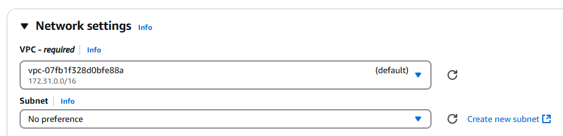
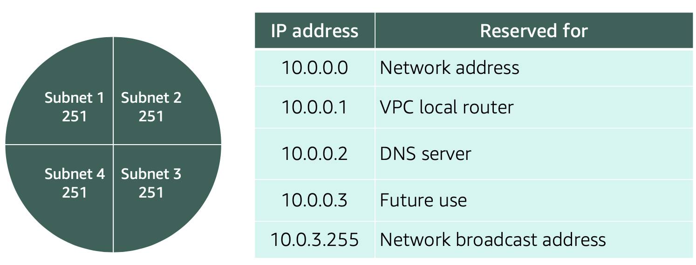

# Coursera: AWS Cloud Technical Essentials: AWS Networking

See https://www.coursera.org/learn/aws-cloud-technical-essentials/lecture/vZsj1/networking-on-aws

## Networking on AWS

Up until now, we've relied on the default VPC:



We did not create this VPC. Instead, AWS creates VPCs for us in each region by default. We have to be careful what we put in these default VPCs, as those resources will be subject to the Internet.

We'll now review some networking basics, along with details about networking on AWS.

### IP Addresses

IP addresses are often 32-bits, and are split into 8-bit "octets" to form what is called an IPv4 address.  As an example, a 32-bit address may be:

```
11000000 10101000 00000001 00011110
```

In IPv4, this is `192.168.1.30`.

If we want to specify a range of addresses, we do this with Classless Inter-Domain Routing (CIDR) notation. As an example, we can say that we want all address starting with `192.168.1.x` as `192.168.1.0/24`, because the first 24-bits are fixed.

When working with networks in the AWS Cloud, you choose your network size by using CIDR notation. In AWS, the smallest IP range you can have is `/28`, which provides 16 addresses. The largest IP range you can have is `/16`, whicch provides you with 65,536 addresses.

## Introduction to Amazon VPC

A VPC in AWS creates a boundary where your applications and resources are isolated from any outside movement, so nothing comes into the VPC and nothing comes out of the VPC without your explicit permission.

When you create a VPC, you need to choose three main things:

* The name of your VPC.
* A Region for your VPC to live in. Each VPC spans multiple Availability Zones within the Region you choose.
* An IP range for your VPC in CIDR notation. This determines the size of your network. Each VPC can have up to four /16 IP ranges.

### Reserved IPs

For AWS to configure a VPC appropriately, AWS reserves five IP addresses in each subnet. The IP addresses are reserved for. As an example with a subnet for the IP address range `10.0.0.0/24`:



### Internet Gateway

To enable internet connectivity for your VPC, you need to create an internet gateway.

### Virtual Private Gateway

A virtual private gateway allows you to connect your AWS VPC to another private network. Once you create and attach a VGW to a VPC, the gateway acts as anchor on the AWS side of the connection. On the other side of the connection, you’ll need to connect a customer gateway to the other private network. A customer gateway device is a physical device or software application on your side of the connection. Once you have both gateways, you can then establish an encrypted VPN connection between the two sides. 

## Amazon VPC Routing

A **route table** contains a set of rules called routes that are used to determine where the network traffic is directed. These route tables can be applied at either the subnet level or at the VPC level. When you create a brand new VPC, AWS creates a route table called the main route table and applies it to the entire VPC. AWS assumes that when you create a new VPC with subnets you want traffic to flow between those subnets.

Whether a subnet is publicly accessible is determined by its associated route table. If the route table doesn't have a route between the subnet and the internet gateway, then it doesn't have public access.

## Amazon VPC Security

In AWS, you have two options to secure your VPC resources:

* **Network access control lists (network ACLs)**: Network ACLs are like a firewall at the subnet level.  They control what kind of traffic is allowed to enter and leave the subnet. The default ACL allows traffic in and out of the subnet.
* **Security groups**: Security groups are firewalls that exist at the EC2 instance level. They are not optional, so anytime we create an EC2 instance, you need to place that EC2 instance inside of a security group that allows the appropriate kinds of traffic to flow to your application.

## Hybrid Connectivity

Sometimes, the solution for an application is partially in AWS, and partially in an on-premises data center.

To connect the on-premises data center to AWS, one option is an AWS Virtual Private Network (AWS VPN). This can either be an **AWS Site-Site VPN** or an **AWS Client VPN**. An AWS Site-Site VPN connects a remote data center to an AWS VPC. An AWS Client VPC for connecting users (usually administrators) to AWS or to the data center.

Another alternative is **AWS Direct Connect**. This is a private, dedicated network connection between the on-premises data center and the VPC. It never touches the public internet, reducing the chances of bottlenecks or increased latency.

## Next

https://www.coursera.org/learn/aws-cloud-technical-essentials/supplement/nZ3Px/reading-2-7-amazon-vpc-routing-and-security
