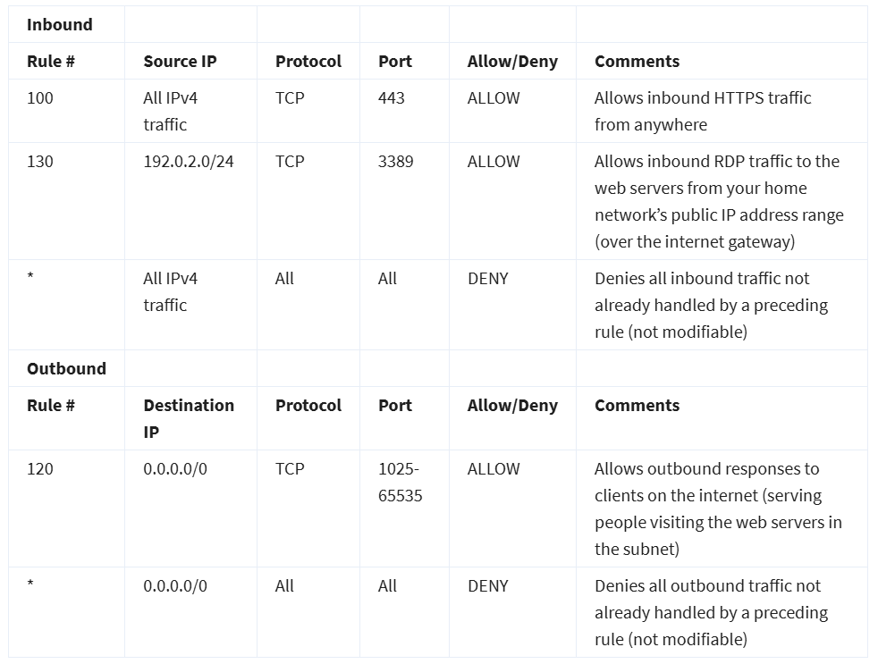
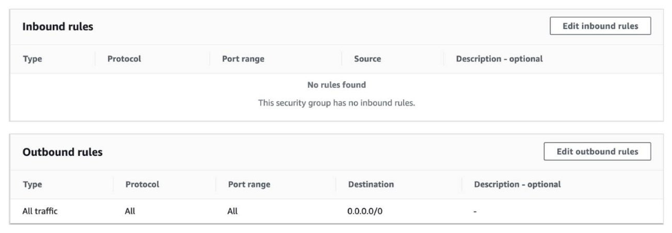

# Coursera: AWS Cloud Technical Essential: AWS Networking (cont.)

See https://www.coursera.org/learn/aws-cloud-technical-essentials/supplement/nZ3Px/reading-2-7-amazon-vpc-routing-and-security

## AWS VPC Routing and Security

### The Main Route Table

When you create a VPC, AWS creates a route table called the main route table. A route table contains a set of rules, called routes, that are used to determine where network traffic is directed. AWS assumes that when you create a new VPC with subnets, you want traffic to flow between them. Therefore, the default configuration of the main route table is to allow traffic between all subnets in the local network.

### Custom Route Tables

While the main route table controls the routing for your VPC, you may want to be more granular about how you route your traffic for specific subnets. For example, your application may consist of a frontend and a database. You can create separate subnets for these resources and provide different routes for each of them.

If you associate a **custom** route table with a subnet, the subnet will use it instead of the main route table. By default, each custom route table you create will have the local route already inside it, allowing communication to flow between all resources and subnets inside the VPC.

### Network ACLs

A **network ACL** (access control list) is like a firewall at the subnet level. A network ACL enables you to control what kind of traffic is allowed to enter or leave your subnet. You can configure this by setting up rules that define what you want to filter.

The default network ACL allows all traffic in and out of the subnet.  If we had a web application, we might restrict it to only accept HTTPS and RDP connections with this custom network ACL:

Network ACLs are considered **stateless**, which is why we need to include both the inbound and outbound ports used for the protocol.

### Security Groups

A **security group** is like a firewall for an EC2 instance. The default configuration of a security group blocks all inbound traffic and allows all outbound traffic:

It might seem like this would block EC2 instances from receiving the response of an customer requests. However, security groups are **stateful**, meaning they will remember if a connection is originally initiated by the EC2 instance or from the outside and temporarily allow traffic to respond without having to modify the inbound rules.

If you want your EC2 instance to accept traffic from the internet, you’ll need to open up inbound ports.

## Next

https://www.coursera.org/learn/aws-cloud-technical-essentials/assignment-submission/rbU7N/ready-for-the-lab