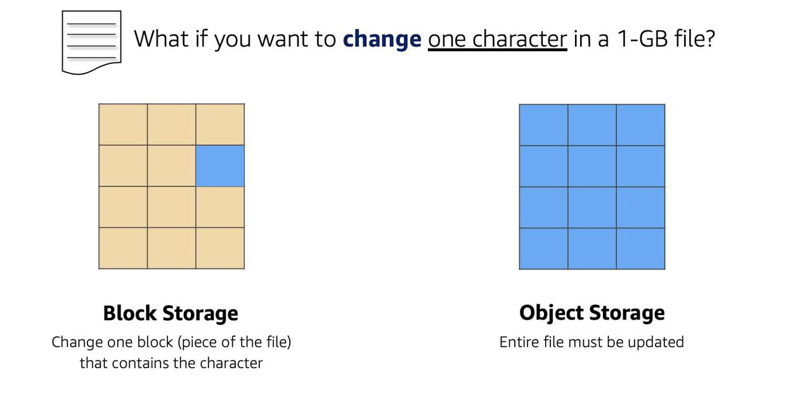
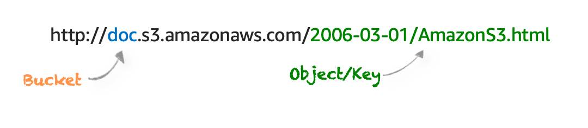

# Coursera: AWS Cloud Technical Essentials: Storage on AWS

See https://www.coursera.org/learn/aws-cloud-technical-essentials/lecture/inyuH/introduction-to-week-3

## Storage Types on AWS

AWS storage services are broken down into three different categories: **block storage**, **object storage**, and **file storage**.

### File Storage

File storage on AWS is much like on a local laptop. Files have metadata like a file name, file size, creation date, and file path.

The file path is a unique ID that allows the system to retrieve the file.

File storage on AWS is ideal for situations where you need centralized access to files that will need to be shared and managed across multiple host computers.

This storage is mounted onto multiple hosts and requires file locking and integration with existing file system communication protocols. Common use cases for file storage include:

* Large content repositories
* Development environments
* User home directories

### Block Storage

While file storage treats files as singular units, block storage splits files into fixed-size cunks of data called **blocks** that have their own addresses. Since each block is addressable, blocks can be retrieved efficiently.

Outside of the address, there is no additional metadata associated with each block. So when you want to change a character in a file, only the one block containing that character needs to be changed. This ease of access allows block storage solutions to be fast and to use less bandwidth.

### Object Storage

Objects, much like files, are also treated as a single unit of data when stored. Unlike file storage, objects are stored in a flat structure instead of a hierachy.

Each object is a file with a unique identifier. This identifier, along with any additional metadata, is bundled with the data and stored.

Changing just one character in an object is more difficult than with block storage. When you want to change one character in a file in object storage, the entire file must be updated.

You can storage almost any type of data, and there is no limit to the number of objects stored.

Object storage is generally useful when storing large data sets, unstructured files like media assets, and static assets, such as photos.

## Amazon EC2 Instance Storage and Amazon Elastic Block Store (EBS)

**Amazon EC2 Instance Store** provides temporary block-level storage for an EC2 instance. This ties the lifecycle of the data to the lifecycle of that EC2 instance. If you delete the instance, the instance store is deleted as well.  For that reason, instance store is considered **ephemeral storage**.

Instance store is ideal if you are hosting applications that replicate data to other EC2 instances, such as Hadoop clusters. In this case, having the speed of locally-attached volumes and the resilience of replicated data helps achieve data distribution at high performance.

It's also ideal for temporary storage of information that changed frequently, such as buffers, caches, scratch data, and other temporary content.

**Amazon Elastic Block Storage (EBS)** is a block-level storage device that you can attach to an EC2 instance. These storage devices are called Amazon EBS **volumes**. EBS volumes are drives of a configured size that attach to an EC2 instance, much like an external drive being attached to a laptop. EBS volumes act similar to external drives in multiple ways:

* Most EBS volumes can only be connected with one EC2 instance at a time, so they cannot be shared by or attached to multiple instances.

* You can detach an EBS volume from one EC2 instance and attach it to another EC2 instance in the same Availability Zone.

* The EBS volume is separate from the EC2 instance. So if an accident happens and the EC2 instance goes down, the data is still persisted on the EBS volume.

* EBS volumes have a fixed volume size. This means there is a max limitation of how much content you can store on the volume.

## Scaling EBS Volumes

EBS volumes can be scaled in two days:

1. Increase the volume size, as long as it's below the maximum size limit of 16 TB. So if we initially provisioned a 4 TB EBS volume, we can choose to increase the size of the volume until we get to 16 TB.

2. Attach multiple EBS volumes to a single EC2 instance. EC2 has a one-to-many relationship with EBS volumes. So we can add additional volumes during or after EC2 instance creation to provide more storage capacity for our hosts.

## Amazon EBS Use Cases

Volumes are commmonly uses in the following scenarios:

* **Operating systems**: Boot volumes to store an operating system. The root device for an instance luanched from an AMI is typically an Amazon EBS volume. These are commonly referred to as **EBS-backed AMIs**.

* **Databases**: A storage layer for databases running on EC2 that rely on transactional reads and writes.

* **Enterprise applications**: EBS provides reliable block storage to run business-critical applications.

* **Throughput-intensive applications**: Applications that perform long, continuous reads and writes.

## Amazon EBS Volume Types

There are four types of EBS volumes:

* **EBS Provisioned IOPS SSD**: Highest perfromance SSD designed for latency-sensitive transactional workloads.

* **EBS General Purpose SSD**: General purpose SSD that balances price and performance for a wide variety of transactional workloads.

* **Throughput Optimiated HDD**: Low-cost HDD designed for frequently accessed, throughput intensive workloads.

* **Cold HDD**: Lowest cost HDD designed for less frequently accessed workloads.

## Benefits of Using Amazon EBS

There are many benefits of using Amazon EBS:

* High availability
* Data persistence
* Data encryption
* Flexibility
* Backups

## EBS Snapshots

While EBS provides persistent storage, persistence alone doesn't guarantee resilience against all types of failure or use error. Here are the main reasons to create EBS snapshots:

1. **Backup and Recovery**: EBS snapshots serve as a point-in-time backup in case the data becomes corrupted or accidentally deleted.

2. **Disaster Recovery**: You can copy snapshots to other Regions to protect against an entire Region failure.

3. **Volume Duplication and Testing**: You can create a new EBS volume from a snapshot at any time. This is handy for spinning up test environments.

4. **Long-Term Archival**: Snapshots can help meet compliance requirements by offering versioned backups over time.

5. **Data Migration**: EBS snapshots are stored in Amazon S3, so you can leverage that to move data between Regions or accounts.

## Object Storage with Amazon Simple Storage Service (S3)

Amazon S3 is a standalone storage solution that isn't tied to compute. It enables you to retrieve your data from anywhere on the web.

Amazon S3 is an **object storage service**. It stores data in a flat structure, using unique IDs to look up objects when requested. An object is simply a file combined with metadata.

### S3 Concepts

In Amazon S3, objects are stored in containers called **buckets**. You can't upload any object to S3 without first creating a bucket. When creating a bucket, you must choose a bucket name and an AWS Region in which the bucket will reside.

Typically, you'll want to place the bucket in the same **Region** as your compute resources. Objects inside a bucket are redundantly stored across multiple devies, across multiple Availability Zones. This level of redundancy provides 99.999999999% durability and 99.99% availability for objects over a given year.

The **bucket name** must be unique across all AWS accounts. AWS stops you from choose a bucket name that has already been chosen by someone else in another AWS account.

These values are combined to produce a URL:

From the above example, we know:

* The bucket name is *doc*.
* The service name is *s3*, and the service provider is *amazonaws*.
* There is an implied folderr *2006-03-01*.
* The object inside the folder is named *AmazonS3.html*

The object name is often referred to as *the key name*.

### S3 Use Cases

Below is a short list summarizing some of hte most common ways you can use Amazon S3.

* **Backup and storage**
* **Media hosting**
* **Software delivery**
* **Data lakes**
* **Static websites**
* **Static content**

### Connectivity Options in s3

By default, everything in Amazon S3 is **private**. This means that all S3 resources, such as buckets, folders, and objects can be viewed by the user or AWS account that created that resource. Amazon S3 resources are all privated and protected to begin with.

You can decide to make resources public, in which case everyone onn the internet can see them. Most of the time, you don't want permissions to be all-or-nothing. You'll want to be more granular about the way you provide access to resources.

To be more granular about who can do what with your S3 resources, Amazon S3 provides two access management features: IAM policies and S3 bucket policies.

### IAM Policies with S3

When IAM policies are attached to IAM users, groups, and roles, the policies define which actions they can perform. IAM policies are not tied to a single AWS service, so they can be used to define access to S3 actions as well. You should use IAM policies for private buckets when:

* You have many buckets with different permission requirements. Instead of defining many different S3 bucket policies, you can use IAM policies instead.
* You want all policies to be in a centralized location. Using IAM policies allows you to manage all policy information in one location.

### S3 Bucket Policies

S3 bucket policies are defined using the same policy language as IAM policies, in a JSON format. The difference is that IAM policies are attached to users, groups, and roles, whereas S3 bucket policies are only attached to buckets. S3 bucket policies specify what actions are allowed or defined on a bucket.

For example, if we have a bucket called employeebucket, we can attach an S3 bucket policy that allows another AWS account to put objects in that buckett.

Or if we wanted to allow anonymous viewers to read the objects in employeebucket, then we can apply a policy to that bucket that callows anyone to read objects in the bucket using `"Effect": Allow` on the `"Action": ["s3:GetObject"]`.

S3 Bucket policies can only be placed on buckets, and cannot be used for folders or objects. However, the policy that is placed on the bucket applies to every object in that bucket. You should use S3 bucket policies when:

* You need a simple way to do cross-account access to S3, without using IAM roles.
* Your IAM policies bump up against the defined size limit. S3 bucket policies have a larger size limit.

### Encrypt S3

Amazon S3 promotes encryption in transit and at rest. Data can be protected at rest in one of two days:

* **Service-side encryption**: S3 encrypts the objects before saving them on disks and then decrypts them when the objects are downloaded.

* **Client-side encryption**: The data is encrypted by a client-side application, and the encrypted data is uploaded to S3. In this case, we manage the encryption process, the encryption keys, and all related tools.

To encrypt in transit, we can use client-side encryption or SSL.

### Versioning to Preserve Objects

Amazon S3 identifies objects in part by using the object name. If we don't use Amazon S3 versioning, anytime we upload an object with the same object name, it overwrites the original file.

To prevent this, we can use S3 versioning. Versioning enables us to keep multiple versions of a single object in the same bucket. Then Amazon S3 automatically generates a unique version ID for the object being stored. Versioning-enabled buckets let us recover objects from accidental deletion or overwrite.

### Unstand Versioning States

Buckets can be in one of three days:

* **Unversioned** (the default): No new or existing bojects in the bucket have a version.

* **Versioning-enabled**: This enables versioning for all objects in the bucket.

* **Versioning-suspended**: This suspends versioning for **new** objects. All new objects in the bucket will not have a version. However, all existing objects keep their object versions.

### Amazon S3 Storage Classes

Amazon S3 provides multiple different storage classes, depending on our needs for the data.

* Amazon S3 Standard
* Amazon S3 Intelligent-Tiering
* Amazon S3 Standard-Infrequent Access (S3 Standard-IA)
* Amazon S3 One Zone-Infrequent Access (S3 One Zone-IA)
* Amazon S3 Glacier Instant Retrieval
* Amazon S3 Glacier Flexible Retrieval
* Amazon S3 Glacier Deep Archive
* Amazon S3 Outposts

### Automate Tier Transitions with Object Lifecycle management

It's possible to define a lifecycle policy configuration for an object or group of objects, defining the automation of transition actions and expiration actions.

* **Transition actions** define when we should transition objects to another storage class.
* **Expiration actions** define when objects expire and should be permanently deleted.

For example, we might choose to transition objects to S3 Standard-IA storage 30 days after we create them, or archive objects to S3 Glacier storage one year after creating them.

## Next

https://www.coursera.org/learn/aws-cloud-technical-essentials/lecture/BK8vM/choose-the-right-storage-service