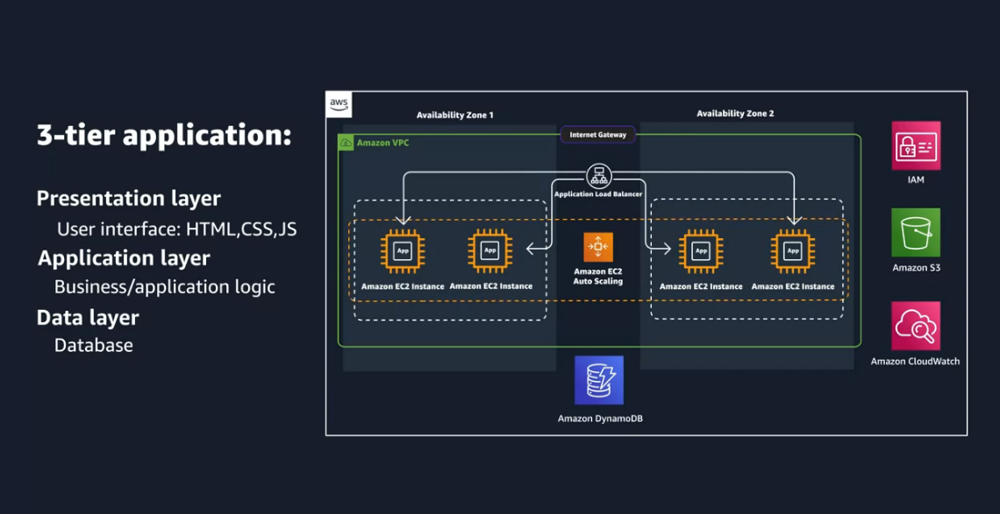
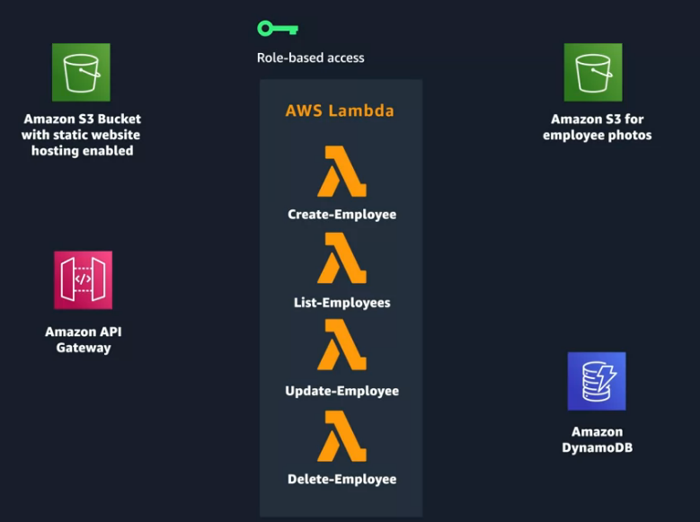
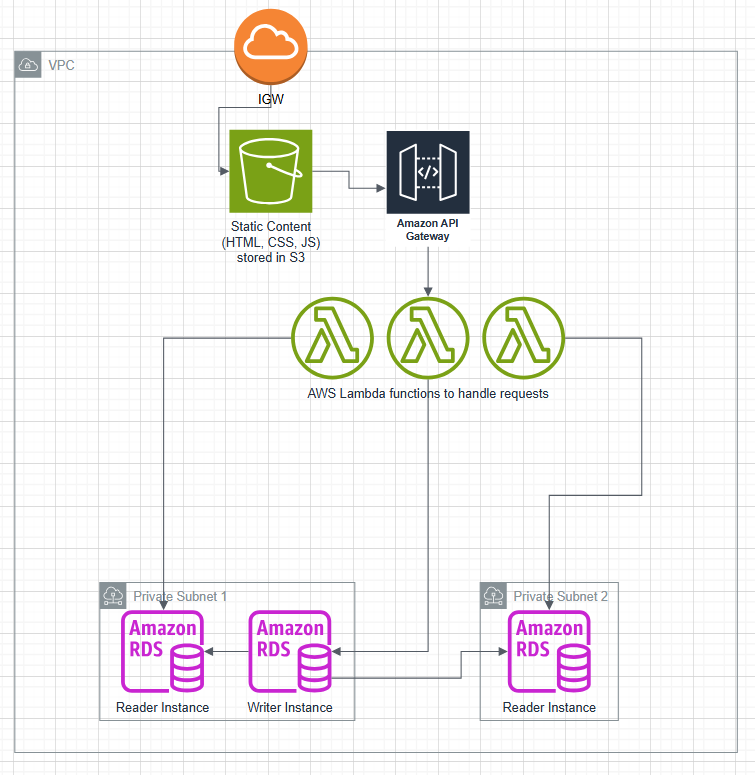

# Coursera: AWS Cloud Technical Essentials: Going Serverless, Generative AI.

See https://www.coursera.org/learn/aws-cloud-technical-essentials/lecture/39eaF/redesigning-the-employee-directory.

## Going Serverless

Let's take a look at our current solution:

This is a classic three-tier architecture. As things are right now, the Amazon EC Two instances are hosting both the presentation layer, as well as the application layer. This is true because the EC Two instances have a web server running that is serving the content for the website, like the HTML, CSS, and JavaScript, which is the presentation layer. Then the same instances are also handling requests for the backend logic for viewing, adding, updating and deleting employees, which is the application layer.

We should separate these two pieces entirely. This ensures that our instances are not overloaded by having to handle different types of requests at the same time.

As one possible alternative, we could go serverless:
* Host our static website content (HTML, CSS, JS) in S3. This would be the presentation layer.
* Host our application layer logic in AWS Lambda. Compared to the previous approach with EC2 instances, this would ensure that our application layer only runs when it processes a request.
* Host our API with AWS API Gateway. This ensures that our presentation layer doesn't talk directly to our application layer. Instead, the requests would be routed through API Gateway.
* Handle access between these services via role-based access using IAM roles.

We could add some other AWS services as well:
* Amazon RT53 for domain-name management.
* Amazon CloudFront for caching static assets closer to the end-user by taking advantage of AWS Edge locations.

## Capstone Project

**Scenario**: You have a web application that accepts requests from the internet. Clients can send requests to query for data. When a request comes in, the web application queries a MySQL database and returns the data to the client.

**Instructions**: Design a three-tier architecture that follows AWS best practices by using services such as Amazon Virtual Private Cloud (Amazon VPC), Amazon Elastic Compute Cloud (Amazon EC2), Amazon Relational Database Service (Amazon RDS) with high availability, and Elastic Load Balancing (ELB). Create an architecture diagram that lays out your design, including the networking layer, compute layer, database layer, and anything else that’s needed to accurately depict the architecture. Write a few paragraphs that explain why you chose the AWS services that you used and how they would support the solution for the given scenario. Your explanation must describe how traffic flows through the different AWS components—from the client to the backend database, and back to the client.

See [Capstone Project.drawio](Capstone Project.drawio).

This could be expanded to include more detail:
* The subnets reside in different availability zones.
* There should be redundancy on S3 and AWS Lambda.
* The subnets are private because of their route tables.
* The subnets are protected by network ACLs.

## Next

https://www.coursera.org/learn/aws-cloud-technical-essentials/lecture/oxssZ/introduction-to-amazon-bedrock