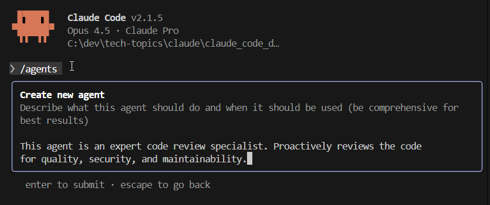

## Vibe Coding with Claude

See https://www.coursera.org/learn/introduction-to-claude-code/lecture/RY9LZ/adding-images.

## Adding Images

With Claude Code, you can paste in screenshots and images to give context. This can be useful for giving reference material when making requests. It can also help Claude Code investigate defects in the software.

## Claude Code Hooks

From Claude's website:

> Claude Code hooks are user-defined shell commands that execute at various points in Claude Code’s lifecycle. Hooks provide deterministic control over Claude Code’s behavior, ensuring certain actions always happen rather than relying on the LLM to choose to run them.

Some examples of hooks are:

* **Notifications**: You can customize how you get notified when Claude Code is awaiting your input or permissions to run something.

* **Formatting**: Claude can be configured to automatically run tools like `prettier` after every edit.

* **Logging**: Claude can log whenever events are performed for auditing purposes.

Available hooks include:

* **PreToolUse**: Runs before a tool is executed
* **PostToolUse**: Runs after a tool completes
* **UserPromptSubmit**: Runs when the user submits a prompt
* **SubagentStop**: Runs when a subagent stops executing
* **Stop**: Runs when Claude Code stops or completes a task
* **SessionStart**: Runs when a new session begins
* **PreCompact**: Runs before conversation context is compacted
* **Notification**: Runs when Claude Code sends a notification

To run hooks within Claude Code, use `/hooks`.

## Slash Commands

Slash commands are user-defined prompts that Claude Code can execute. They are defined in Markdown files within the `.claude/commands` folder.

For example, see [proofread.md](.claude/commands/proofread.md). This was used to complete the above "Claude Code Hooks" section.

Slash commands can be defined globally as well.

A useful built-in slash command is `/clear`. This is used to clear the context, which can be desirable to reduce both costs and the chance of hallucinations.

## Developing with Claude Code Agents

With Claude Code, it's possible to create and use specialized AI subagents for task-specific workflows. They can be beneficial, because they have their own context window and capabilities. Key benefits of using agents include:

* **Context preservation**: Each agent maintains its own conversation history, preventing context overflow in complex tasks.
* **Specialized expertise**: Agents can focus on specific domains like code review, testing, or documentation.
* **Reusability**: Once defined, agents can be invoked across multiple projects and sessions.
* **Flexible permissions**: Agents can be configured with different tool access levels based on their purpose.

To define a new agent, create a `.claude/agents` folder, and then run the `/agents` command.

For example, I ran the `/agents` command in the [claude_code_demo](../claude_code_demo/) project.

The end result is the [code-reviewer](../claude_code_demo/.claude/agents/code-reviewer.md) agent.

## Next

https://www.coursera.org/learn/introduction-to-claude-code/lecture/jvJMr/build-a-calendar-with-claude-code