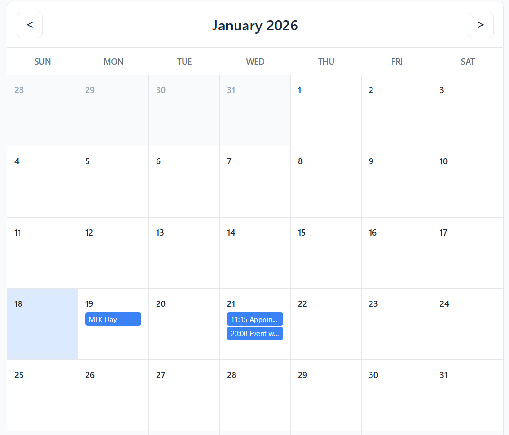

## Vibe Coding with Claude

See https://www.coursera.org/learn/introduction-to-claude-code/lecture/jvJMr/build-a-calendar-with-claude-code.

## Build a Calendar with Claude Code

In this lab, we are creating a Calendar app. We started by defining our workflow with [CLAUDE.md](./calendar-app-demo/.claude/CLAUDE.md).

After that, I started Claude and put it in Plan mode (Shift+Tab+Tab). I then gave it this prompt:

> Create a simple Calendar app (month  view). Features: view month grid, add/edit/delete events,  store events in  localStorage (JSON), responsive UI, an add-event modal, and basic validation. Create tasks/TODO.md with a checklist and acceptance criteria for each task.

I noticed a bug in the rendering, so I pasted a screenshot into Claude:

[](./image1.png)

Claude was then able to identify and fix the issue. See [BUG.md](./calendar-app-demo/BUG.md). I reload the page, and the issue is fixed:



Let's create some commands to help with the app. I added the [a11y-check.md](./calendar-app-demo/.claude/commands/a11y-check.md) file to check accessibility. I ran it, and it produced an extensive list of accessibility issues to improve. See the results in [TODO.md](./calendar-app-demo/tasks/TODO.md).

We'll leave the project at this point. However, the course instructor recommends a Docs Helper agent, and then using Claude to push to Netlify.

## Claude Code and MCP

Claude can easily connect to MCP servers for added context about **external tools**. For information on how to do this, see https://code.claude.com/docs/en/mcp.

We will use the context7 MCP server: https://github.com/upstash/context7. To add it, we run the command:

```
claude mcp add --scope project --transport http context7 https://mcp.context7.com/mcp 
```

The `--scope project` means that it is only to be used in this specific project (folder). Other scopes are `local` and `global`. From within Claude, when we type `/mcp`, it will list the context7 MCP server.

I then use this MCP server:

> use the latest tailwindCss docs and implement styling accordingly. Use context7.

Claude then updated the code to use TailwindCSS by CDN. See [styles.css](./calendar-app-demo/css/styles.css).

## Conclusion

Claude Code is a valuable tool that can drastically accelerate coding efforts.