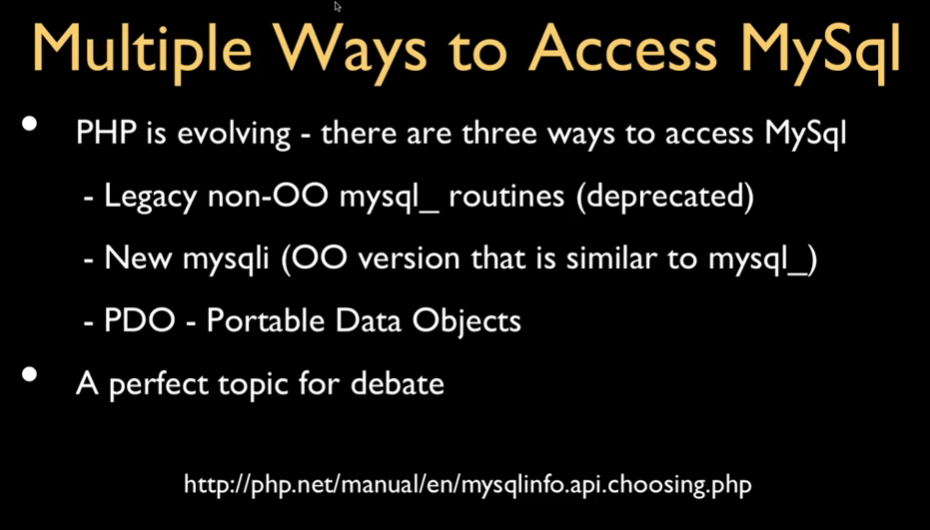

# Coursera: Building Database Applications in PHP

See https://www.coursera.org/learn/database-applications-php/lecture/BX7Pc/installing-mamp-on-windows10.

## MAMP on Windows 10

* If you save files under c:\MAMP\htdocs, then they will be served under http://localhost/.
* If you name a file `index.php`, it will automatically be served by Apache for that folder.

As an example, if you create a file `c:\MAMP\htdocs\first\index.php`, it will be served when you visit `http://localhost/first/`.

You can switch from the server just serving HTML content to executing code by using the PHP tags:
```
<h1>Hello from this page!</h1>

<p>
<?php

$x = 6 * 7;
echo "The answer is " . $x . ". What is the question?";
>
</p>
```

## Issues With MAMP

For some reason, "Open WebStart page" is not working for me in MAMP. Also, I see that phpMyAdmin is not installed under the MAMP folder. There seem to be a lot of issues with MAMP.

## XAMPP for Windows

XAMPP appears to be an alternative to MAMP with more capabilities. It is available at [apachefriends.org](https://www.apachefriends.org/download.html).

The XAMPP dashboard works successfully at http://localhost/dashboard/phpinfo.php, and it has `display_errors` **on**.

## Using NGrok

NGrok acts as a reverse proxy, accepting traffic at a public `ngrok.io` address and forwarding it to a personal machine. It can be downloaded at: https://ngrok.com/download/windows.

After downloading and installing, we can expose our XAMPP server:
```
ngrok http 80
```

It looks like the connection is getting blocked. If I need this for any sort of testing, I'll sort something out.

## PHP Database Libraries

The Portable Data Objects (PDO) library allows you to connect from PHP to a SQL DB. By performing the SQL queries within PHP, we hide our underlying PHP schema and data from the end user.

In PHP4, SQL routines were available through non-OO `mysql_routines`. Starting in PHP5, they introduced `mysqli`. At this point, `mysqli` is also deprecated, and PDO is the primary way to interact between PHP and MySQL.



Before interacting with the MySQL DB via PHP, we'll set up some preliminary structures:
```
CREATE DATABASE misc;

USE misc;
CREATE TABLE users (
    user_id INTEGER NOT NULL AUTO_INCREMENT PRIMARY KEY,
    name VARCHAR(128),
    email VARCHAR(128),
    password VARCHAR(128),
    INDEX(email)
) ENGINE=InnoDB CHARSET=utf8;
```
And then we add a couple of users with `INSERT` statements.

## Running SQL Queries in PHP

After that, we can query the DB. See:
* [second/index.php](./projects/second/index.php)
* [second/index2.php](./projects/second/index2.php)
* [third/index.php](./projects/third/index.php)

## Next

See https://www.coursera.org/learn/database-applications-php/lecture/wfC9R/accessing-mysql-using-pdo-inserting-data.