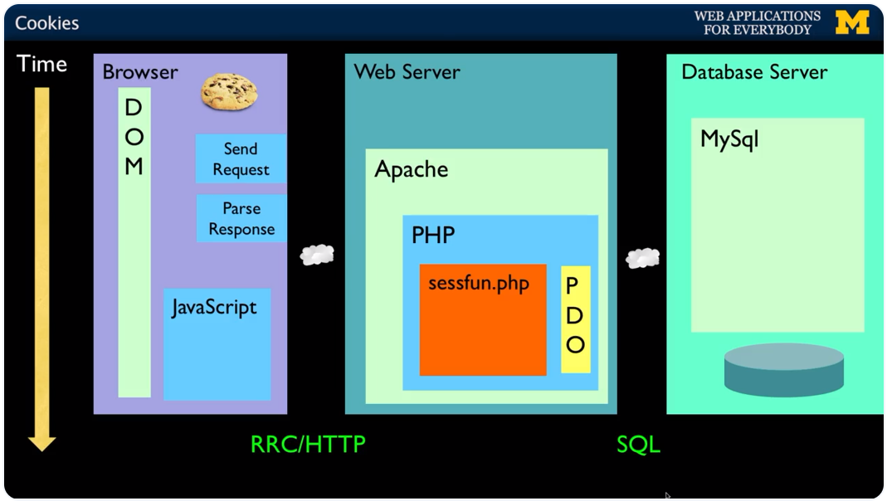

# Coursera: Building Database Applications in PHP

See https://www.coursera.org/learn/database-applications-php/lecture/9BTbS/cookies.

## HTTP Cookies

Cookies are part of the HTTP protocol. It is **key-value pair** data **stored in the browser**. However, it is **server data**.



The cookies will then be sent to the server **on every request**. This allows the server to know **which browser** requests are coming from.

Cookies have an expirations date. Some may last for years, while others are short-term and go away as soon as the browser is closed. The latter are **session cookies**.

In addition to `$_GET` and `$_POST`, PHP also has `$_COOKIE`. `$_COOKIE` is an auto-global array that is automatically sent if the `variables_order` contains "C".

```php
if (! isset($_COOKIE['zap']) ) {
    setcookie('zap', '42', time() + 3600); // Set to an hour from now.
}
```

## Sessions

**Sessions** are data stored in the server. Like cookies, session are auto-globals available at `$_SESSION`. In most server applications, as soon as we meet a new (unmarked) browser, we create a session.

We set a session cookie to be stored in the browser, which indicates the session id in use -- gives this browser a unique "mark".

The creation and destruction of sessions is handled by a web framework or some utility code that we use in our applications.

* A PHP session can be established & initialized by calling `session_start()` before any output has come out.

* If the user has cookies set, we can use the array `$_SESSION` to store data between requests for a particular browser.

* By default, these are stored in a temporary folder on disk.

The session data can be flushed by calling `session_destroy()`.

## Sessions Without Cookies

* For a simple application handling login, logout, and shopping cart-like information, cookie session are sufficient.

* If an application needs to function within an iframe, or if it needs to be possible to have more than one active session (i.e. multiple tabs to the same site), we cannot use session cookies.

* PHP has support for maintaining a session without a cookie.

```php
<?php
  // Tell PHP we won't be using cookies for the session.
  ini_set('session.use_cookies', '0');
  ini_set('session.use_only_cookies' 0);
  ini_set('session.use_trans_sid', 1);

  session_start();

// Start the view.
?>
<p><b>No cookies for you</b></p>
```

The result is that the session ID is included with each request:
```php
<p><a href="nocookie.php?PHPSESSID=1234567890abcdef1234">Click This Anchor Tag!</a></p>
<form action="nocookie.php" method="post">
  <input type="hidden" name="PHPSESSID" value="1234567890abcdef1234" />
  <input type="submit" name="click" value="CLick This Submit Button!" />
</form>
```

## Code Walkthrough - Cookies and Sessions

See [cookie.php](./projects/cookie.php) and [session.php](./projects/session.php).


**Reminder**: Session cookies expire immediately when a user closes their web browser or ends their browsing session. They are temporary, stored in the browser's volatile memory (RAM) rather than on the hard drive, and do not have an expiration date set. Some browsers, however, may restore sessions upon restart.

## Next

https://www.coursera.org/learn/database-applications-php/lecture/dVuUw/redirect-routing-and-authentication