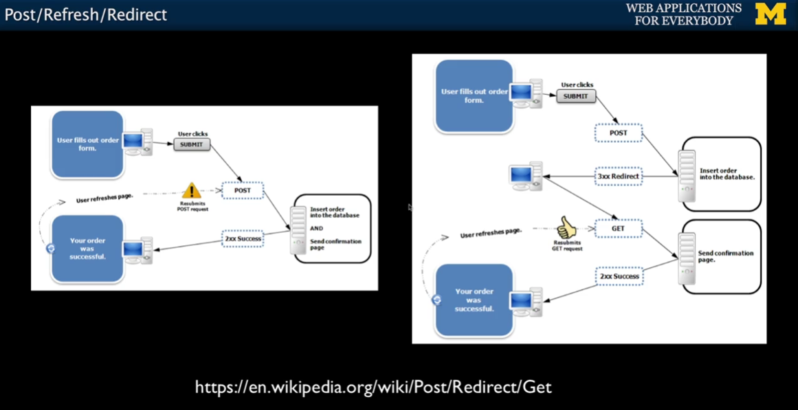

# Coursera: Building Database Applications in PHP

See https://www.coursera.org/learn/database-applications-php/lecture/679GQ/post-refresh-redirect.

## POST / Refresh / Redirect

As discussed before, GET should be used for retrieving data, and POST should be used when modifying data.

However, once you do a POST, **if you refresh**, the browser will re-send the POST data a second time. The user gets a pop-up that tries to explain what is about to happen. This leads to a bad user experience.

To avoid the double POST, the pattern is to do `POST` -> redirect -> `GET`.



We can share the data between the `POST` and the `GET` by using sessions! See the difference between [guess.php](./projects/guess.php) (incorrect) and [guess2.php](./projects/guess2.php) (correct).

```php
<?php
session_start();
if ( isset($_POST['guess']) ) {
    $guess = intval($_POST['guess']);
    $_SESSION['guess'] = $guess;
    if ($guess == 42 ) {
        $_SESSION['message'] = "Great job!";
    } else if ( $guess < 42 ) {
        $_SESSION['message'] = "Too low";
    } else {
        $_SESSION['message'] = "Too high";
    }
    header("Location: guess2.php");
    return;
}
?>
<html>
<head>
<title>A Guessing Game</title>
</head>
<body>
<?php
$guess = isset($_SESSION['guess']) ? $_SESSION['guess'] : '';
$message = isset($_SESSION['message']) ? $_SESSION['message'] : false;
?>
<p>The Guessing Game</p>
<?php
if ( $message !== false ) {
    echo("<p>$message</p>\n");
}
?>
<form method="post">
    <p><label for="guess">Input Guess</label>
    <input type="text" name="guess" id="guess" size="10"
        <?php echo 'value="' . htmlentities($guess) . '"';?>
    /></p>
    <input type="submit" value="Guess">
</form>
</body>
</html>
```

See more information on [Wikipedia](https://en.wikipedia.org/wiki/Post/Redirect/Get).

## Implementing Login and Logout

Recap on sessions & authentication:
* Having a session is **not** the same as being logged in.
* Generally you have a session the instant you connect to a web site.
* The session ID cookie is set when the first page is delivered.
* Login puts user information in the session (stored in the server).
* Logout removes user information from the session.

The key is that login information is stored **in the session**, so that the server can retrieve it when processing a user's requests.

## Assignment: Autos with Post-Redirect-Get

The project assignment was to update the previous Automobiles project to use the Post-Redirect-Get pattern. See all source code in the [assignment](./projects/assignment/) folder.

## Next

https://www.coursera.org/learn/database-applications-php/lecture/fYwaP/create-read-update-and-delete-crud