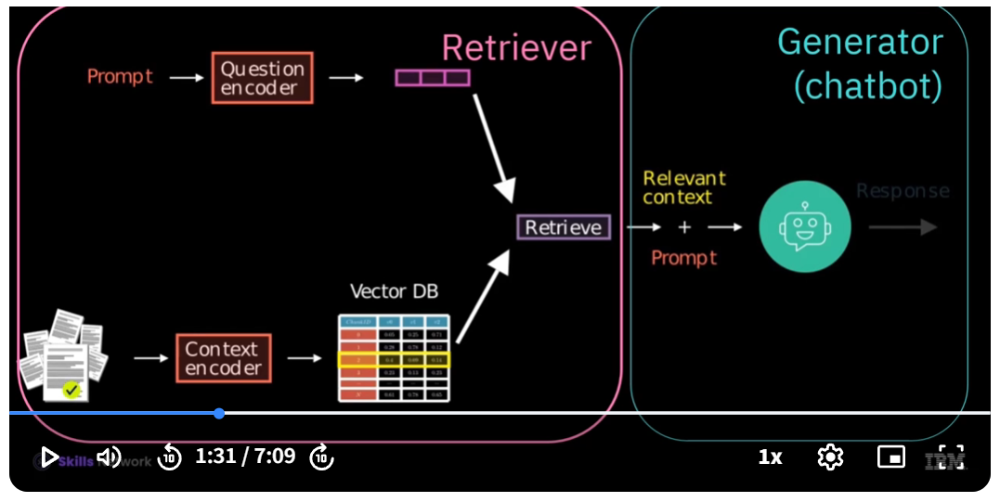
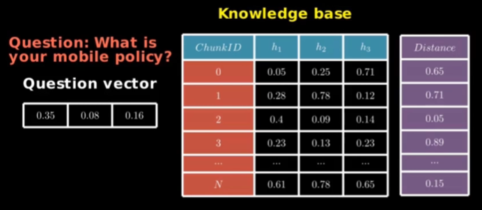
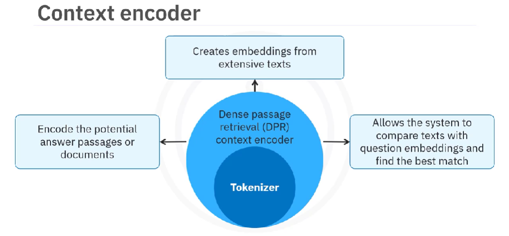

# Coursera: Fundamentals of AI Agents Using RAG and LangChain

See https://www.coursera.org/learn/fundamentals-of-ai-agents-using-rag-and-langchain/lecture/k6RMl/course-introduction.

## Course Overview

RAG allows you to generate a response when the model is not pre-trained. We'll learn about the RAG process, context and question encoders with their tokenizers, and the Facebook AI similarity search (Faiss) library. We'll also gain insight into in-context learning, along with LangChain tools, components, chat models, and document loader.

## Retrieval-Augmented Generation (RAG)

RAG is an AI framework that helps optimize the output of LLMs without re-training the model. LLMs perform well on general tasks, but may not perform well on specialized queries. Therefore, adding external data sources helps to generate domain-specific responses.

RAG consists of two main components -- a **retriever** (the core of RAG), and a **generator** (the ChatGPT).

RAG begins by using a *question encoder* to convert the prompt into a high-dimensional vector. Knowledge documents are converted into high-dimensional vectors by using a *context encoder*.

The system compares the prompt vector to the vectors representing the text chunks in the knowledge base. The system calculates distance between the prompt vector and the context vectors using distance metrics to determine similarity.

Next, it'll choose 3-5 context vectors to augment the inserted input using distance inputs. Finally, the selected text from the knowledge base and the query are provided to the chatbot to generate an appropriate response.

## RAG, Encoders, and FAISS

The system uses a *dense passage retrieval (DPR) context encoder* and its tokenizer to create embeddings from the knowledge base.

This information is then passed to the chatbot, where the context embeddings are compare with the prompt embeddings to find the best match.

In contrast, the *DPR question encoder* and its tokenizer focus on encoding the input questions into a **fixed-dimensional** vector representation.

**Facebook AI Similarity Search (Faiss)** offers efficient algorithms for searching through high-dimensional vectors. It calculates the distance beween the context embeddings and the question embedding.

This is useful in RAG, because it allows us to identify the most relevant context to include with our question when we make our request to the model.

### Recap

* The RAG process involves encoding, storing, and retrieving prompts as vectors to produce a response.
* The DPR context encoder and its tokenizer encode potential answer passages or documents
* Faiss is a Library by Facebook AI Research that uses algorithms to search through high-dimensional vectors
* The question encoder and its tokenizer encode input questions into fixed-dimensional vectors.

## Lab: RAG with Hugging Face

## Next

https://www.coursera.org/learn/fundamentals-of-ai-agents-using-rag-and-langchain/ungradedLti/XqGWi/lab-rag-with-pytorch
