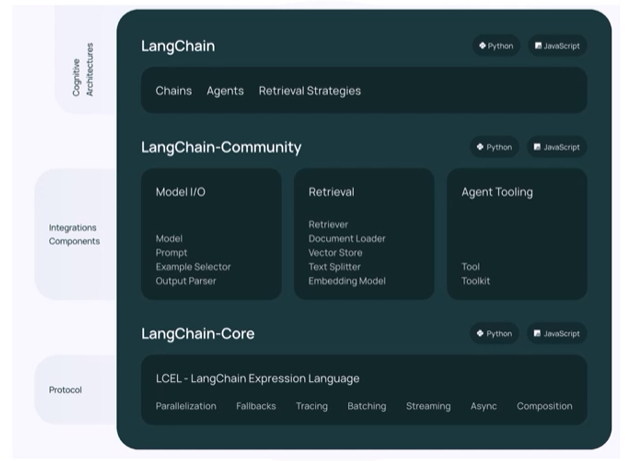
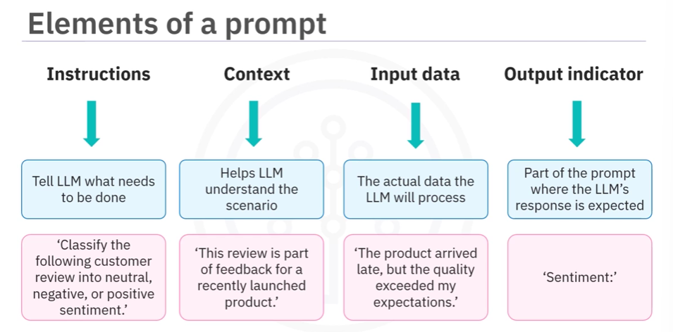

# Coursera: Fundamentals of AI Agents Using RAG and LangChain

See https://www.coursera.org/learn/fundamentals-of-ai-agents-using-rag-and-langchain/lecture/uRc3Y/introduction-to-langchain.

## Introduction to LangChain

LangChain is an open-source framework that helps develop applications using LLMs. It facilitates tools for customization of models.

LangChain consists of several components:



* The LangChain component includes chains, agents, and retrieval strategies which help to make an applications cognitive architecture.
* LangChain Core is a LangChain expression language.
* LangChain Community consists of integrations that are split into lightweight packages.

## Introduction to Prompt Engineering and In-Context Learning

**In-context learning** is a method of prompt engineering that includes demonstrations of the task provided to the LLM as part of the prompt. However, it doesn't require additional training.

A new task is learned from a small set of examples presented within the context at inference time.

### What are prompts?

**Prompts** are instructions or context provided to an LLM to achive a desired task.
  * **Instructions** are clear, direct commands that tell the AI what to do.
  * **Context** is the information that helps the LLM make sense of the instruction. It could be data, parameters, or any relevant details to shape the LLM's response.



## Advanced Methods of Prompt Engineering

* A **zero-shot prompt** instruct an LLM to perform a task without any prior specific training or examples.
* A **one-shot prompt** gives the LLM a single example to help it perform a similar task.
* A **few-shot prompt** learns from a small set of examples before tackling a similar task.
* **Chain-of-thought (CoT) prompting** guides LLMs through complex reasoning in a step-by-step manner.
  * **Example**: "Consider the problem: 'A store has 22 apples. They sold 15 apples today and got a new delivery of 8 apples. How many apples are there now?' Break down each step of your calculation.
* **Self-consistent** is a technique to enhance relability of output. It generates multiple independent answers to the same question, and then it evaluates these to determine the most consistent result.
  * **Example**: 'When I was 6, my sister was half my age. Now I am 70, what age is my sister?' Provide three independent calculations and explanations, then determine the most consistent result.

### Tools and applications
Some examples of tools that facilitate interations with LLMs are:
* OpenAI playground
* LangChain
* HuggingFace
* IBM AI classroom

LangChain uses prompt templates to generate effective prompts. For example:
```
from langchain_core.prompts import PromptTemplate
prompt_template = PromptTemplate.from_template(
    "Tell me a {adjective} joke about {content}."
)

prompt_template.format(adjective="funny", content="chickens")
=>
"Tell me a funny joke about chickens."
```

## Next

https://www.coursera.org/learn/fundamentals-of-ai-agents-using-rag-and-langchain/ungradedLti/Bsvrm/lab-in-context-engineering-and-prompt-templates
