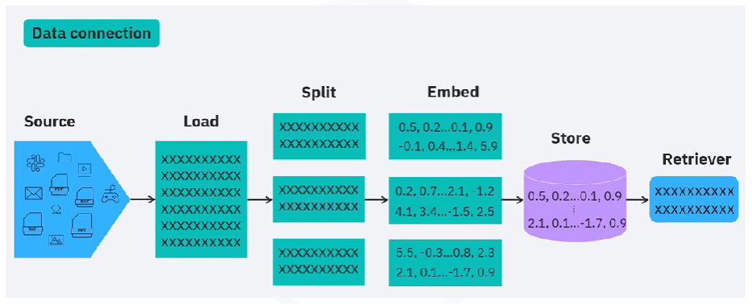
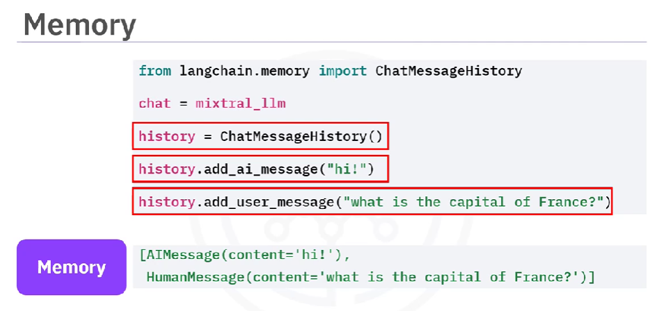

# Coursera: Fundamentals of AI Agents Using RAG and LangChain

See https://www.coursera.org/learn/fundamentals-of-ai-agents-using-rag-and-langchain/lecture/suHxQ/langchain-documents-for-building-rag-applications.

## LangChain Documents for Building RAG Applications

In RAG, external data is retrieved and integrated into the follow-up steps.



The **document source** serves as a container for data information about the page content and the document metadata.

**Loading documents** can be done from more than 100 sources. It handles many different document types from all sorts of applications.

After the document is loaded, it is separated into chunks by **splitters**.

Once the document has been split, **embeddings** capture the meaning of the text.

The embedding is that stored in a data store, such as a **vector database**. Efficient retrieval is necessary for successful use of RAG. This is done by **document retrievers**.

## LangChain Chains and Agents for Building Applications

**Chains** are a sequence of calls. A sequential chain consists of basic steps where each step takes one input to generate one output. The output from Step 1 becomes the input for Step 2.

In code, a chain is created from a prompt template. For example:
```
template = """Your job is to come up with...
  {location}
  YOUR RESPONSE:
"""
prompt_template = PrompteTemplate(template=template, input_variables=['location'])

# chain 1
location_chain = LLMChain(llm=mixtral_llm, prompt=prompt_template, output_key='meal')
```

The output is stored under the key 'meal'. That will then become the input for step 2:
```
template = """Given the meal {meal}, give a short and simple recipe...

YOUR RESPONSE:
"""

prompt_template = PrompteTemplate(template=template, input_variables=['meal'])

# chain 2
location_chain = LLMChain(llm=mixtral_llm, prompt=prompt_template, output_key='recipe')
```

Once all LLMChain objects are created, we combine them with a `SequentialChain`.

Continuity and context preservation are important when interacting in a chain. With LangChain, this can be accomplished using the `ChatMessageHistory` class to preserve AI messages and user messages in memory.



## Lab: LangChain

> LangChain is an open-source framework uniquely designed to empower the development of applications leveraging large language models (LLMs). It stands out by providing essential tools and abstractions that enhance the customization, accuracy, and relevance of the information generated by these models.

> At its core, LangChain offers a generic interface compatible with nearly any LLM. This facilitates a centralized development environment where data scientists can seamlessly integrate LLM applications with various external data sources and software workflows. This integration is crucial for those looking to harness the full potential of AI in their processes.

> One of the most powerful features of LangChain is its module-based approach. This approach allows flexibility in performing experiments and optimizations of interactions with LLMs. Data scientists can dynamically compare prompts and switch between foundation models without significant code modifications. This saves valuable development time and enhances the ability to fine-tune applications to meet specific needs.

## Next

https://www.coursera.org/learn/fundamentals-of-ai-agents-using-rag-and-langchain/ungradedLti/iIDVM/guided-project-summarize-private-documents-using-rag-langchain-and-llms