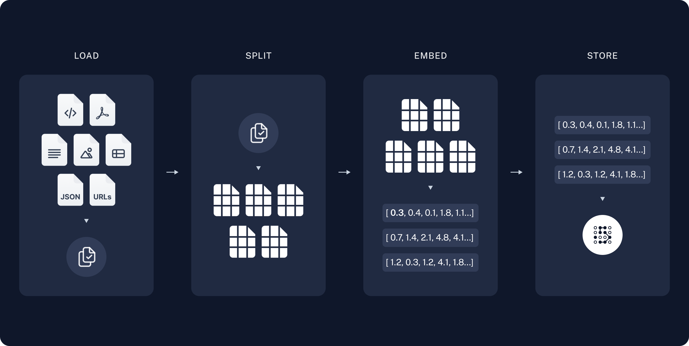
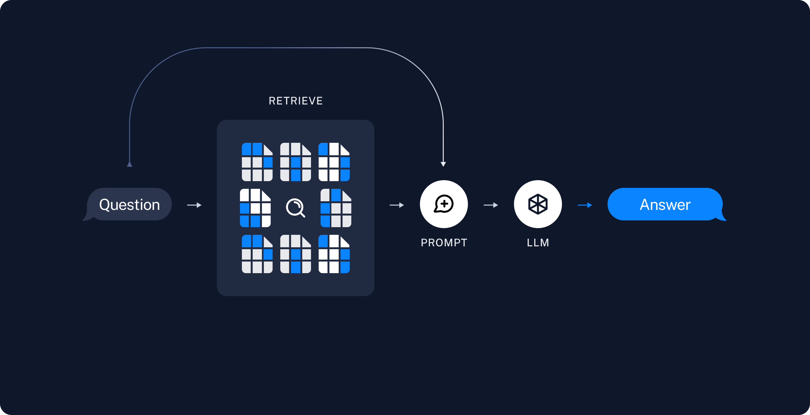

# Coursera: Fundamentals of AI Agents Using RAG and LangChain

See https://www.coursera.org/learn/fundamentals-of-ai-agents-using-rag-and-langchain/ungradedLti/iIDVM/guided-project-summarize-private-documents-using-rag-langchain-and-llms.

## Summarize Private Documents Using RAG, LangChain, and LLMs

If you want to build AI applications that can reason about private data or data introduced after a model's cut-off date, you must augment the knowledge of the model with the specific information it needs. Retrieval-augmented generation (RAG) is a technique for augmenting LLM knowledge with additional data.

### RAG architecture

A RAG application has two main components:

1. **Indexing**. This is a pipeline for ingesting and indexing data from a source. This can be done offline.

  a. **Load**: First, you load the data with `DocumentLoaders`.

  b. **Split**: Text splitters break large `Doucments` into smaller chunks. This is useful, because large chunks are harder to search and won't fit in a model's context window.

  c. **Store**: The splits are stored so that they can later be searched. This is done using a `VectorStore` and `Embeddings` model.

2. **Retrieval and generation**. This takes the user query at run time and retrieves relevant data from the index. The data is then passed to the model.

  a. **Retrieve**: Given a user input, relevant splits are retrieved from storage using a retriever.

  b. **Generate**: A ChatModel / LLM produces an answer using a prompt that includes the question **and** the retrieved data.

## Guided Project: Summarize Private Documents Using RAG, LangChain, and LLMs

See `lab_with_rag.bat` and `lab_with_rag.py`.

## Summary
* LangChain provides an environment for building and integrating large language model (LLM) applications into external data sets and workflow.

* LangChain simplifies the integration of language models like GPT-4 and makes it accessible for developers to build natural language processing or NLP applications. 

* The components of LangChain are:

  * Chains, agents, and retriever

  * LangChain-Core

  * LangChain-Community 

* Generative models understand and capture the underlying patterns and data distribution to resemble the given data sets. Generative models are applicable in generating images, text, and music, augmenting data, discovering drugs, and detecting anomalies. 

* Types of generative models are: 

  * Gaussian mixture models (GMMs)

  * Hidden Markov models (HMMs)

  * Restricted Boltzmann machines (RBMs)

  * Variational autoencoders (VAEs)

  * Generative adversarial networks (GANs)

  * Diffusion models

* In-context learning is a method of prompt engineering where task demonstrations are provided to the model as part of the prompt.

* Prompts are inputs given to an LLM to guide it toward performing a specific task. They consist of instructions and context.

* Prompt engineering is a process where you design and refine the prompts to get relevant and accurate responses from AI.

* Prompt engineering has several advantages:

  * It boosts the effectiveness and accuracy of LLMs.

  * It ensures relevant responses.

  * It facilitates meeting user expectations.

  * It eliminates the need for continual fine-tuning.

* A prompt consists of four key elements: instructions, context, input data, and output indicator.

* Advanced methods for prompt engineering are: zero-shot prompting, few-shot prompting, chain-of-thought prompting, and self-consistency.

* Prompt engineering tools facilitate interactions with LLMs. 

* LangChain uses “prompt templates,” which are predefined recipes for generating effective prompts for LLMs 

* An agent is a key component in prompt applications that can perform complex tasks across various domains using different prompts.

* The language models in LangChain use text input to generate text output. 

* The chat model understands the questions or prompts and responds like a human.

* The chat model handles various chat messages, such as:

  * HumanMessage

  * AIMessage

  * SystemMessage

  * FunctionMessage

  * ToolMessage

* The prompt templates in LangChain translate the questions or messages into clear instructions.

* An example selector instructs the model for the inserted context and guides the LLM to generate the desired output. 

* Output parsers transform the output from an LLM into a suitable format.

* LangChain facilitates comprehensive tools for retrieval-augmented generation (RAG) applications, focusing on the retrieval step to ensure sufficient data fetching. 

* The “Document object” in LangChain serves as a container for data information, including two key attributes, such as page_content and metadata.

* The LangChain document loader handles various document types, such as HTML, PDF, and code, from various locations.

* LangChain in document retrieves relevant isolated sections from the documents by splitting them into manageable pieces. 

* LangChain embeds documents and facilitates various retrievers. 

* LangChain is a platform that embeds APIs for developing applications. 

* Chains in the LangChain is a sequence of calls. In chains, the output from one step becomes the input for the next step. 

* In LangChain, chains first define the template string for the prompt, then create a PromptTemplate using the defined template and create an LLMChain object name.  

* In LangChain, memory storage is important for reading and writing historical data. 

* Agents in LangChain are dynamic systems where a language model determines and sequences actions, such as predefined chains. 

* Agents integrate with tools such as search engines, databases, and websites to fulfill user requests.

## Next

https://www.coursera.org/learn/fundamentals-of-ai-agents-using-rag-and-langchain/assignment-submission/bpWG3/graded-quiz-prompt-engineering-and-langchain