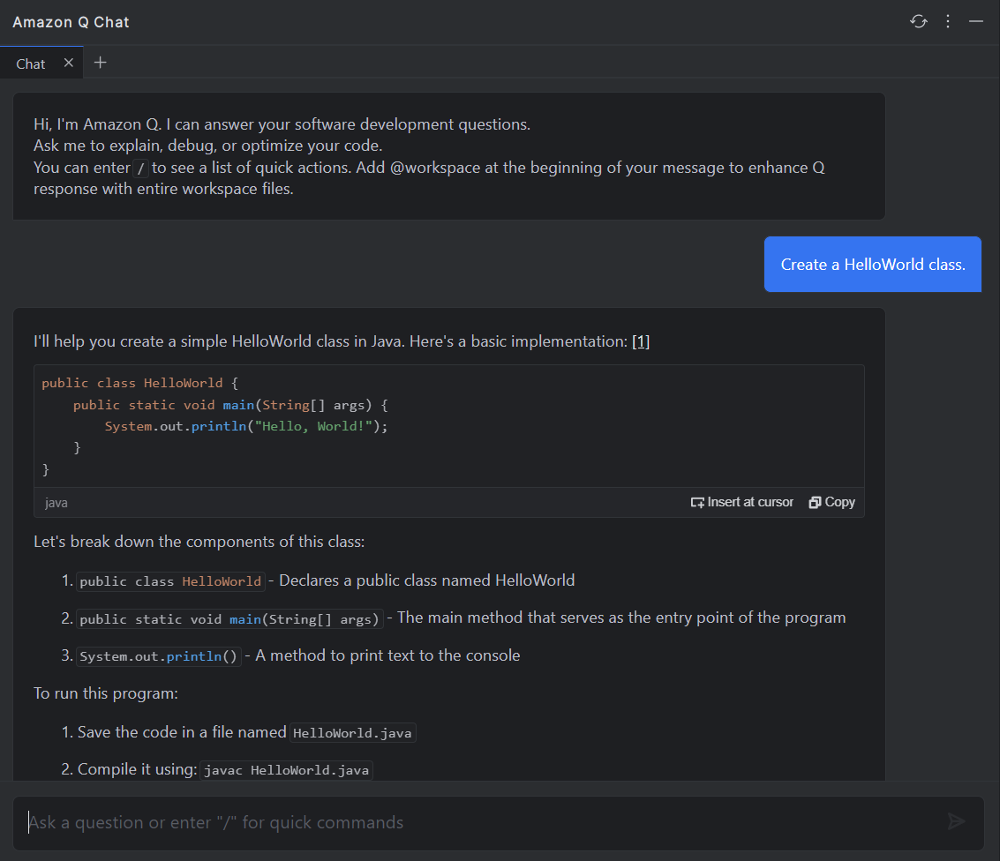

# Coursera: Generative AI in Software Development

See https://www.coursera.org/learn/generative-ai-in-software-development/supplement/oIc3i/introduction-to-prompt-engineering.

## Introduction to prompt engineering

There are several prompting techniques for interacting with generative AI tools:

* Instruction-based prompts
* Few-shot prompting
* Zero-shot prompting
* Chain-of-thought prompting
* Role-based prompting
* Contextual prompts

Each technique serves a specific purpose.

### Instruction-based prompts

Instruction-based prompts are direct and specific. They tell the AI exactly what to do, such as: "Create a PHP function that sorts an array of integers."

This is particularly useful when the task is straightforward and doesn't require additional context.

### Few-shot prompting

Few-shot prompting provides examples to guide the AI's response. For example, if you want a method to multiply two numbers, you might provide functions for adding and subtracting two numbers in your prompt.

The examples help the AI understand the expected format, making it easier to generate consistent and relevant responses. Few-shot prompting is effective for following specific conventions, patterns, or formats.

### Zero-shot prompting

Zero-shot prompting involves asking the AI to perform a task without providing any examples. Instead, this approach relies on the AI's existing knowledge of common tasks.

Zero-shot prompting works best when the task is universally understood.

### Chain-of-thought prompting

Chain-of-thought prompting guides the AI to solve a problem step-by-step. This technique works for complex tasks requiring logical reasoning or multiple steps.

For example, you could use this method to prompt for a method to calculate the factorial of a number:

> "To calculate the factorial of a number, first consider the base case, where the factorial of 0 is 1. Then, recursively multiply the number by the factorial of the number minus 1. Now, calculate the factorial of 5."

### Role-based prompting

Role-based prompting assigns the AI a specific persona, which can tailor the response to match the desired tone or style. This is especially useful when you need explanations or answers framed in a specific way. For example:

> "Act as a PHP teacher, with 10 years of teaching experience, and explain how polymorphism works in PHP."

### Contextual prompting

Contextual prompting includes background information or a specific scenario to tailor the AI's repsonse. This is useful when the response needs to be relevant to a particular use case.

> "Imagine you're building a simple program that calculates areas of shapes. Explain how polymorphism can be used to handle ..."

## Amazon Accounts

We are going to configure Amazon Q Developer, an AI-driven assistant tailored for Java developers. Information on Amazon Q is available at https://aws.amazon.com/q.

To install Amazon Q, go to plugins in IntelliJ IDEA, and search for "Amazon Q" in the marketplace. Follow the necessary steps to create an AWS Builder account.

Once installation and setup is complete, we can prompt Amazon Q to create a Hello World class:

With Amazon Q Developer, you’ll spend less time fixing errors and more time focusing on writing clean, effective code. It’s a tool designed to make your work easier and help you grow as a developer.

## Next

https://www.coursera.org/learn/generative-ai-in-software-development/lecture/Nd5PD/introduction-to-amazon-q-developer