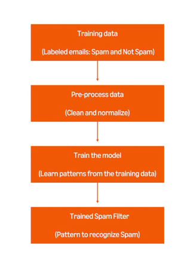

# Coursera: Generative AI in Software Development

See https://www.coursera.org/learn/generative-ai-in-software-development/ungradedLab/dPyU2/exploring-code.

## Exploring code lab

## Module summary

Generative AI tools analyze code, learn from it, and offer suggestions.

It can generate boilerplate code, suggest algorithms when you're stuck, and even refactor inefficient code. This allows us to focus on the bigger challenges.

AI is about automating repetitive work, catching potential errors early, and leaving you free to focus on designing robust, scalable solutions.

## Additional resources: Introduction to AI

There are many other Generative AI tools that are revolutionizing software development. Many of these are open-source solutions that empower developers to integrate AI capabilities into their development workflow seemlessly:

* **ChatGPT** is a versatile tool for generating code snippets, debugging, and offering programming insights.

* **GitHub Copilot** provides real-time AI-powered code analysis, and it supports many languages.

* **DeepCode by Snyk** offers AI-driven, real-time code analysis for many languages, and it integrates seemlessly with GitHub, GitLab, and Bitbucket.

* **SonarQube** is a platform that provides continuous code quality and security analysis.

* **Jetbrains AI Assistant** enables you to refactor code, receive real-time suggestions, and interact with an AI-powered assistant within the JetBrains IDE ecosystem.

## AI and machine learning basics

The goal of AI is to enable computers to perform tasks that typically involve human intelligence:

* Recognizing patterns
* Understanding language
* Making decisions

**Machine learning** is a specific field of study within the larger field of artificial intelligence. It allows compouters to learn from examples and apply that learning to new tasks.

The following diagram illustrates the process of training a spam filter using machine learning:

An important limitation of machine learning is **false positives**. In the example of a spam email filter, this happens when a legitimate email is flagged as spam, because it shares characteristics or patterns of a spam email.

## Decision trees

### Introduction

A decision tree is a machine learning tool that helps classify data and predict outcomes by breaking down this decision-making process into a **series** of simple questions

### What is a tree?

A tree is a data structure consisting of connected nodes. Those nodes can have different types (root node, parent node, child node, internal node, leaf node).

### What is a decision tree?

A decision tree is a special type of tree used in machine learning. **Input data** is the information initially provided to the model so it can learn during training, or later provided to the model for making decisions based on learned rules. The nodes of a decision tree represent stages of the decision-making process:

* **Internal nodes** represent questions or conditions.
* **Branches** represent possible answers or outcomes of a condition.
* **Leaf nodes** represent the final decision or result.

**Note**: The characteristics under consideration are referred to as a feature or characteristic, and their value is therefore referred to as a feature value.

### Rules of a decision tree

Decision trees are **unidirectional**, and the following rules apply:

1. Every path leads to a leaf node.
2. Decision trees handle all possible outcomes by having **exhaustive conditions** and a **default behavior**.
3. Decision trees have no infinite loops, since decisions move from "top" to "bottom". Therefore, the algorithm will end after a finite number of steps.

### Disadvantages of decision trees

1. **Overfitting** is when the decision tree becomes overly complex, capturing noise in the data rather than the underlying pattern.

2. **Instability** is when a slight change in the data can lead to a completely different tree structure.

3. **Bias towards features with more levels** is seen sometimes, in that decision trees will become biased towards features with many unique values.

## Next

https://www.coursera.org/learn/generative-ai-in-software-development/lecture/QChSp/random-forests