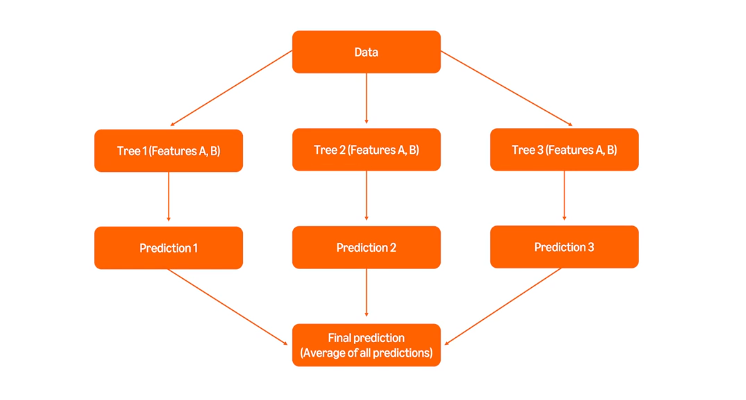
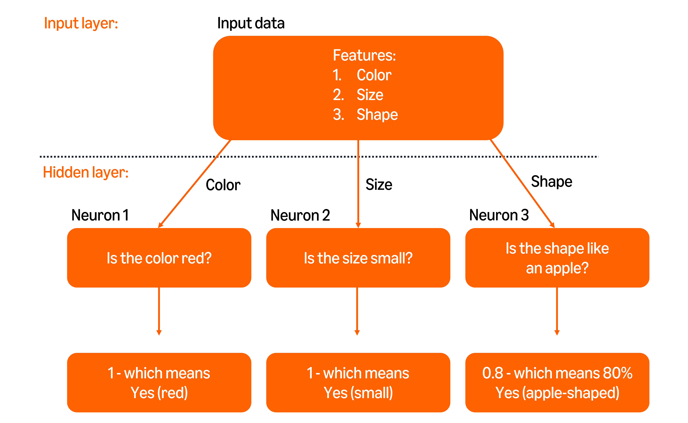
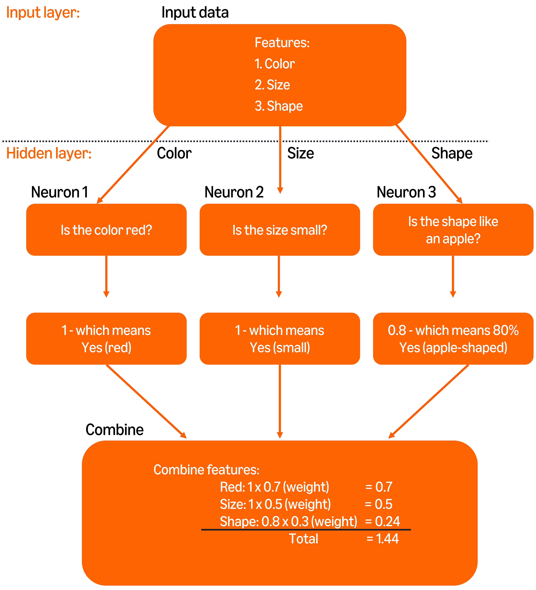
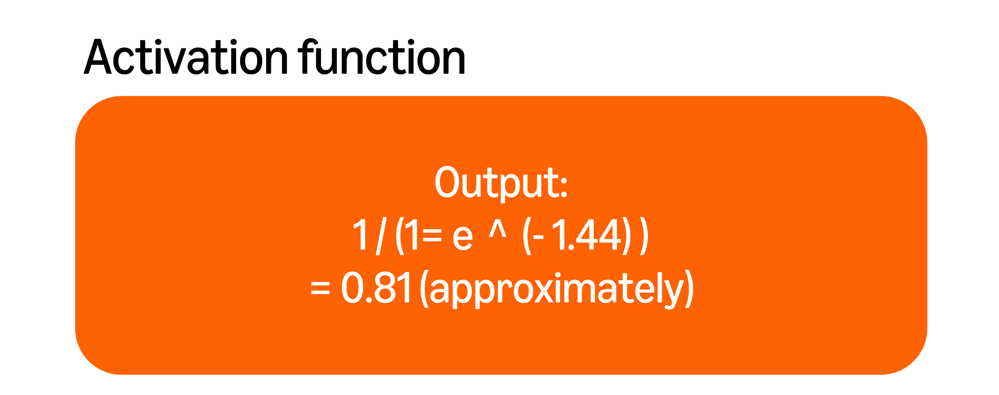
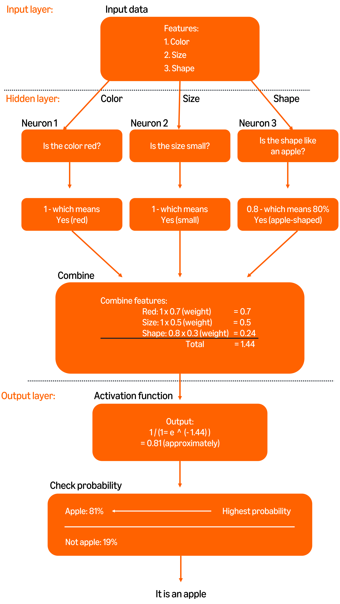

# Coursera: Generative AI in Software Development

See https://www.coursera.org/learn/generative-ai-in-software-development/lecture/QChSp/random-forests.

## Random forests

A random forest is a group of decision trees whose results are collected together to arrive at a prediction.

While a single decision tree can provide an answer quickly, it could suffer from overfitting.

Each decision tree is trained on a subset of the data. This ensures that each tree learns unique patterns. The random forest's result is derived by averaging the output of all of the decision trees.

A random forest is based on two key principles, **bagging** and **feature randomness**.

**Bagging** is the principle that each tree is trained on a different random subset, characterist or feature of the data. This is also called "bootstrap aggregating", and it reduces the chance of overfitting by ensuring that each tree has a unique perspective on the data.

At each split in the tree, only a random subset of the features is considered. This is the principle of **feature randomness**, and it ensures that the tree doesn't rely too heavily on a single feature.



Random forests have multiple strengths:

* **Reduce overfitting**
* **Improved accuracy**
* **Versatility**: The work well for both classification tasks and regression tasks.
* **Missing data**
* **Numerical & categorical tasks**

## Neural networks

A neural network is a computational model inspired by the human brain. It processes data in three main steps:

* **Input layer**: This is where raw data, like an image, enters the network.
* **Hidden layers**: Intermediate stations where the data is processed and transformed.
* **Output layer**: This is where the result is produced.

Each of these layers is called a **neuron** or **node**.

## Neural network reading

A neural network performs its actions, which are segregated into three main layers: the input layer, hidden layers, and the output layer.

The **input layer** is where the raw features are fed into the network.

The **hidden layers** are where the network processes the inputs to find patterns. Each neuron in the hidden layer combines inputs and applies *weights* to each input. It then uses an *activation function* to decide whether to pass the information forward.

The **output layer** takes the combined information and produces the final prediction.

### Scores, weights, and the activation function

**Step 1: Scoring the outputs from the hidden layer**. Each neuron outputs a **score** or **signal** which represents the likelihood of a particular feature matching the target. The scores might range between 0 and 1.



**Step 2: Assigning the weighted scores**. Each hidden layer output is assigned a value called a **weight** based on its importance (which is utilized in the next step). Initially, the neural network makes its first prediction using random values or weights.

**Step 3: Summing the weighted scores**. The weighted scores are added together to produce the combined score from the hidden layer.



**Step 4: Passing through the activation function**. The data is then passed from the hidden layer to the output layer, where it is passed through an activation function. A possible activation function may be the sigmoid function, which takes an input number and returns a decimal value between 0 and 1.

```
Sigmoid = 1 / ( 1 + e^(-x) )
```



So in this specific example, the result is 0.81 or 81% probability.

There are many other activation functions as well:

* ReLU (rectified linear unit)
* Tanh (hyperbolic tangent)
* ELU (exponential linear unit)
* Softmax
* Swish

**Step 5: Making a final decision in the output layer**. The output layer uses the activation results to make the final decision.



### Learning from mistakes: Error correction

A neural network learns by checking its mistakes and its weights, like a **feedback loop**. It will try again with the adjusted weight for the different features.

A neural network will gradually learn to prioritize a particular feature by distribution more weight to that feature, so that it gets the answer or prediction correct most of the time.

## Next

https://www.coursera.org/learn/generative-ai-in-software-development/lecture/h3Rp7/overview-of-digital-transformation