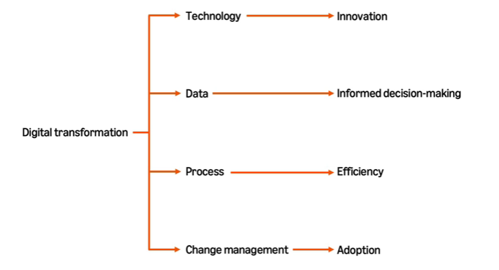
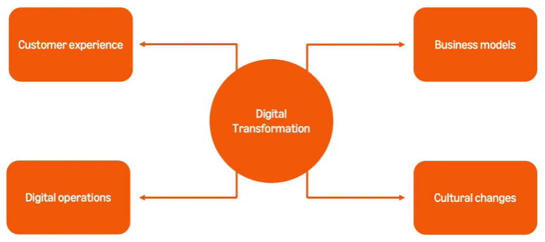

# Coursera: Generative AI in Software Development

See https://www.coursera.org/learn/generative-ai-in-software-development/lecture/h3Rp7/overview-of-digital-transformation.

## Overview of digital transformation

Digital transformation is revolutionizing how companies operate and serve customers. It integrates digital technology into every part of a business.

At the core of digital transformation is software development, building systems that power these innovations.

AI is currently driving digital transformation by allowing:
* Transforming data
* Automating tasks
* Enhancing decision-making
* Chatbots
* Predictive AI

It handles repetitive tasks and allows teams to focus on creative and analytical work.

## Four domains of digital transformation

Digital transformation focuses on four key areas:
* Technology
* Data
* Processes
* Change management

**Technology** is the enabler. The tools can speed up tasks and improve customer experiences.

**Data** is the foundation for making informed choices. It allows us to identify trends.

**Processes** define how things get done. By optimizing them, businesses can save time and resources.

**Change management** ensures people embrace these changes.

## **Technology** in digital transformation

**Artificial intelligence** allows computers to mimic human thinking, streamline processes, and drive smarer decisions.

AI includes several domains:
* Predictive analysis
* Automation
* Personalization

**Internet of Things** (IoT) connects devices to smart networks. IoT systems connect the physical and digital worlds, allowing the environment to be more adaptive.

**Cloud computing** allows businesses to access hardware and software online.

Cloud computing provides:
* Scalable storage
* Cost efficiency
* Remote collaboration

It allows flexible, connected, future-ready collaboration.

## **Data** in digital transformation

Data is the driving force behind modern decision-making and operational efficiency.

### Data in the digital age

By collecting and analyzing data, it's possible to uncover insights, make predictions, and shape strategies for the future.

Data is information that can be collected, organized, and analyzed. It may include:
* Numbers, such as sales figures or temperatures.
* Text, such as customer feedback or social media posts.
* Visuals, such as photos or videos.
* Sounds, like voice recordings or environmental noise.

This data can be used to detect patterns, predict future behavior, and make smarter decisions.

### The importance of data in digital transformation

Data allows businesses to make informed decisions, improve processes, and meet high expectations. Data improves business performance in at least two weeks:

* **Enhancing decision-making with data analytics**. Strategic decisions are founded in data.

* **Improving operational efficiency through insights**. Data boosts efficiency by streamlining operations and reducing costs.

## Creating a recommendation program lab

This lab had some technical issues.
* The code generated by Amazon Q Developer didn't work correctly.
  * It didn't sort the flavors by number of sales, which was a requirement.
  * It didn't recommend a flavor based on age, which was a requirement.
* It didn't have the JDK properly configured for the project.

## Next

https://www.coursera.org/learn/generative-ai-in-software-development/lecture/O943a/ai-in-customer-relationship-management-crm
