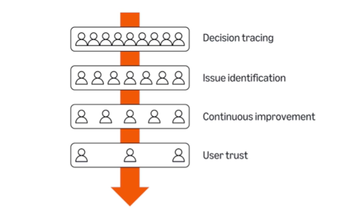
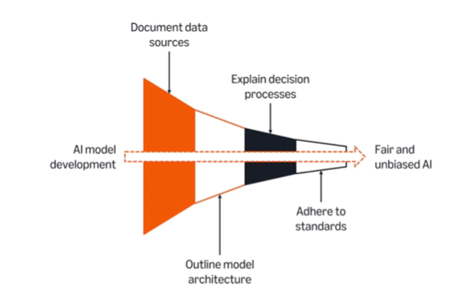
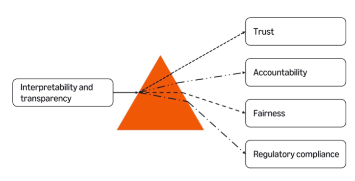

# Coursera: Generative AI in Software Development

See https://www.coursera.org/learn/generative-ai-in-software-development/lecture/Erdn8/scalability.

## Scalability

Scalability is a system's ability to adapt to changing workloads. For AI, scalability means being able to handle millions of users and vast amounts of data.

The two primary challenges with scalability are *data storage* and *data processing*.

When scaling up to large amounts of users, a big challenge is managing deployment of model updates. Often times, a new model will be rolled out gradually. A-B testing, in which the new model or feature is rolled out to a small group first, is another option.

Google uses and maintains the AI framework **TensorFlow**, which is optimized for distributed systems. This enables Google to train and deploy large AI models across its vast ecosystem.

TensorFlow uses a collection of distributed DBs, load balancing, and content delivery networks.

Facebook uses Hadoop, a framework for handling large-scale data processing. Hadoop allows Facebook to handle large datasets across many machines.

## Interpretability and transparency

Interpretabilitty and transparency in AI are essential, so that we can trust the decisions that are made. This is especially critical in fields like healthcare and finance.

**Interpretability**: The ability to explain or understand how an AI system reaches its outcome.

How does interpretability achieve trust?

Trust begins with *decision tracing*, which shows the steps the AI takes to reach its decision. This process makes it easier to identify and fix problems, a process called *issue identification*.

These insights lead to *continuous improvements*, the process of updating the model to achieve better results. That results in enhanded *user trust*, so that the AI system is dependable in critical applications.

**Transparency**: Ensures that the inner workings of an AI model are clear and understandable to all stakeholders.

This includes providing insights into how the model is built.

Experts often speak about the pillars of AI trustworthiness:

Not all AI models are designed with these features in mind. This distinguishes the difference between *interpretable AI models* and *blackbox models*.

**Interpetable AI models** include:
* Decision trees
* Linear regression

Their advantages are simplicity and easy of understanding. This allows for clear explanation of results to users.

**Black box models** are complex AI systems whose decision making process are difficult for humans to interpret. You can't trace the steps that led to the outcome.

This includes:
* Deep neural networks
* Shallow neural networks

Their advantages include high performance, especially in complex tasks. However, they do not provide a clear explanation for their results.

## Improving model transparency

A "black box" approach to AI—where decision-making processes are opaque—can erode trust, obscure errors, or perpetuate biases with potentially disastrous outcomes.

This is where model transparency plays a crucial role.

## Techniques to improve model transparency

### LIME (Local Interpretable Model-agnostic Explanations)

LIME is a technique that explains the predictions of complex models by approximating them with simpler, interpretable models. It creates a simple, interpretable model, like a linear regression, to approximate the behavior of a complex model for a specific instance. By perturbing input data and analyzing the results, LIME identifies the features most important to the prediction.

LIME is useful because it:

* Explains decisions clearly for individual cases.
* Works with any type of machine learning model.
* Helps uncover biases or errors in predictions.

### SHAP (SHapley Additive exPlanations)

SHAPE is a method that explains the output of machine learning models by assigning each feature an importance value based on cooperative game theory. It provides consistent, mathematically grounded insights into how each feature contributes to a model's predictions.

SHAP is valued for its:

* Fair and consistent explanations.
* Ability to provide both local (individual) and global (overall) insights.
* Strong theoretical foundation in game theory.

SHAP can be computationally expensive for complex models, but its clarity and fairness make it a preferred choice for improving trust in AI.

### LIME vs SHAP

**LIME** focuses on local explanations, approximating a model's behavior for specific predictions using simpler models. It is lightweight and effective but lacks the theoretical rigor of SHAP.

**SHAP** provides both local and global insights by fairly distributing feature importance based on game theory. While it is more consistent and reliable, it can be computationally intensive, especially for complex models.

## Next

https://www.coursera.org/learn/generative-ai-in-software-development/lecture/R3AZI/integration-with-existing-systems