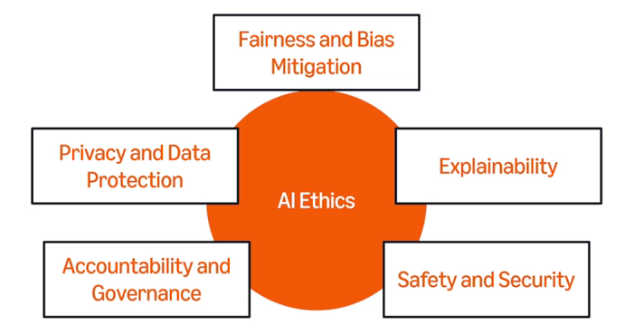
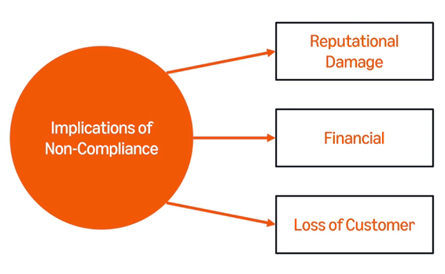

# Coursera: Generative AI in Software Development

See https://www.coursera.org/learn/generative-ai-in-software-development/lecture/R3AZI/integration-with-existing-systems.

## Integration with existing systems

There can be several challenges to integration:

* System compatibility
* Data silos
* Change management
* GDPR compliance

A few key strategies can keep integration on track:

* Collaborative planning between IT planning and business teams
* Pilot programs to undercover challenges early
* Regular monitoring keeps improvements on track
* Partnering with vendors for training and best practices

## Ethical and regulatory compliance

There are several key components to AI ethics:

There are several implications of *not* complying:

So how can we ensure compliance?

* Collect user consent, and delete data when needed.
* Use a diverse dataset to ensure fairness.
* Explain the AI's decisions.
* Train staff, so everyone understands and upholds ethical and regulatory standards.

## Compliance in action

Ethics is the foundation of responsible AI development. Some of its key principles include: **fairness**, **transparency**, **privacy**, **accountability**, and **safety**.

### What is regulatory compliance?

Regulatory compliance ensures AI systems align with legal and organizational standards. Three key areas are **data protection**, **discrimination**, and **consumer rights**.

