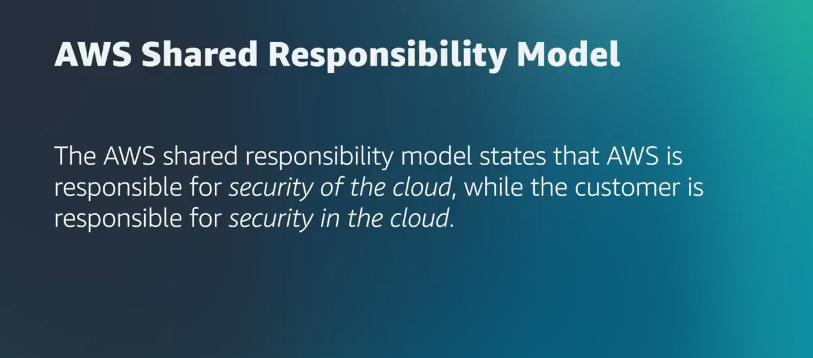

# Coursera: Migrating to the AWS Cloud: Introduction.

See https://www.coursera.org/learn/aws-fundamentals-migrating-to-the-cloud/home/module/1.

## Course Links

If you encounter a broken item, the fastest way to alert course staff is to open a ticket through the [Contact AWS Training and Certification](https://support.aws.amazon.com/#/contacts/aws-training) page. Use these tickets to report technical issues, or problems with the content or the labs—they should not be used to ask questions about what to do next in the lab or in the course.

For general questions about AWS topics, go to [AWS re:Post](https://repost.aws/) to join a vibrant community that can help you become even more successful on AWS.

Lastly, for technical help related to the Coursera platform, see the [Learner Help Center](https://www.coursera.support/s/learner-help-center?language=en_US).

## What is Migration?

Migration is moving your application stack from one platform to another. We will be revieiwng how to move an application from an on-premise (i.e. on-prem) architecture into the AWS Cloud.

### Why move?

* **Save some cash**. People who move to AWS Cloud typically save 31% on their yearly infrastructure costs.
* **Corporate or managerial direction**. Often the decision is driven by a company acquisition or by senior leadership.

### What should move?

It's important to determine what to move to the cloud, and what to leave in the data center.

The easiest option is the **lift and shift**.  You're going to pick everything up and mmove it over to the cloud. This isn't very difficult, if the application doesn't have many dependencies.

Or you could leave some components in the existing environment. This is known as a **hybrid deployment**. This is recommended if the application has a lot of complicated dependencies. The major upside is that you can speed up your migration process.

The downfall of a hybrid deployment is that the application becomes more complicated. You have to handle networking between the cloud and on-prem environments.

Keep the **seven Rs of migration** in mind.

* **Relocate**: Pick up compatible applications and drop them in the cloud. This works with services, such as Docker or VMWare, that can be moved without requiring any code changes or major revisions.
* **Rehost**: Also known as "lift and shift". We're going to pick everything up, make the needed cahnges, and move it over to AWS.
* **Replatform**
* **Repurchase**
* **Refactor**: The hardest R to implement. It involves substantial changes to the application and architecture to make the move to the cloud. 
* **Retire**: Applications eventually age out at some point.
* **Retain**

## Why Migrate?

### Elasticity

One big reason to migrate to the cloud is its **elasticity**. One example of elasticity is **scalability**. Utilizing the cloud provides a level of scalability that is nearly impossible to match with an on-premises environment.

Another form of elasticity is **reliability**, as a result of being able to launch additional resources to replace failed or unresponsive components. That's not possible in an on-premises environment.

### Security

A second reason to migrate to the cloud is **security**. AWS Cloud provides innate security measures included with the use of many services. It also allows the use of additional security-focused services and features.

Keep in mind the AWS Shared Responsibility Model:

This looks differently from service to service. However, it generally means that AWS is responsible for the overarching security of the data-center locations, the underlying components being used, and the software that AWS manages. The customer is then responsible for securing solutions and infrastructures, access to accounts and resources, and maintaining security standards applicable to utilization.

## Increased Flexibility and Speed of Deployment

Compared to on-premises environments, the AWS Cloud provides an unmatched level of speed and flexibility for launching resources, infastructures, and solutions.

## Migrations Early Considerations

Some parts are going to be more difficult than others to plan.

Parts of the on-prem architecture is going to translate easily into AWS Cloud:

* Relational databases are handled by Amazon RDS.
* Kubernetes is handled by Amazon EKS.
* Virtual machines are handled by Amazon EC2.

But what if you have something like a custom-built fleet of non-relational database servers? That may be more work to migrate.

### How long will it take?

Establishing a timeframe is not a simple task. It's based on the application and method of migration.

* How many applications are **relocating**? Those can be done in a matter of days.
* Are you **rehosting** applications? Those may take weeks.
* **Refactoring**? That could take months.

Embrace the timeless practice of underpromising and overdelivering.

Also, ensure that you include all key stakeholders in the migration plan and timeline. **DBAs** will provide valuable database insights, and **the DevOps team** will be responsible for deploying the newly migrated application.

You need complete team buy-in and buy-off.

## Next

https://www.coursera.org/learn/aws-fundamentals-migrating-to-the-cloud/lecture/YCvj8/migration-overview