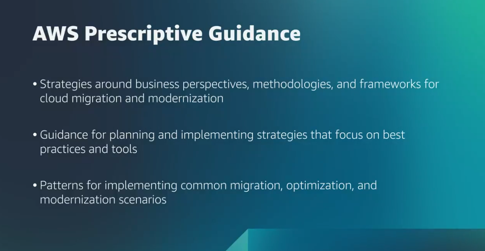

# Coursera: Migrating to the AWS Cloud: Migration Overview.

See https://www.coursera.org/learn/aws-fundamentals-migrating-to-the-cloud/lecture/YCvj8/migration-overview.

## Migration Overview

The migration discussion is a three-phase process designed to help migrate any number of applications:

* **Assess**: Evaluate your organization's current readiness for operating in the cloud. (Why are we migrating?) AWS has tools to help assess on-premise resources, to build a right-sized and optimized cost projection for running in AWS, and to assist in understanding total cost-of-ownership projections.
* **Mobilize**: Create a migration plan and refine your business case. Tools like the AWS Application Discovery Service, AWS Migration Hub, and the Migration Partner solutions can help with making appropriate decisions.
* **Migrate and modernize**: This is the phase where each application is designed, migrated, and validated.

These are not discrete phases. Instead, it's better to view it as an iterative process.

## Intro and Demo of AWS Prescriptive Guidance

Prescriptive Guidance provides time-tested strategies, guides, and patterns to help accelerate cloud migration, modernization, and optimization.

This helps with the migrate-and-modernize phase, but you still need to understand the other phases.

## Week 1 Reading

Below are the overarching topics on Migrating to the AWS Cloud:

* The [AWS shared responsibility model](https://aws.amazon.com/compliance/shared-responsibility-model/) describes a relationship where AWS is responsible for security *of* the cloud, and the customer is responsible for the security *in* the cloud.

* One approach to planning a migration is to review [the 7 R's of migration](https://docs.aws.amazon.com/prescriptive-guidance/latest/application-portfolio-assessment-guide/prioritization-and-migration-strategy.html#migration-r-type): retire, retain, rehost, replatform, refactor, and repurchase.

* Another approach to planning a migration is to follow [the three-phase migration process](https://aws.amazon.com/cloud-migration/how-to-migrate/): assess, mobilize, migrate-and-modernize.

* The [AWS Prescriptive Guidance](https://aws.amazon.com/prescriptive-guidance/?apg-all-cards.sort-by=item.additionalFields.sortText&apg-all-cards.sort-order=desc&awsf.apg-new-filter=*all&awsf.apg-content-type-filter=*all&awsf.apg-code-filter=*all&awsf.apg-category-filter=categories%23migration&awsf.apg-rtype-filter=*all&awsf.apg-isv-filter=*all&awsf.apg-product-filter=*all&awsf.apg-env-filter=*all) page provides strategies, guides, and patterns to help accelerate your cloud migration.

## Next

https://www.coursera.org/learn/aws-fundamentals-migrating-to-the-cloud/lecture/qILsd/what-is-assessing