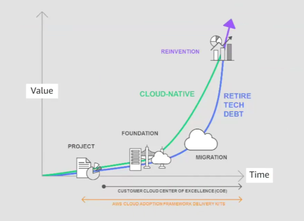
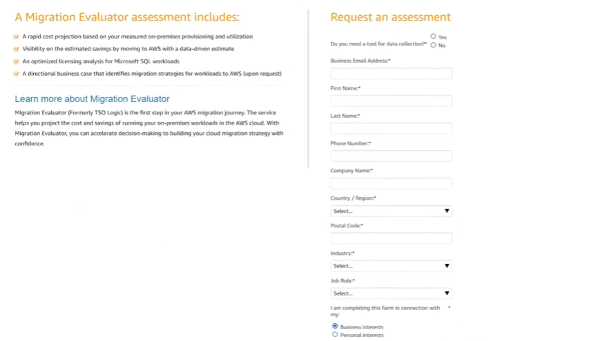
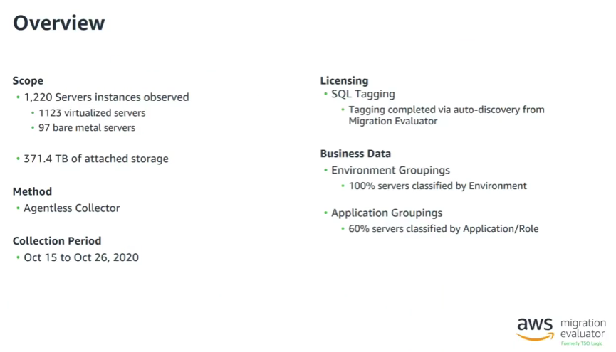
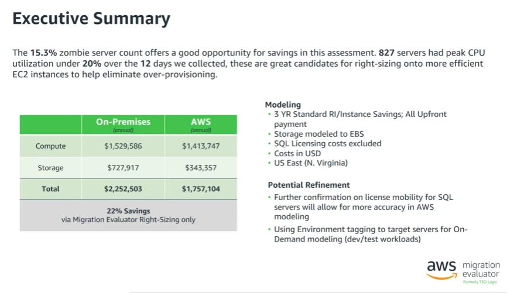
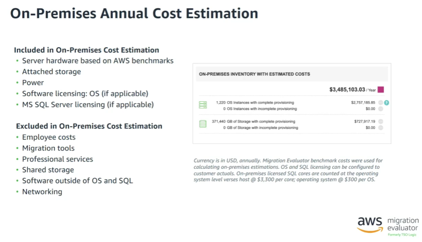

# Coursera: Migrating to the AWS Cloud: What Is Assessing?

See https://www.coursera.org/learn/aws-fundamentals-migrating-to-the-cloud/lecture/qILsd/what-is-assessing.

## What Is Assessing?

The assessment phase is achieves three goals for the cloud migration journey:

1. Understand where the organization is in its cloud journey.

2. Identify the areas of strengths and weaknesses from a cloud-readiness perspective.

3. Create an action plan to fix the identified gaps.

**Project**: The first step typically involves introducing a new project with low value or importance. This is experimentation.

**Foundation**: This is creating the infrastructure that will be needed.

**Migration**: This is actually moving the pieces from their current on-premises solution to the cloud.

**Reinvention**: Now that we're in the cloud, how do we want to revise our architecture? This usually involves identifying strengths and weaknesses, and then meetings with key stakeholders.

## Migration Evaluator Deep Dive & Demo

The AWS Migration Evaluator is a service provided by AWS. It starts with submitting a request for assessment:

AWS then provides an agent that can be installed on bare-metal systems or on a virtual environment. The agent collects all of the data needed about network traffic.

From that data, the AWS team will produce an overview report with recommendations:

This information is valuable for the assessment phase.

## Tools to Help

AWS provides a couple of tools to help with migration.

The **AWS Migration Evaluator** provides a baseline of what the organization is running, and it then projects on-premises costs based on usage.

**Migration Evaluator Quick Insights** provides a one-page summary of costs broken by service and software licenses. These reports are updated automatically.

If the organization decides more information is needed, you can request a Migration Evaluator business case.

Then the **AWS Migration Hub** is a single palce to store IT access inventory data while tracking migrations to any AWS region.

You can then import data automatically with **AWS Discovery Agent** or **AWS Discovery Collector**, which is an agentless approach for VMware environments.

From there, you can use the network visualization to accelerate planning by quickly identifying servers and dependencies, as well as grouping servers into applications.

## Next

https://www.coursera.org/learn/aws-fundamentals-migrating-to-the-cloud/lecture/fDa3e/migration-hub-deep-dive